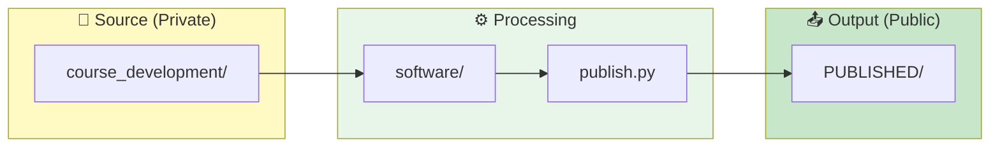
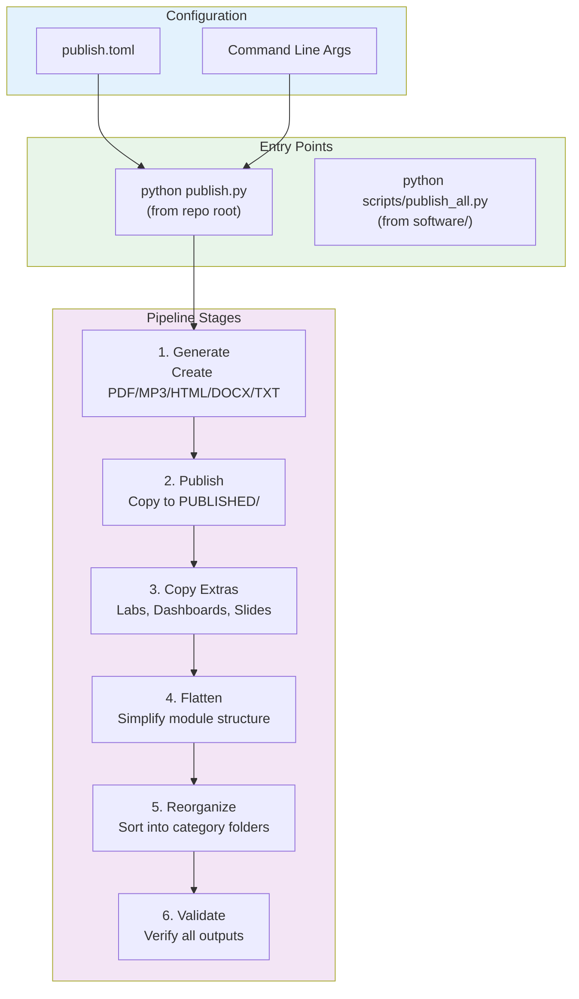
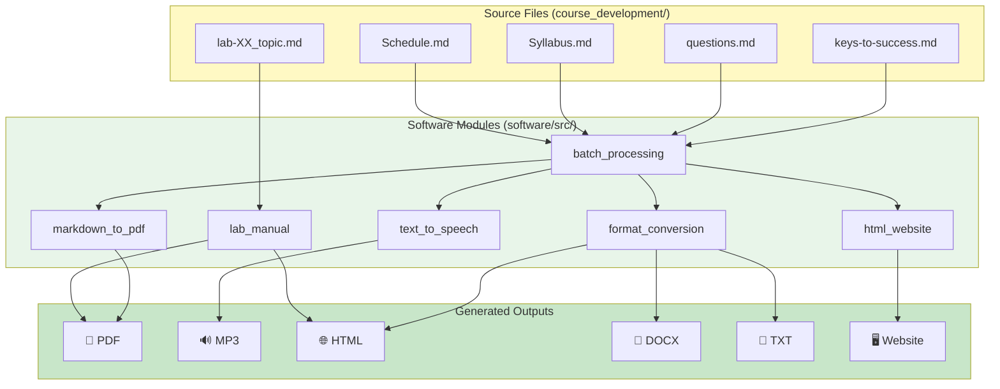

# How It Works

> **Quick Navigation**: [README](README.md) | [Contributing](CONTRIBUTING.md) | [Document Types](DOCUMENT_TYPES.md) | [software/docs](software/docs/README.md)

A comprehensive guide to understanding the CR-BIO course management system—how it's organized, how to generate course materials, and where to find detailed documentation.

---

## System Overview

CR-BIO is an automated curriculum management system for Biology courses at College of the Redwoods. It transforms Markdown source files into multiple output formats (PDF, MP3, HTML, DOCX, TXT) for two courses:

- **BIOL-1**: General Biology (17 modules) - Pelican Bay Prison
- **BIOL-8**: Human Anatomy & Physiology (15 modules) - College of the Redwoods



---

## Repository Structure at a Glance

```text
cr-bio/
├── 📝 course_development/        # Source content (private, editable)
│   ├── biol-1/                   # BIOL-1 course materials
│   └── biol-8/                   # BIOL-8 course materials
│
├── 📤 PUBLISHED/                  # Generated outputs (public repos)
│   ├── biol-1/                   # → github.com/docxology/biol-1
│   └── biol-8/                   # → github.com/docxology/biol-8
│
├── 🛠️ software/                   # Automation tooling
│   ├── src/                      # Python modules (14 total)
│   ├── scripts/                  # CLI orchestration scripts
│   ├── tests/                    # Test suite (420+ tests)
│   └── docs/                     # Technical documentation
│
├── 📄 Root Documentation
│   ├── README.md                 # Project entry point
│   ├── HOW_IT_WORKS.md           # This file - comprehensive guide
│   ├── CONTRIBUTING.md           # How to contribute content
│   ├── DOCUMENT_TYPES.md         # All document types reference
│   ├── GENERATION.md             # Content generation guide
│   ├── AGENTS.md                 # Technical specifications
│   └── CLAUDE.md                 # AI assistant guidance
│
└── 📄 Configuration
    ├── publish.toml              # Pipeline configuration
    ├── publish.py                # Main entry point
    ├── .cursorrules              # Real Methods Policy
    └── .gitignore                # Git exclusions
```

---

## The Publish Pipeline

The heart of CR-BIO is the automated publish pipeline that transforms source content into distribution-ready materials.



### Quick Commands

```bash
# Recommended: Full pipeline using configuration
python publish.py                    # Uses publish.toml settings
python publish.py --dry-run          # Preview without generating

# Override formats
python publish.py --override-formats pdf,html

# Direct script access (from software/ directory)
cd software && uv run python scripts/publish_all.py --clean --verbose
```

---

## Documentation Map

### By Audience

| If you are a... | Start with... | Then explore... |
|-----------------|---------------|-----------------|
| **New User** | [README.md](README.md) | [GENERATION.md](GENERATION.md) |
| **Content Author** | [CONTRIBUTING.md](CONTRIBUTING.md) | [DOCUMENT_TYPES.md](DOCUMENT_TYPES.md) |
| **Developer** | [software/docs/ARCHITECTURE.md](software/docs/ARCHITECTURE.md) | [software/AGENTS.md](software/AGENTS.md) |
| **AI Assistant** | [CLAUDE.md](CLAUDE.md) | [AGENTS.md](AGENTS.md) |

### By Topic

| Topic | Document | Description |
|-------|----------|-------------|
| **Getting Started** | [README.md](README.md) | Project overview, quick start |
| **Content Creation** | [CONTRIBUTING.md](CONTRIBUTING.md) | How to add labs, assessments, modules |
| **Document Types** | [DOCUMENT_TYPES.md](DOCUMENT_TYPES.md) | Complete reference of all file types |
| **Generation** | [GENERATION.md](GENERATION.md) | How to generate outputs |
| **Configuration** | [publish.toml](publish.toml) | Pipeline configuration options |
| **Architecture** | [software/docs/ARCHITECTURE.md](software/docs/ARCHITECTURE.md) | System design and modules |
| **Workflows** | [software/docs/ORCHESTRATION.md](software/docs/ORCHESTRATION.md) | Multi-module patterns |
| **Quick Reference** | [software/docs/QUICKSTART.md](software/docs/QUICKSTART.md) | Installation and commands |
| **API Reference** | [software/AGENTS.md](software/AGENTS.md) | All function signatures |
| **Testing** | [software/tests/README.md](software/tests/README.md) | Test suite documentation |

---

## Content Flow

### From Source to Output



### Module Layers

The software is organized into dependency layers:

| Layer | Modules | Description |
|-------|---------|-------------|
| **0 - Independent** | `module_organization`, `file_validation` | No dependencies |
| **1 - Core** | `markdown_to_pdf`, `text_to_speech`, `speech_to_text`, `lab_manual` | Single-purpose converters |
| **2 - Format** | `format_conversion` | Multi-format transformations |
| **3 - Orchestration** | `batch_processing`, `html_website`, `schedule` | Combine converters |
| **4 - Integration** | `canvas_integration`, `publish`, `validation` | External systems |

Each module can be used independently—see [ARCHITECTURE.md](software/docs/ARCHITECTURE.md) for details.

---

## Configuration Reference

### publish.toml

The main configuration file controls the entire pipeline:

```toml
[publish]
clean = true        # Clear outputs before generation
verbose = false     # Enable verbose logging

[publish.formats]
pdf  = true         # PDF files (via WeasyPrint)
docx = true         # Word documents
html = true         # HTML files
txt  = true         # Plain text
mp3  = false        # Audio narration (slower, ~30s per file)

[publish.courses.biol-1]
enabled = true
include_labs = true
include_syllabus = true

[publish.courses.biol-8]
enabled = true
include_labs = true
# Note: Exams are NOT published (teacher-only materials)

[publish.pipeline]
generate = true     # Generate outputs from source
publish  = true     # Copy to PUBLISHED/
flatten  = true     # Flatten and reorganize to categories
validate = true     # Validate all outputs
```

### Key Settings

| Setting | Purpose | Default |
|---------|---------|---------|
| `publish.clean` | Clear existing outputs first | `true` |
| `publish.formats.mp3` | Generate audio (slow) | `false` |
| `publish.courses.*.enabled` | Enable/disable specific course | `true` |
| `publish.pipeline.validate` | Run validation after generation | `true` |

---

## Real Methods Policy

> ⚠️ **Important**: This repository follows a strict Real Methods Policy.

**All code uses real implementations—no mocks, stubs, or fake methods.**

This applies to:

- ✅ All library implementations (WeasyPrint, gTTS, etc.)
- ✅ All file operations (real file system)
- ✅ All validation logic
- ✅ All tests (no mocking)

See [.cursorrules](.cursorrules) for the complete policy statement.

---

## Development Workflow

### Setting Up

```bash
# 1. Clone and enter software directory
cd software

# 2. Install dependencies
uv sync

# 3. Install system dependencies (macOS)
brew install cairo pango gdk-pixbuf glib

# 4. Set environment variable
export DYLD_LIBRARY_PATH="/opt/homebrew/lib:$DYLD_LIBRARY_PATH"

# 5. Run tests
uv run pytest tests/ -v
```

### Making Changes

1. **Edit source** in `course_development/`
2. **Run pipeline** with `python publish.py`
3. **Verify outputs** in `PUBLISHED/`
4. **Push changes** to public repos (`PUBLISHED/biol-1/`, `PUBLISHED/biol-8/`)

---

## Common Tasks

| Task | Command/Location |
|------|------------------|
| Generate all outputs | `python publish.py` |
| Preview without generating | `python publish.py --dry-run` |
| Generate PDF only | `python publish.py --override-formats pdf` |
| Add a new lab | See [CONTRIBUTING.md](CONTRIBUTING.md#lab-protocol-development) |
| Add a new quiz | See [CONTRIBUTING.md](CONTRIBUTING.md#assessment-development) |
| Run tests | `cd software && uv run pytest` |
| View test coverage | `cd software && uv run pytest --cov=src --cov-report=html` |
| Validate outputs | `cd software && uv run python scripts/validate_outputs.py --course all` |

---

## External Links

| Resource | URL |
|----------|-----|
| BIOL-1 Public Repository | [github.com/docxology/biol-1](https://github.com/docxology/biol-1) |
| BIOL-8 Public Repository | [github.com/docxology/biol-8](https://github.com/docxology/biol-8) |
| Dr. Daniel Ari Friedman | [@docxology](https://github.com/docxology) |

---

## Quick Reference Card

### File Types → Outputs

| Source Type | Location | PDF | MP3 | HTML | DOCX | TXT |
|-------------|----------|-----|-----|------|------|-----|
| keys-to-success.md | `module-XX/` | ✅ | ✅ | ✅ | ✅ | ✅ |
| questions.md | `module-XX/` | ✅ | ✅ | ✅ | ✅ | ✅ |
| lab-XX_topic.md | `labs/` | ✅ | — | ✅ | — | — |
| Syllabus.md | `syllabus/` | ✅ | ✅ | ✅ | ✅ | ✅ |
| Schedule.md | `syllabus/` | ✅ | ✅ | ✅ | ✅ | ✅ |

### Key Functions

| Function | Module | Purpose |
|----------|--------|---------|
| `render_markdown_to_pdf()` | markdown_to_pdf | Markdown → PDF |
| `generate_speech()` | text_to_speech | Text → MP3 |
| `convert_file()` | format_conversion | Any → Any |
| `render_lab_manual()` | lab_manual | Lab → PDF/HTML |
| `generate_module_website()` | html_website | Module → Website |
| `publish_course()` | publish | Copy to PUBLISHED/ |

---

*Last Updated: 2026-02-03*
