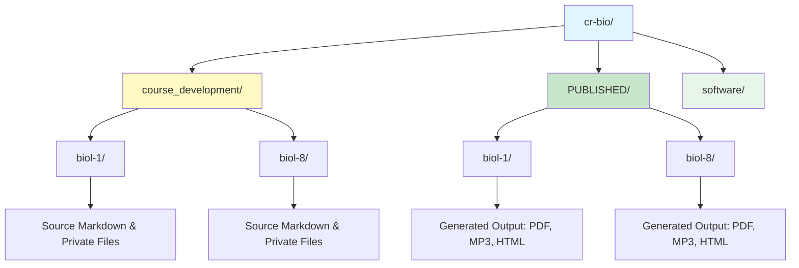

# Biology at College of the Redwoods (Del Norte, CA)

This is a private repository for Biology courses at College of the Redwoods (Del Norte, CA), organized by Dr. Daniel Ari Friedman ([@docxology](https://github.com/docxology) on GitHub).

## Repository Structure

The repository is organized into three main areas:

1. **`course_development/`**: The "Back Office" for private curriculum development.
2. **`PUBLISHED/`**: Public, ready-to-upload course materials.
3. **`software/`**: Automation tools and documentation.



---

## 🏗️ Course Development (`course_development/`)

This is the working directory for instructors. It contains the source of truth for all course content.

### Courses

- **[BIOL-1](course_development/biol-1/)**: Biology 1 at Pelican Bay Prison
- **[BIOL-8](course_development/biol-8/)**: Biology 8 at College of the Redwoods

### Structure

Each course folder contains:

- **`course/`**: Working modules with source Markdown files
- **`syllabus/`**: Syllabus source files
- **`private/`**: Instructor-only materials (Tests, Accommodations)
- **`resources/`**: References, Templates, Media

---

## 📤 Published Outputs (`PUBLISHED/`)

Final rendered materials for public distribution. **Each course is a separate public GitHub repository:**

| Course | Public Repository | Description |
|--------|-------------------|-------------|
| BIOL-1 | [github.com/docxology/biol-1](https://github.com/docxology/biol-1) | General Biology - Pelican Bay Prison |
| BIOL-8 | [github.com/docxology/biol-8](https://github.com/docxology/biol-8) | Human Anatomy & Physiology - CR Del Norte |

### Architecture

- `PUBLISHED/` is **excluded from cr-bio** (via `.gitignore`)
- Each subfolder (`biol-1/`, `biol-8/`) is an independent git repo
- Use `software/scripts/publish_all.py` to generate and validate outputs
- Use `git push` within each subfolder to update the public repos

**Note**: Do not edit files here directly. Edit source in `course_development/` and regenerate.

---

## 🛠️ Software Utilities (`software/`)

The automation engine for the repository.

- **`src/`**: Python modules (markdown_to_pdf, text_to_speech, etc.)
- **`scripts/`**: CLI tools (generate_all_outputs.py, publish_course.py)
- **`docs/`**: [Documentation](software/docs/README.md) for the software system

### Key Scripts

The primary entry point is the top-level `publish.py` script with configuration via `publish.toml`:

```bash
# Full publish pipeline (recommended)
python publish.py

# Dry run to see what would be generated
python publish.py --dry-run

# Override formats on command line
python publish.py --override-formats pdf,html
```

#### Configuration (`publish.toml`)

```toml
[publish]
clean = true        # Clean output directories before generation
verbose = false     # Enable verbose logging

[publish.formats]
pdf  = true         # Generate PDF files
docx = true         # Generate Word documents
html = true         # Generate HTML files
txt  = true         # Generate plain text files
mp3  = false        # Generate audio narration (slower, ~30s per file)

[publish.courses.biol-1]
enabled = true
include_labs = true
include_dashboards = true

[publish.pipeline]
generate = true     # Run output generation
publish = true      # Copy to PUBLISHED/
flatten = true      # Flatten module structure
validate = true     # Validate outputs
```

#### Direct Script Access

```bash
# Generate outputs for a specific course
cd software && uv run python scripts/generate_all_outputs.py --course biol-8

# Generate only specific formats
cd software && uv run python scripts/generate_all_outputs.py --formats pdf,html

# Validate outputs
cd software && uv run python scripts/validate_outputs.py --course all
```

See [software/docs/README.md](software/docs/README.md) for comprehensive documentation.
