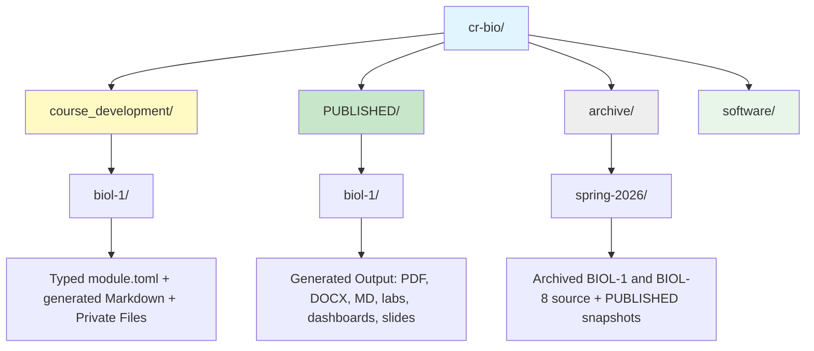

# Biology at College of the Redwoods

This is a private repository for Biology courses at College of the Redwoods, organized by Dr. Daniel Ari Friedman ([@docxology](https://github.com/docxology) on GitHub). The active course is BIOL-1 at Pelican Bay for Fall 2026; Spring 2026 courses are preserved under [`archive/spring-2026/`](archive/spring-2026/README.md).

## Repository Structure

The repository is organized into three main areas:

1. **`course_development/`**: The "Back Office" for private curriculum development.
2. **`PUBLISHED/`**: Generated, tracked public-ready materials for active subtree publishing.
3. **`archive/`**: Historical course/source and generated snapshots.
4. **`software/`**: Automation tools and documentation.


```mermaid
graph TD
    Root[cr-bio/] --> Dev[course_development/]
    Root --> Pub[PUBLISHED/]
    Root --> Archive[archive/]
    Root --> Software[software/]
    
    Dev --> Biol1[biol-1/]
    Pub --> PubBiol1[biol-1/]
    Archive --> Spring2026[spring-2026/]
    
    Biol1 --> Biol1Source[Typed module.toml + generated Markdown + Private Files]
    PubBiol1 --> PubBiol1M["Generated Output: PDF, DOCX, MD, labs, dashboards, slides"]
    Spring2026 --> ArchivedCourses["Archived BIOL-1 and BIOL-8 source + PUBLISHED snapshots"]
    
    style Root fill:#e1f5ff
    style Dev fill:#fff9c4
    style Pub fill:#c8e6c9
    style Archive fill:#eeeeee
    style Software fill:#e8f5e9
```

---

## 📖 Documentation Guide

> **New here?** Start with [software/docs/README.md](software/docs/README.md) for a comprehensive visual guide to the entire system.

### Quick Links by Audience

| If you are a... | Start with... |
|-----------------|---------------|
| **New User** | [README.md](README.md) (this file) → [software/docs/README.md](software/docs/README.md) |
| **Content Author** | [CONTRIBUTING.md](CONTRIBUTING.md) → [software/docs/ARCHITECTURE.md](software/docs/ARCHITECTURE.md) |
| **Developer** | [software/docs/ARCHITECTURE.md](software/docs/ARCHITECTURE.md) → [software/AGENTS.md](software/AGENTS.md) |
| **AI Assistant** | [CLAUDE.md](CLAUDE.md) → [AGENTS.md](AGENTS.md) |

### Documentation Index

| Document | Purpose |
|----------|---------|
| [software/docs/README.md](software/docs/README.md) | **Master guide** — System overview, documentation map, configuration |
| [CONTRIBUTING.md](CONTRIBUTING.md) | How to add labs, assessments, and content |
| [software/docs/ARCHITECTURE.md](software/docs/ARCHITECTURE.md) | Document types, system design, directory structure |
| [software/docs/ORCHESTRATION.md](software/docs/ORCHESTRATION.md) | Publish pipeline, lab generation, selective generation |
| [software/docs/QUICKSTART.md](software/docs/QUICKSTART.md) | Quick setup and generation commands |
| [AGENTS.md](AGENTS.md) | Technical specifications and conventions |
| [CLAUDE.md](CLAUDE.md) | AI assistant guidance and commands |
| [software/docs/](software/docs/README.md) | Developer documentation (architecture, API, testing) |

---

## 🏗️ Course Development (`course_development/`)

This is the working directory for instructors. It contains the source of truth for active course content.

### Courses

- **[BIOL-1](course_development/biol-1/)**: General Biology at Pelican Bay, Fall 2026
- **[Spring 2026 archive](archive/spring-2026/README.md)**: Historical BIOL-1 and BIOL-8 source trees plus generated snapshots

### Structure

Each course folder contains:

- **`course/`**: Working modules with typed `module.toml` source plus generated Markdown files
- **`syllabus/`**: Syllabus source files
- **`private/`**: Instructor-only materials (Tests, Accommodations)
- **`resources/`**: References, templates, media, slides, and deterministic generated module visuals

---

## 📤 Published Outputs (`PUBLISHED/`)

Final rendered materials for public distribution. Active subtrees are pushed to public GitHub repositories:

| Course | Public Repository | Description |
|--------|-------------------|-------------|
| BIOL-1 | [github.com/docxology/biol-1](https://github.com/docxology/biol-1) | General Biology - Pelican Bay |

BIOL-8 is archived for Spring 2026 and is not an active publish target.

### Architecture

- `PUBLISHED/` is generated and **tracked in cr-bio** so `git subtree split --prefix=PUBLISHED/<course>` can publish each public course repository.
- Each active subfolder (currently `biol-1/`) is a subtree prefix, not a nested git checkout.
- Use `python publish.py --dry-run` to inspect the configured pipeline, `python publish.py --skip-git` for local regeneration, and full `python publish.py` only when you intend to commit/push.
- Use `software/scripts/publish_all.py` for lower-level generation/publish debugging.

**Note**: Do not edit files here directly. Edit source in `course_development/` and regenerate.

---

## 🛠️ Software Utilities (`software/`)

The automation engine for the repository.

- **`src/`**: Python modules (`module_content`, markdown_to_pdf, text_to_speech, etc.)
- **`scripts/`**: CLI tools (generate_all_outputs.py, publish_course.py)
- **`docs/`**: [Documentation](software/docs/README.md) for the software system

### Key Scripts

The primary entry point is the top-level `publish.py` script with configuration via `publish.toml`:

```bash
# Full publish pipeline, including configured git operations
python publish.py

# Dry run to see what would be generated
python publish.py --dry-run

# Generate and validate locally without committing or pushing
python publish.py --skip-git

# Override formats on command line
python publish.py --override-formats pdf,docx,md
```

#### Configuration (`publish.toml`)

```toml
[publish]
clean = true        # Clean output directories before generation
verbose = false     # Enable verbose logging

[publish.formats]
pdf  = true         # Generate PDF files
docx = true         # Generate Word documents
html = false        # Generate HTML files
txt  = false        # Generate plain text files
md   = true         # Generate Markdown copy
mp3  = false        # Generate audio narration (slower, ~30s per file)

[publish.courses.biol-1]
enabled = true
include_labs = true
include_dashboards = true

[publish.pipeline]
generate    = true  # Run output generation
publish     = true  # Copy to PUBLISHED/
copy_extras = true  # Copy labs and dashboards
flatten     = true  # Flatten module structure
validate    = true  # Validate outputs
git_push    = true  # Push to public repos
```

#### Direct Script Access

```bash
# Regenerate typed module Markdown/SVG assets
cd software && uv run python scripts/generate_module_materials.py --course biol-1

# Generate outputs for the active course
cd software && uv run python scripts/generate_all_outputs.py --course biol-1

# Generate only specific formats
cd software && uv run python scripts/generate_all_outputs.py --formats pdf,docx,md

# Validate outputs
cd software && uv run python scripts/validate_outputs.py --course all

# Validate repository/documentation contracts
cd software && uv run python scripts/validate_repo_contracts.py
```

See [software/docs/README.md](software/docs/README.md) for comprehensive documentation.
