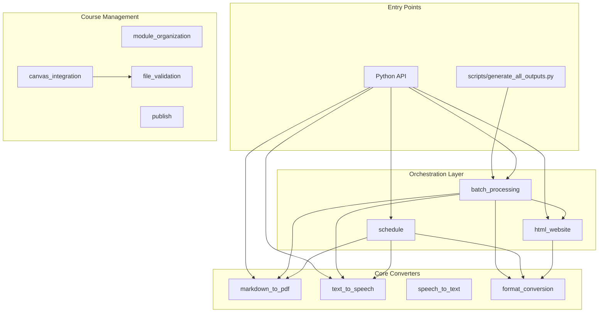
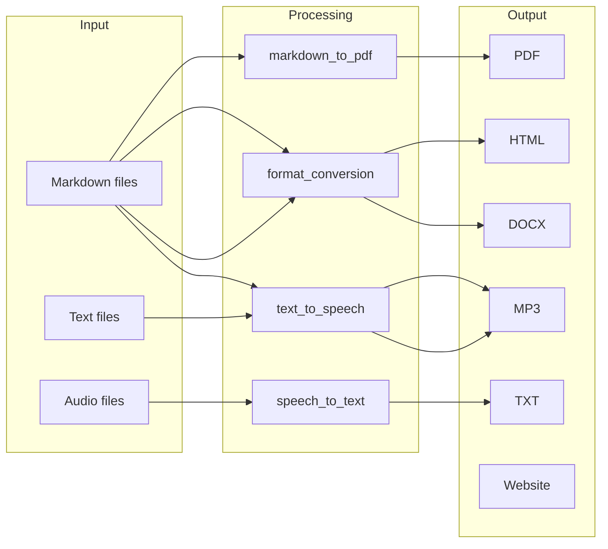
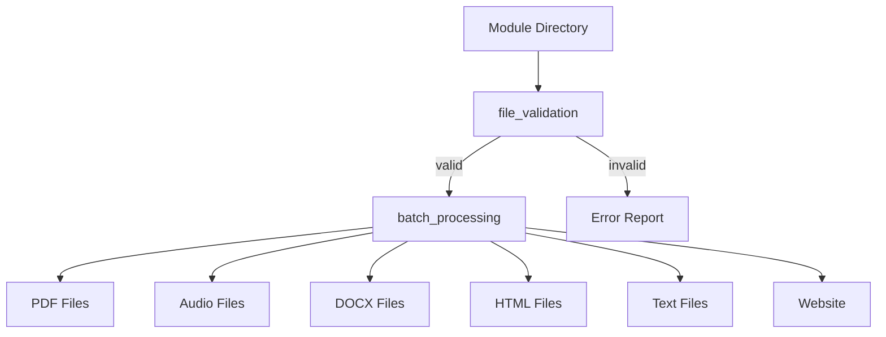
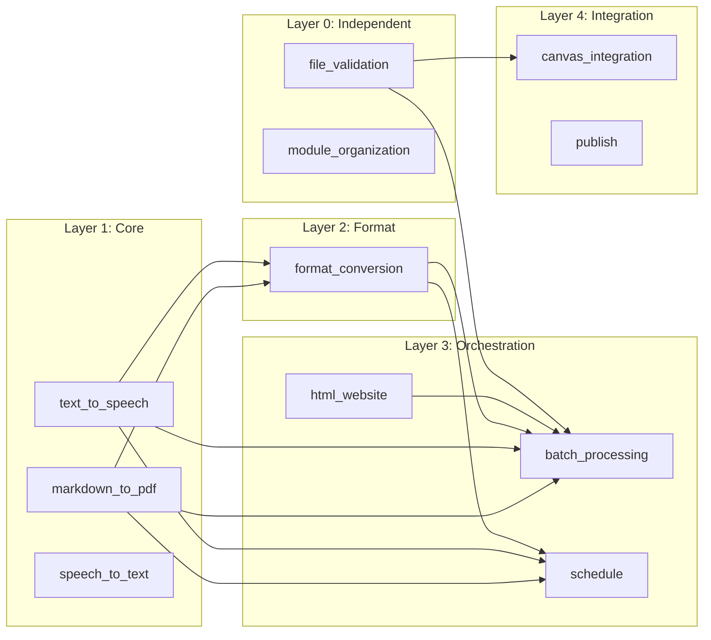

# System Architecture

> **Navigation**: [← README](README.md) | [Orchestration →](ORCHESTRATION.md) | [Quick Start](QUICKSTART.md) | [API Reference](../AGENTS.md)

## Overview

The cr-bio software follows a modular architecture with clear separation of concerns. Each module is self-contained with its own `main.py` (public API), `utils.py` (internal utilities), and `config.py` (constants).

---

## Modular Design Principles

The architecture is built on five core principles that ensure maximum modularity:

### 1. Self-Contained Modules

Each module contains all the code, configuration, and logic needed to fulfill its purpose. Modules do not rely on internal implementation details of other modules.

- **Public API**: All external access is through `main.py` functions
- **Internal Implementation**: Helper functions and utilities are in `utils.py`
- **Configuration**: Module-specific constants and settings are in `config.py`
- **No Shared State**: Modules do not share mutable state with other modules

### 2. Clear Boundaries

Each module has a well-defined boundary between its public interface and internal implementation.

- **Public Interface**: Functions exported from `main.py` are the only way other modules should interact
- **Internal Implementation**: `utils.py` functions are private to the module
- **Configuration Interface**: `config.py` exposes constants but not implementation details
- **Documentation**: Module boundaries are documented in each module's `AGENTS.md`

### 3. Minimal Dependencies

Modules minimize dependencies on other modules. When dependencies exist, they are explicit and documented.

- **Layer 0 (Independent)**: No dependencies on other modules
- **Layer 1 (Core)**: Depend only on external libraries
- **Layer 2+ (Higher Layers)**: Depend only on lower layers
- **Explicit Dependencies**: All inter-module dependencies are documented in `AGENTS.md`

### 4. Composable Design

Modules can be combined in various ways to create different workflows.

- **Sequential Composition**: Output of one module feeds into another
- **Parallel Composition**: Multiple modules process different inputs simultaneously
- **Conditional Composition**: Modules can be conditionally invoked based on validation or other criteria
- **Orchestration**: Higher-level modules coordinate lower-level modules

### 5. Testable in Isolation

Each module can be tested independently without requiring other modules to be present.

- **Unit Tests**: Test individual module functions in isolation
- **Integration Tests**: Test module interactions explicitly
- **No Hidden Dependencies**: All dependencies are explicit and can be verified
- **Mock-Free Testing**: Tests use real implementations, not mocks

---

## High-Level Architecture



---

## Data Flow

### Content Generation Pipeline



### Batch Processing Pipeline



---

## Module Structure

Every module follows this structure:

```
module_name/
├── __init__.py      # Exports public functions
├── main.py          # Public API (imported by users)
├── utils.py         # Internal helper functions
└── config.py        # Constants and configuration
```

### Layer Definitions

| Layer | Modules | Description |
|-------|---------|-------------|
| **Core** | markdown_to_pdf, text_to_speech, speech_to_text | Single-purpose converters |
| **Format** | format_conversion | Multi-format transformations |
| **Orchestration** | batch_processing, html_website, schedule | Combine multiple converters |
| **Management** | module_organization, file_validation | Course/module structure |
| **Integration** | canvas_integration, publish | External services and publishing |

---

## Module Dependencies



### Dependency Rules

1. **Core converters** (Layer 1) depend only on external libraries
   - Can be used completely independently
   - No dependencies on other modules
   - Examples: `markdown_to_pdf`, `text_to_speech`, `speech_to_text`

2. **Format conversion** (Layer 2) uses core converters
   - Depends on Layer 1 modules for functionality
   - Can be used independently if Layer 1 modules are available
   - Example: `format_conversion`

3. **Orchestration** (Layer 3) combines any lower layer
   - Composes multiple modules to create workflows
   - Can use any combination of lower-layer modules
   - Examples: `batch_processing`, `html_website`, `schedule`

4. **Management** (Layer 0) is independent
   - No dependencies on other modules
   - Can be used standalone
   - Examples: `module_organization`, `file_validation`

5. **Integration** (Layer 4) uses validation before external calls
   - Depends on validation modules for safety
   - Interfaces with external systems
   - Examples: `canvas_integration`, `publish`

### Using Modules Independently

All modules can be imported and used independently. Even modules that depend on others can be used directly if their dependencies are satisfied:

```python
# Use a core module independently
from src.markdown_to_pdf.main import render_markdown_to_pdf
render_markdown_to_pdf("input.md", "output.pdf")

# Use an orchestration module independently
from src.batch_processing.main import process_module_by_type
process_module_by_type("/path/to/module", "/path/to/output")
```

### Interface Contracts

When modules depend on others, they interact through well-defined interfaces:

- **Function Signatures**: Public functions have documented type hints
- **Return Values**: Consistent return types across modules
- **Error Handling**: Exceptions are documented and predictable
- **Side Effects**: File operations and external calls are explicit

See [Module Independence](#module-independence) for details on standalone usage.

---

## Repository Structure

```
software/
├── src/                              # Source code (11 modules)
│   ├── __init__.py
│   ├── batch_processing/             # Module batch operations
│   ├── canvas_integration/           # Canvas LMS upload
│   ├── file_validation/              # Content validation
│   ├── format_conversion/            # Format transformations
│   ├── html_website/                 # Interactive websites
│   ├── markdown_to_pdf/              # PDF generation
│   ├── module_organization/          # Directory structure
│   ├── schedule/                     # Schedule processing
│   ├── speech_to_text/               # Audio transcription
│   └── text_to_speech/               # Audio generation
│
├── tests/                            # Test suite
│   ├── conftest.py                   # Shared fixtures
│   ├── test_batch_processing_main.py # 25+ tests
│   ├── test_format_conversion_utils.py # 20+ tests
│   ├── test_schedule_main.py         # 28 tests
│   ├── test_html_website_features.py # 30+ tests
│   └── ...
│
├── scripts/                          # CLI scripts
│   ├── generate_all_outputs.py       # Generate all course outputs
│   ├── generate_module_website.py    # Single module website
│   └── generate_syllabus_renderings.py
│
├── docs/                             # Documentation
│   ├── README.md                     # Overview (start here)
│   ├── ARCHITECTURE.md               # This file
│   ├── ORCHESTRATION.md              # Workflow patterns
│   ├── QUICKSTART.md                 # Installation/setup
│   └── AGENTS.md                     # Documentation standards
│
├── README.md                         # Project overview
├── AGENTS.md                         # API reference
├── pyproject.toml                    # Dependencies and config
└── run_tests.sh                      # Test runner script
```

---

## Configuration

### Module Configuration Pattern

Each module has a `config.py`:

```python
# src/batch_processing/config.py
SKIP_DIRECTORIES = ["output", ".git", "__pycache__", "node_modules"]
OUTPUT_DIRECTORIES = {
    "pdf": "pdf",
    "audio": "audio", 
    "text": "text",
}
```

```python
# src/schedule/config.py
SUPPORTED_OUTPUT_FORMATS = ["pdf", "html", "docx", "txt", "mp3"]
SCHEDULE_FILE_PATTERNS = ["Schedule.md", "schedule.md", "*schedule*.md"]
SCHEDULE_COLUMNS = ["Week", "Date", "Topic", "Notes"]
```

### External Dependencies

| Module | External Library | Purpose |
|--------|-----------------|---------|
| markdown_to_pdf | WeasyPrint | PDF rendering |
| text_to_speech | gTTS | Google TTS |
| speech_to_text | SpeechRecognition | Audio transcription |
| format_conversion | python-docx, pypdf | DOCX/PDF handling |
| html_website | markdown2 | HTML conversion |

---

## Module Independence

### Standalone Modules

These modules can be used without any other modules:

| Module | Purpose | Standalone Usage |
|--------|---------|------------------|
| `markdown_to_pdf` | Convert Markdown to PDF | Yes - only needs WeasyPrint |
| `text_to_speech` | Generate audio from text | Yes - only needs gTTS |
| `speech_to_text` | Transcribe audio to text | Yes - only needs SpeechRecognition |
| `module_organization` | Create module structures | Yes - no dependencies |
| `file_validation` | Validate module files | Yes - no dependencies |

### Dependent Modules

These modules depend on others but can still be used independently if dependencies are available:

| Module | Dependencies | Independent Usage |
|--------|--------------|-------------------|
| `format_conversion` | Core converters (Layer 1) | Yes - if core modules available |
| `batch_processing` | Multiple core/format modules | Yes - if dependencies available |
| `html_website` | `batch_processing`, `format_conversion` | Yes - if dependencies available |
| `schedule` | Core converters, `format_conversion` | Yes - if dependencies available |
| `canvas_integration` | `file_validation` | Yes - if validation available |
| `publish` | None (file operations only) | Yes - no module dependencies |

### Example: Independent Module Usage

```python
# Example 1: Use markdown_to_pdf independently
from src.markdown_to_pdf.main import render_markdown_to_pdf
render_markdown_to_pdf("lecture.md", "lecture.pdf")

# Example 2: Use text_to_speech independently
from src.text_to_speech.main import generate_speech
generate_speech("Hello world", "output.mp3")

# Example 3: Use file_validation independently
from src.file_validation.main import validate_module_files
result = validate_module_files("/path/to/module")
print(f"Valid: {result['valid']}")

# Example 4: Use format_conversion independently (requires core modules)
from src.format_conversion.main import convert_file
convert_file("input.md", "html", "output.html")
```

### Module Import Patterns

All modules follow consistent import patterns:

```python
# Import main function
from src.module_name.main import primary_function

# Import utility (if needed, though utils are typically internal)
from src.module_name.utils import helper_function

# Access configuration (if needed)
from src.module_name import config
```

See [ORCHESTRATION.md](ORCHESTRATION.md) for examples of composing modules together.

---

## Testing Architecture

Tests are organized to mirror source structure:

| Test File | Module | Test Count |
|-----------|--------|------------|
| test_batch_processing_main.py | batch_processing | 25+ |
| test_format_conversion_utils.py | format_conversion | 20+ |
| test_schedule_main.py | schedule | 28 |
| test_schedule_utils.py | schedule | 26 |
| test_html_website_features.py | html_website | 30+ |
| test_html_website_utils.py | html_website | 28 |

**Coverage Goal**: 100% for all modules

---

## Related Documentation

| Document | Description |
|----------|-------------|
| [README.md](README.md) | Documentation overview |
| [ORCHESTRATION.md](ORCHESTRATION.md) | Multi-module workflows |
| [QUICKSTART.md](QUICKSTART.md) | Installation and quick commands |
| [../AGENTS.md](../AGENTS.md) | Complete API reference |
| [../tests/README.md](../tests/README.md) | Test suite documentation |
