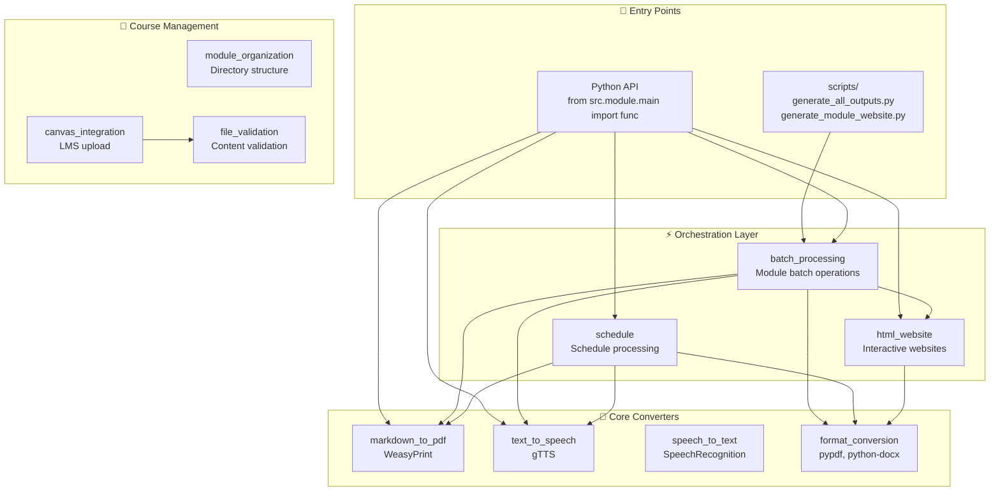
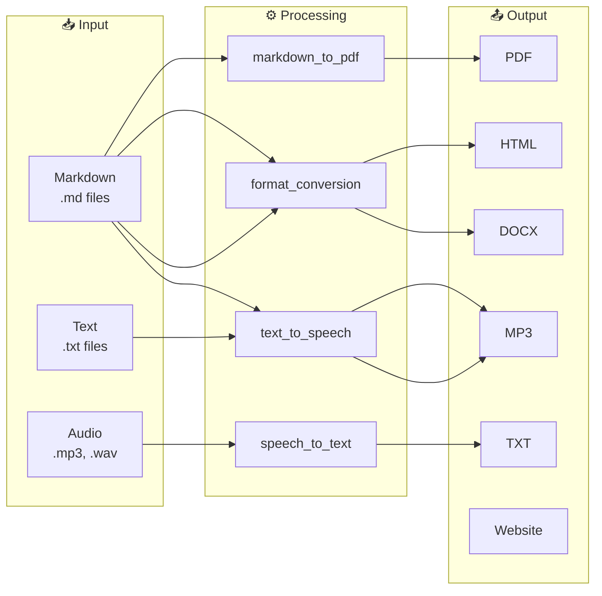
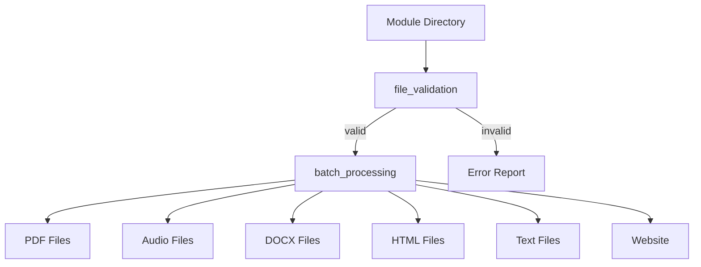
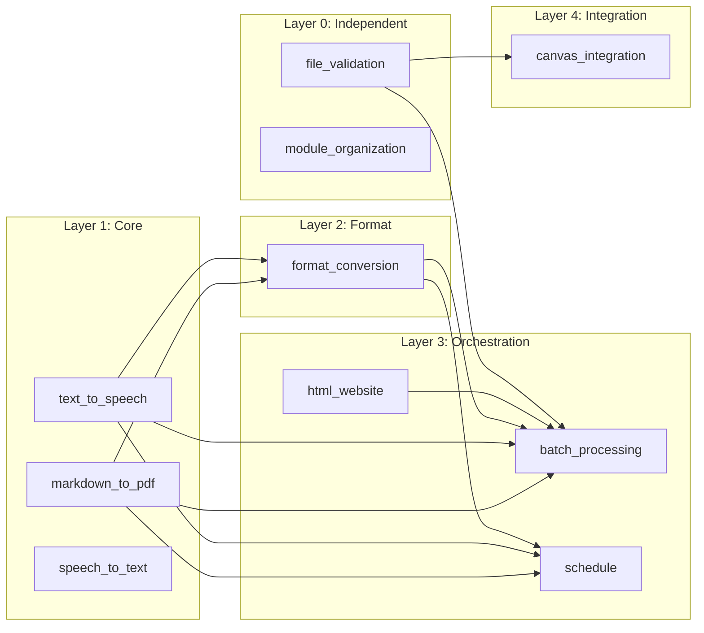

# System Architecture

> **Navigation**: [← README](README.md) | [Orchestration →](ORCHESTRATION.md) | [Quick Start](QUICKSTART.md) | [API Reference](../AGENTS.md)

## Overview

The cr-bio software follows a **modular architecture** with clear separation of concerns. Each module is self-contained with its own `main.py` (public API), `utils.py` (internal utilities), and `config.py` (constants).

---

## 📐 High-Level Architecture



---

## 🔄 Data Flow

### Content Generation Pipeline



### Batch Processing Pipeline



---

## 📦 Module Structure

Every module follows this structure:

```
module_name/
├── __init__.py      # Exports public functions
├── main.py          # Public API (imported by users)
├── utils.py         # Internal helper functions
└── config.py        # Constants and configuration
```

### Layer Definitions

| Layer | Modules | Description |
|-------|---------|-------------|
| **Core** | markdown_to_pdf, text_to_speech, speech_to_text | Single-purpose converters |
| **Format** | format_conversion | Multi-format transformations |
| **Orchestration** | batch_processing, html_website, schedule | Combine multiple converters |
| **Management** | module_organization, file_validation | Course/module structure |
| **Integration** | canvas_integration | External service (Canvas LMS) |

---

## 🔗 Module Dependencies



### Dependency Rules

1. **Core converters** (Layer 1) depend only on external libraries
2. **Format conversion** (Layer 2) uses core converters
3. **Orchestration** (Layer 3) combines any lower layer
4. **Management** (Layer 0) is independent
5. **Integration** (Layer 4) uses validation before external calls

---

## 📁 Repository Structure

```
software/
├── src/                              # Source code (10 modules)
│   ├── __init__.py
│   ├── batch_processing/             # Module batch operations
│   ├── canvas_integration/           # Canvas LMS upload
│   ├── file_validation/              # Content validation
│   ├── format_conversion/            # Format transformations
│   ├── html_website/                 # Interactive websites
│   ├── markdown_to_pdf/              # PDF generation
│   ├── module_organization/          # Directory structure
│   ├── schedule/                     # Schedule processing
│   ├── speech_to_text/               # Audio transcription
│   └── text_to_speech/               # Audio generation
│
├── tests/                            # Test suite (334 tests)
│   ├── conftest.py                   # Shared fixtures
│   ├── test_batch_processing_main.py # 25+ tests
│   ├── test_format_conversion_utils.py # 20+ tests
│   ├── test_schedule_main.py         # 28 tests
│   ├── test_html_website_features.py # 30+ tests
│   └── ...
│
├── scripts/                          # CLI scripts
│   ├── generate_all_outputs.py       # Generate all course outputs
│   ├── generate_module_website.py    # Single module website
│   └── generate_syllabus_renderings.py
│
├── docs/                             # Documentation
│   ├── README.md                     # Overview (start here)
│   ├── ARCHITECTURE.md               # This file
│   ├── ORCHESTRATION.md              # Workflow patterns
│   ├── QUICKSTART.md                 # Installation/setup
│   └── AGENTS.md                     # Documentation standards
│
├── README.md                         # Project overview
├── AGENTS.md                         # API reference
├── pyproject.toml                    # Dependencies and config
└── run_tests.sh                      # Test runner script
```

---

## 🔧 Configuration

### Module Configuration Pattern

Each module has a `config.py`:

```python
# src/batch_processing/config.py
SKIP_DIRECTORIES = ["output", ".git", "__pycache__", "node_modules"]
OUTPUT_DIRECTORIES = {
    "pdf": "pdf",
    "audio": "audio", 
    "text": "text",
}
```

```python
# src/schedule/config.py
SUPPORTED_OUTPUT_FORMATS = ["pdf", "html", "docx", "txt", "mp3"]
SCHEDULE_FILE_PATTERNS = ["Schedule.md", "schedule.md", "*schedule*.md"]
SCHEDULE_COLUMNS = ["Week", "Date", "Topic", "Notes"]
```

### External Dependencies

| Module | External Library | Purpose |
|--------|-----------------|---------|
| markdown_to_pdf | WeasyPrint | PDF rendering |
| text_to_speech | gTTS | Google TTS |
| speech_to_text | SpeechRecognition | Audio transcription |
| format_conversion | python-docx, pypdf | DOCX/PDF handling |
| html_website | markdown2 | HTML conversion |

---

## 🧪 Testing Architecture

Tests are organized to mirror source structure:

| Test File | Module | Test Count |
|-----------|--------|------------|
| test_batch_processing_main.py | batch_processing | 25+ |
| test_format_conversion_utils.py | format_conversion | 20+ |
| test_schedule_main.py | schedule | 28 |
| test_schedule_utils.py | schedule | 26 |
| test_html_website_features.py | html_website | 30+ |
| test_html_website_utils.py | html_website | 28 |

**Coverage Goal**: 100% for all modules

---

## 📖 Related Documentation

| Document | Description |
|----------|-------------|
| [README.md](README.md) | Documentation overview |
| [ORCHESTRATION.md](ORCHESTRATION.md) | Multi-module workflows |
| [QUICKSTART.md](QUICKSTART.md) | Installation and quick commands |
| [../AGENTS.md](../AGENTS.md) | Complete API reference |
| [../tests/README.md](../tests/README.md) | Test suite documentation |
