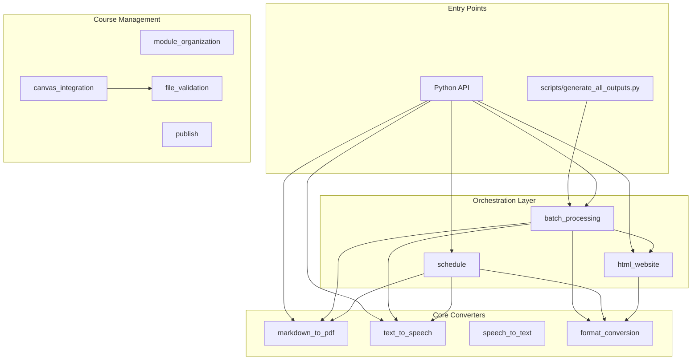
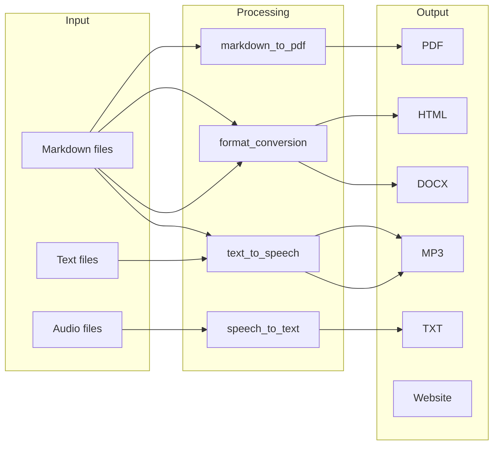
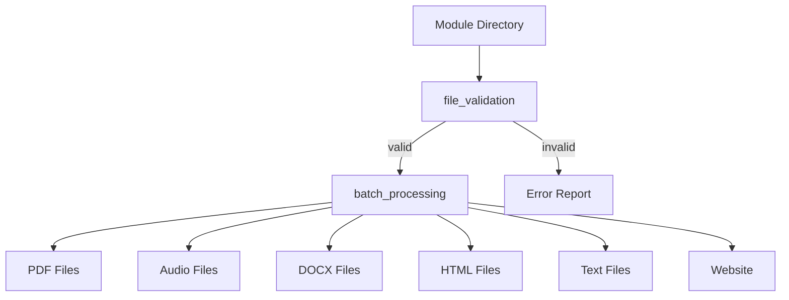
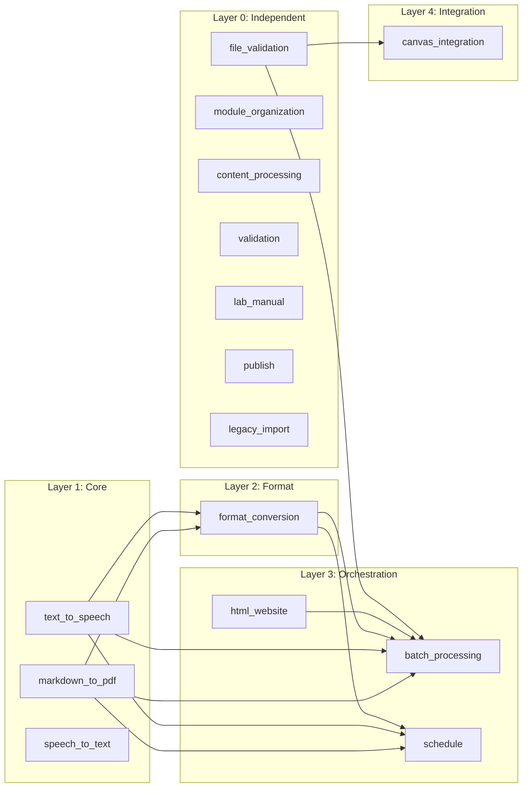

# System Architecture

> **Navigation**: [← README](README.md) | [Orchestration →](ORCHESTRATION.md) | [Quick Start](QUICKSTART.md) | [Standards](AGENTS.md) | [API Reference](../AGENTS.md)

## Overview

The cr-bio software follows a modular architecture with clear separation of concerns. Each module is self-contained with its own `main.py` (public API), `utils.py` (internal utilities), and `config.py` (constants).

This document covers the system design, module layers, document types, and content directory structure. For workflow composition patterns, see [ORCHESTRATION.md](ORCHESTRATION.md).

---

## Modular Design Principles

The architecture is built on five core principles that ensure maximum modularity:

### 1. Self-Contained Modules

Each module contains all the code, configuration, and logic needed to fulfill its purpose. Modules do not rely on internal implementation details of other modules.

- **Public API**: All external access is through `main.py` functions
- **Internal Implementation**: Helper functions and utilities are in `utils.py`
- **Configuration**: Module-specific constants and settings are in `config.py`
- **No Shared State**: Modules do not share mutable state with other modules

### 2. Clear Boundaries

Each module has a well-defined boundary between its public interface and internal implementation.

- **Public Interface**: Functions exported from `main.py` are the only way other modules should interact
- **Internal Implementation**: `utils.py` functions are private to the module
- **Configuration Interface**: `config.py` exposes constants but not implementation details
- **Documentation**: Module boundaries are documented in each module's `AGENTS.md`

### 3. Minimal Dependencies

Modules minimize dependencies on other modules. When dependencies exist, they are explicit and documented.

- **Layer 0 (Independent)**: No dependencies on other modules
- **Layer 1 (Core)**: Depend only on external libraries
- **Layer 2+ (Higher Layers)**: Depend only on lower layers
- **Explicit Dependencies**: All inter-module dependencies are documented in `AGENTS.md`

### 4. Composable Design

Modules can be combined in various ways to create different workflows.

- **Sequential Composition**: Output of one module feeds into another
- **Parallel Composition**: Multiple modules process different inputs simultaneously
- **Conditional Composition**: Modules can be conditionally invoked based on validation or other criteria
- **Orchestration**: Higher-level modules coordinate lower-level modules

### 5. Testable in Isolation

Each module can be tested independently without requiring other modules to be present.

- **Unit Tests**: Test individual module functions in isolation
- **Integration Tests**: Test module interactions explicitly
- **No Hidden Dependencies**: All dependencies are explicit and can be verified
- **Mock-Free Testing**: Tests use real implementations, not mocks

---

## High-Level Architecture


```mermaid
graph TB
    subgraph entryPoints[Entry Points]
        CLI["scripts/generate_all_outputs.py"]
        PY["Python API"]
    end

    subgraph coreConverters[Core Converters]
        M2P["markdown_to_pdf"]
        TTS["text_to_speech"]
        STT["speech_to_text"]
        FC["format_conversion"]
    end

    subgraph orchestration[Orchestration Layer]
        BP["batch_processing"]
        HW["html_website"]
        SCH["schedule"]
    end

    subgraph courseManagement[Course Management]
        MO["module_organization"]
        FV["file_validation"]
        CI["canvas_integration"]
        PUB["publish"]
    end

    CLI --> BP
    PY --> BP
    PY --> M2P
    PY --> TTS
    PY --> SCH
    PY --> HW
    
    BP --> M2P
    BP --> TTS
    BP --> FC
    BP --> HW
    
    SCH --> M2P
    SCH --> TTS
    SCH --> FC
    
    HW --> FC
    
    CI --> FV
```

---

## Data Flow

### Content Generation Pipeline


```mermaid
flowchart LR
    subgraph input[Input]
        MD["Markdown files"]
        TXT["Text files"]
        AUDIO["Audio files"]
    end

    subgraph processing[Processing]
        M2P["markdown_to_pdf"]
        TTS["text_to_speech"]
        STT["speech_to_text"]
        FC["format_conversion"]
    end

    subgraph output[Output]
        PDF["PDF"]
        MP3["MP3"]
        HTML["HTML"]
        DOCX["DOCX"]
        TXTO["TXT"]
        WEB["Website"]
    end

    MD --> M2P --> PDF
    MD --> FC --> HTML
    MD --> FC --> DOCX
    MD --> TTS --> MP3
    TXT --> TTS --> MP3
    AUDIO --> STT --> TXTO
```

### Batch Processing Pipeline


```mermaid
flowchart TD
    INPUT["Module Directory"] --> VALIDATE["file_validation"]
    VALIDATE -->|"valid"| PROCESS["batch_processing"]
    VALIDATE -->|"invalid"| ERRORS["Error Report"]
    
    PROCESS --> PDF["PDF Files"]
    PROCESS --> MP3["Audio Files"]
    PROCESS --> DOCX["DOCX Files"]
    PROCESS --> HTML["HTML Files"]
    PROCESS --> TXT["Text Files"]
    PROCESS --> WEB["Website"]
```

---

## Module Structure

Every module follows this structure:

```
module_name/
├── __init__.py      # Exports public functions
├── main.py          # Public API (imported by users)
├── utils.py         # Internal helper functions
└── config.py        # Constants and configuration
```

### Layer Definitions

| Layer | Modules | Description |
|-------|---------|-------------|
| **Core** | markdown_to_pdf, text_to_speech, speech_to_text, lab_manual | Single-purpose converters |
| **Format** | format_conversion | Multi-format transformations |
| **Orchestration** | batch_processing, html_website, schedule | Combine multiple converters |
| **Management** | module_organization, file_validation, validation | Course/module structure and validation |
| **Integration** | canvas_integration, publish | External services and publishing |

---

## Module Dependencies


```mermaid
graph LR
    subgraph layer0[Layer 0: Independent]
        FV["file_validation"]
        MO["module_organization"]
        CP["content_processing"]
        VAL["validation"]
        LM["lab_manual"]
        PUB["publish"]
        LI["legacy_import"]
    end

    subgraph layer1[Layer 1: Core]
        M2P["markdown_to_pdf"]
        TTS["text_to_speech"]
        STT["speech_to_text"]
    end

    subgraph layer2[Layer 2: Format]
        FC["format_conversion"]
    end

    subgraph layer3[Layer 3: Orchestration]
        BP["batch_processing"]
        HW["html_website"]
        SCH["schedule"]
    end

    subgraph layer4[Layer 4: Integration]
        CI["canvas_integration"]
    end

    M2P --> FC
    TTS --> FC
    
    M2P --> BP
    TTS --> BP
    FC --> BP
    HW --> BP
    
    M2P --> SCH
    TTS --> SCH
    FC --> SCH
    
    FV --> BP
    FV --> CI
```

### Dependency Rules

1. **Core converters** (Layer 1) depend only on external libraries
   - Can be used completely independently
   - No dependencies on other modules
   - Examples: `markdown_to_pdf`, `text_to_speech`, `speech_to_text`

2. **Format conversion** (Layer 2) uses core converters
   - Depends on Layer 1 modules for functionality
   - Can be used independently if Layer 1 modules are available
   - Example: `format_conversion`

3. **Orchestration** (Layer 3) combines any lower layer
   - Composes multiple modules to create workflows
   - Can use any combination of lower-layer modules
   - Examples: `batch_processing`, `html_website`, `schedule`

4. **Management** (Layer 0) is independent
   - No dependencies on other modules
   - Can be used standalone
   - Examples: `module_organization`, `file_validation`

5. **Integration** (Layer 4) uses validation before external calls
   - Depends on validation modules for safety
   - Interfaces with external systems
   - Examples: `canvas_integration`, `publish`

### Using Modules Independently

All modules can be imported and used independently. Even modules that depend on others can be used directly if their dependencies are satisfied:

```python
# Use a core module independently
from src.markdown_to_pdf.main import render_markdown_to_pdf
render_markdown_to_pdf("input.md", "output.pdf")

# Use an orchestration module independently
from src.batch_processing.main import process_module_by_type
process_module_by_type("/path/to/module", "/path/to/output")
```

### Interface Contracts

When modules depend on others, they interact through well-defined interfaces:

- **Function Signatures**: Public functions have documented type hints
- **Return Values**: Consistent return types across modules
- **Error Handling**: Exceptions are documented and predictable
- **Side Effects**: File operations and external calls are explicit

See [Module Independence](#module-independence) for details on standalone usage.

---

## Repository Structure

```text
software/
├── src/                              # Source code (16 packages)
│   ├── __init__.py
│   ├── batch_processing/             # Module batch operations
│   ├── canvas_integration/           # Canvas LMS upload
│   ├── content_processing/           # Question renumbering, text normalize
│   ├── file_validation/              # Content validation
│   ├── format_conversion/            # Format transformations
│   ├── html_website/                 # Interactive websites
│   ├── lab_manual/                   # Rich lab manual rendering
│   ├── legacy_import/                # Legacy import utilities
│   ├── markdown_to_pdf/              # PDF generation
│   ├── module_organization/          # Directory structure
│   ├── publish/                      # Course publishing
│   ├── schedule/                     # Schedule processing
│   ├── shared/                       # Cross-cutting file_utils helpers
│   ├── speech_to_text/               # Audio transcription
│   ├── text_to_speech/               # Audio generation
│   └── validation/                   # Output validation
│
├── tests/                            # Test suite
│   ├── conftest.py                   # Shared fixtures
│   ├── test_batch_processing_main.py # 25+ tests
│   ├── test_format_conversion_utils.py # 20+ tests
│   ├── test_schedule_main.py         # 28 tests
│   ├── test_html_website_features.py # 30+ tests
│   └── ...
│
├── scripts/                          # CLI scripts
│   ├── generate_all_outputs.py       # Generate all course outputs
│   ├── generate_module_website.py    # Single module website
│   └── generate_syllabus_renderings.py
│
├── docs/                             # Documentation
│   ├── README.md                     # Overview (start here)
│   ├── ARCHITECTURE.md               # This file
│   ├── ORCHESTRATION.md              # Workflow patterns
│   ├── QUICKSTART.md                 # Installation/setup
│   └── AGENTS.md                     # Documentation standards
│
├── README.md                         # Project overview
├── AGENTS.md                         # API reference
├── pyproject.toml                    # Dependencies and config
└── run_tests.sh                      # Test runner script
```

---

## Configuration

### Module Configuration Pattern

Each module has a `config.py`:

```python
# src/batch_processing/config.py
SKIP_DIRECTORIES = ["output", ".git", "__pycache__", "node_modules"]
OUTPUT_DIRECTORIES = {
    "pdf": "pdf",
    "audio": "audio", 
    "text": "text",
}
```

```python
# src/schedule/config.py
SUPPORTED_OUTPUT_FORMATS = ["pdf", "html", "docx", "txt", "mp3"]
SCHEDULE_FILE_PATTERNS = ["Schedule.md", "schedule.md", "*schedule*.md"]
SCHEDULE_COLUMNS = ["Week", "Date", "Topic", "Notes"]
```

### External Dependencies

| Module | External Library | Purpose |
|--------|-----------------|---------|
| markdown_to_pdf | WeasyPrint | PDF rendering |
| text_to_speech | gTTS | Google TTS |
| speech_to_text | SpeechRecognition | Audio transcription |
| format_conversion | python-docx, pypdf | DOCX/PDF handling |
| html_website | markdown2 | HTML conversion |

---

## Module Independence

### Standalone Modules

These modules can be used without any other modules:

| Module | Purpose | Standalone Usage |
|--------|---------|------------------|
| `markdown_to_pdf` | Convert Markdown to PDF | Yes - only needs WeasyPrint |
| `text_to_speech` | Generate audio from text | Yes - only needs gTTS |
| `speech_to_text` | Transcribe audio to text | Yes - only needs SpeechRecognition |
| `module_organization` | Create module structures | Yes - no dependencies |
| `file_validation` | Validate module files | Yes - no dependencies |

### Dependent Modules

These modules depend on others but can still be used independently if dependencies are available:

| Module | Dependencies | Independent Usage |
|--------|--------------|-------------------|
| `format_conversion` | Core converters (Layer 1) | Yes - if core modules available |
| `batch_processing` | Multiple core/format modules | Yes - if dependencies available |
| `html_website` | `batch_processing`, `format_conversion` | Yes - if dependencies available |
| `schedule` | Core converters, `format_conversion` | Yes - if dependencies available |
| `canvas_integration` | `file_validation` | Yes - if validation available |
| `publish` | None (file operations only) | Yes - no module dependencies |

### Example: Independent Module Usage

```python
# Example 1: Use markdown_to_pdf independently
from src.markdown_to_pdf.main import render_markdown_to_pdf
render_markdown_to_pdf("lecture.md", "lecture.pdf")

# Example 2: Use text_to_speech independently
from src.text_to_speech.main import generate_speech
generate_speech("Hello world", "output.mp3")

# Example 3: Use file_validation independently
from src.file_validation.main import validate_module_files
result = validate_module_files("/path/to/module")
print(f"Valid: {result['valid']}")

# Example 4: Use format_conversion independently (requires core modules)
from src.format_conversion.main import convert_file
convert_file("input.md", "html", "output.html")
```

### Module Import Patterns

All modules follow consistent import patterns:

```python
# Import main function
from src.module_name.main import primary_function

# Import utility (if needed, though utils are typically internal)
from src.module_name.utils import helper_function

# Access configuration (if needed)
from src.module_name import config
```

See [ORCHESTRATION.md](ORCHESTRATION.md) for examples of composing modules together.

---

## Testing Architecture

Tests are organized to mirror source structure:

| Test File | Module | Test Count |
|-----------|--------|------------|
| test_batch_processing_main.py | batch_processing | 25+ |
| test_format_conversion_utils.py | format_conversion | 20+ |
| test_schedule_main.py | schedule | 28 |
| test_schedule_utils.py | schedule | 26 |
| test_html_website_features.py | html_website | 30+ |
| test_html_website_utils.py | html_website | 28 |

**Coverage Goal**: 100% for all modules

---

## Development Tooling

### Package Management (uv)

[uv](https://github.com/astral-sh/uv) manages dependencies and virtual environments:

```bash
uv sync              # Install all dependencies
uv run pytest        # Run commands in venv
uv lock              # Regenerate uv.lock
uv add <package>     # Add new dependency
```

### Testing (pytest)

Configuration in `pyproject.toml`:

| Setting | Value |
|---------|-------|
| Test path | `tests/` |
| Coverage | `--cov=src --cov-report=html` |
| Markers | `requires_internet`, `requires_api` |

**Commands**:

```bash
uv run pytest                    # All tests
uv run pytest -v tests/          # Verbose
./run_tests.sh                   # macOS wrapper
```

### Coverage Reporting

| File/Directory | Purpose |
|----------------|---------|
| `.coverage` | SQLite database (generated) |
| `htmlcov/` | HTML report directory |

Generate report:

```bash
uv run pytest --cov=src --cov-report=html
open htmlcov/index.html
```

### Code Quality Tools

| Tool | Purpose | Command |
|------|---------|---------|
| **black** | Code formatting | `uv run black src/` |
| **mypy** | Static type checking | `uv run mypy src/` |
| **ruff** | Fast linting | `uv run ruff check src/` |

All tools configured in `pyproject.toml` with:

- Line length: 100
- Target: Python 3.11

---

## Versioning

### Version Locations

The software version is maintained in two synchronized locations:

| Location | Purpose | Format |
|----------|---------|--------|
| `pyproject.toml` | Package metadata (pip/uv) | `version = "0.1.0"` |
| `src/__init__.py` | Runtime access | `__version__ = "0.1.0"` |

### Checking the Version

```python
# From Python
from src import __version__
print(__version__)  # "0.1.0"

# From shell
uv run python -c "from src import __version__; print(__version__)"
```

### Semantic Versioning

The project follows [Semantic Versioning](https://semver.org/) (SemVer):

| Format | When to Increment |
|--------|-------------------|
| `MAJOR.minor.patch` | Breaking API changes |
| `major.MINOR.patch` | New features, backward-compatible |
| `major.minor.PATCH` | Bug fixes, backward-compatible |

**Current Version**: `0.1.0` (pre-release, API may change)

### Module Stability

| Module | API Stability | Since |
|--------|---------------|-------|
| `markdown_to_pdf` | **Stable** | 0.1.0 |
| `text_to_speech` | **Stable** | 0.1.0 |
| `format_conversion` | **Stable** | 0.1.0 |
| `batch_processing` | **Stable** | 0.1.0 |
| `html_website` | **Stable** | 0.1.0 |
| `schedule` | **Stable** | 0.1.0 |
| `lab_manual` | **Stable** | 0.1.0 |
| `module_organization` | **Stable** | 0.1.0 |
| `file_validation` | **Stable** | 0.1.0 |
| `validation` | **Stable** | 0.1.0 |
| `publish` | **Stable** | 0.1.0 |
| `canvas_integration` | Experimental | 0.1.0 |

### Function Signatures

All public API functions are documented with versioned signatures in [../AGENTS.md](../AGENTS.md). Key functions:

```python
# Core Converters (Stable since 0.1.0)
render_markdown_to_pdf(markdown_path: str, output_path: str) -> str
generate_speech(text: str, output_path: str, lang: str = "en") -> str
convert_file(input_path: str, output_path: str) -> str
transcribe_audio(audio_path: str) -> str

# Orchestration (Stable since 0.1.0)  
process_module_by_type(module_path: str, output_dir: str, formats: list[str] = None) -> dict
generate_module_website(module_path: str, output_dir: str) -> str
process_schedule(schedule_path: str, output_dir: str) -> dict

# Course Management (Stable since 0.1.0)
create_module_structure(course_path: str, module_number: int) -> Path
validate_module_files(module_path: str) -> dict
publish_course(course: str, formats: list[str]) -> dict
```

### Dependency Versioning

External dependencies are pinned to minimum versions in `pyproject.toml`:

```toml
dependencies = [
    "markdown>=3.5.0",
    "weasyprint>=60.0",
    "gtts>=2.5.0",
    "pypdf>=4.0.0",
    "python-docx>=1.1.0",
]
```

Exact versions are locked in `uv.lock` for reproducible builds.

### Version History

See [README.md](README.md#version-history) for the complete changelog.

---

## Error Handling Patterns

### Exception Types

Each module raises specific exceptions that can be caught and handled:

| Module | Exception | Cause |
|--------|-----------|-------|
| `markdown_to_pdf` | `OSError` | Missing WeasyPrint dependencies |
| `markdown_to_pdf` | `FileNotFoundError` | Input file not found |
| `text_to_speech` | `gTTSError` | Rate limiting or network issues |
| `format_conversion` | `ValueError` | Unsupported format |
| `file_validation` | Returns `{"valid": False}` | Validation failure (no exception) |
| `batch_processing` | `FileNotFoundError` | Module directory not found |

### Recommended Error Handling

```python
from src.markdown_to_pdf.main import render_markdown_to_pdf
from src.text_to_speech.main import generate_speech
import logging

logger = logging.getLogger(__name__)

def safe_render(markdown_path: str, output_path: str) -> bool:
    """Safely render with logging."""
    try:
        render_markdown_to_pdf(markdown_path, output_path)
        logger.info(f"Generated: {output_path}")
        return True
    except FileNotFoundError:
        logger.error(f"Input not found: {markdown_path}")
        return False
    except OSError as e:
        logger.error(f"WeasyPrint error: {e}")
        return False

def safe_generate_audio(text: str, output_path: str) -> bool:
    """Safely generate audio with retry."""
    import time
    for attempt in range(3):
        try:
            generate_speech(text, output_path)
            logger.info(f"Generated: {output_path}")
            return True
        except Exception as e:
            if "429" in str(e):  # Rate limited
                logger.warning(f"Rate limited, waiting...")
                time.sleep(2 ** attempt)
            else:
                logger.error(f"Audio error: {e}")
                return False
    return False
```

---

## Performance Considerations

### Processing Time Estimates

| Operation | Time per File | Notes |
|-----------|--------------|-------|
| PDF generation | ~0.5-1s | Local, fast |
| HTML conversion | ~0.1s | Local, very fast |
| DOCX conversion | ~0.2s | Local, fast |
| Audio (gTTS) | ~2-5s | Network-bound, slowest |
| Website generation | ~3-5s | Includes bundling |

### Optimization Strategies

```python
# 1. Skip audio for fast iterations
results = process_module_by_type(module_path, output_dir, formats=["pdf", "html"])

# 2. Process single module for testing
uv run python scripts/generate_module_renderings.py --course biol-8 --module 1

# 3. Use validation to skip unchanged files (if implementing caching)
validation = validate_module_files(module_path)
if not validation.get("changed_files"):
    print("No changes detected")
```

### Resource Usage

| Resource | Typical Usage | Peak Usage |
|----------|--------------|------------|
| Memory | ~200 MB | ~500 MB (large PDFs) |
| CPU | Single core | Multi-core (parallel) |
| Network | None (except gTTS) | gTTS: ~50 KB/min audio |
| Disk I/O | Moderate | High during batch ops |

---

## Document Types

### Input → Output Matrix

| Input Type | PDF | DOCX | HTML | TXT | MP3 | Website |
|------------|-----|------|------|-----|-----|---------|
| **Markdown (.md)** | ✅ | ✅ | ✅ | ✅ | ✅ | ✅ |
| **Plain Text (.txt)** | ✅ | - | ✅ | - | ✅ | - |
| **HTML (.html)** | ✅ | - | - | ✅ | - | - |
| **PDF (.pdf)** | - | - | - | ✅ | - | - |
| **Audio (.mp3/.wav/.m4a)** | - | - | - | ✅ | - | - |

### Document Type Catalog

#### Module Content

| Document | Location | BIOL-1 | BIOL-8 | Output Formats | Output Location |
|----------|----------|--------|--------|----------------|-----------------|
| **keys-to-success.md** | `course/module-XX-*/` | 17 | 15 | PDF, DOCX, HTML, TXT, MP3 | `module-XX/output/study-guides/` |
| **questions.md** | `course/module-XX-*/` | 17 | 15 | PDF, DOCX, HTML, TXT, MP3 | `module-XX/output/study-guides/` |

#### Laboratory Protocols

| Property | Value |
|----------|-------|
| **Location** | `course/labs/lab-XX_*.md` |
| **BIOL-1 Count** | 11 complete, 6 stubs |
| **BIOL-8 Count** | 11 complete, 4 stubs |
| **Output Formats** | PDF (fillable), HTML (interactive) |
| **Output Location** | `course/labs/output/` |

**Lab Directives Supported:**

- `{fill:text}` — Single-line input
- `{fill:textarea rows=N}` — Multi-line text area
- `<!-- lab:data-table rows=N -->` — Fillable data table
- `<!-- lab:reflection prompt="Q" -->` — Reflection box
- `<!-- lab:object-selection -->` — Object selection field

See [ORCHESTRATION.md#lab-manual-generation](ORCHESTRATION.md#lab-manual-generation) for generation commands, and [`software/src/lab_manual/README.md`](../src/lab_manual/README.md) for complete documentation.

#### Assessments

| Document | Location | BIOL-1 | BIOL-8 | Format | Published |
|----------|----------|--------|--------|--------|-----------|
| **Exams** (`exam-XX.md` + key) | `course/exams/` | 2 exams + keys on disk (`exam-01`, `exam-03`) | 3 unit exams + keys (`exam-01`–`exam-03`) | Layout varies by file (see live `exam-*.md`) | Teacher-only / local render |
| **Quizzes** (`module-XX_quiz.md` + key) | `course/quizzes/` | Templates only | 17 + 17 keys | 7 MC + 3 FR = 10 pts | Teacher-only |

BIOL-8 unit exam coverage (see course `AGENTS.md`): `exam-01` (modules 01–06), `exam-02` (07–10), `exam-03` (11–15); modules 16–17 and comprehensive final as scheduled. BIOL-1 exam README lists current on-disk exams and planned finals.

#### Syllabus Materials

| Document | Location | Output Formats | Output Location |
|----------|----------|----------------|-----------------|
| **Syllabus.md** | `syllabus/BIOL-X_*.md` | PDF, DOCX, HTML, TXT, MP3 | `syllabus/output/` |
| **Schedule.md** | `syllabus/Schedule.md` | PDF, DOCX, HTML, TXT, MP3 | `syllabus/output/` |

**Note:** Syllabus outputs use a flat structure (files directly in output/, not subdirectories).

#### Slides

| Property | BIOL-1 | BIOL-8 |
|----------|--------|--------|
| **Location** | `resources/slides/module-N-slides-{full,notes}.pdf` | `resources/slides/*.pdf` (topic-titled files); optional PDFs under `course/module-*/resources/` |
| **Count** | 30 PDFs = 15 module numbers × 2 variants (**module 9** has no slide pair in repo) | 15 PDFs under `resources/slides/` as of last inventory |
| **Versions** | `*-full.pdf`, `*-notes.pdf` | Typically one PDF per slide set in `resources/slides/` |

**Note:** Slides are pre-generated PDFs, not dynamically rendered. Re-count files on disk if modules are added.

#### Interactive Website

Per-module single-page interactive HTML website generated by the `html_website` module.

**Website Features:**

- 🗂️ **Sidebar Navigation** — Collapsible sidebar with quick links to all sections
- ↔️ **Resizable Split-View** — Draggable handle to adjust sidebar/content width
- 🌙 **Dark Mode** — Toggle persists via localStorage
- ⬆️ **Back to Top** — Button appears when scrolling
- 📱 **Mobile Responsive** — Works on phones and tablets (with toggleable menu)
- 🖨️ **Print Friendly** — Clean output for printing
- ♿ **Accessibility** — Skip navigation, high contrast mode
- 🎧 **Embedded Audio** — Audio players for each content section
- ✅ **Interactive Quizzes** — MC, T/F, matching, free response with progress tracking

---

## Content Directory Structure

```
course_development/
├── biol-1/
│   ├── course/
│   │   ├── module-01-study-of-life/
│   │   │   ├── keys-to-success.md       # Source
│   │   │   ├── questions.md             # Source
│   │   │   ├── resources/               # Supplementary materials
│   │   │   └── output/
│   │   │       ├── study-guides/        # PDF, DOCX, HTML, TXT, MP3
│   │   │       └── website/             # index.html
│   │   ├── labs/
│   │   │   ├── lab-01_measurement-methods.md
│   │   │   └── output/                  # PDF, HTML
│   │   ├── exams/                       # Teacher-only, rendered locally
│   │   └── quizzes/                     # Templates only
│   ├── syllabus/
│   │   ├── BIOL-1_Spring-2026_Syllabus.md
│   │   ├── Schedule.md
│   │   └── output/                      # PDF, DOCX, HTML, TXT, MP3
│   ├── resources/
│   │   └── slides/                      # 30 PDFs
│   └── private/                         # Facility-specific
│
├── biol-8/
│   ├── course/
│   │   ├── module-01-exploring-life-science/
│   │   │   ├── keys-to-success.md
│   │   │   ├── questions.md
│   │   │   ├── resources/               # Module PDF
│   │   │   └── output/
│   │   │       ├── study-guides/
│   │   │       └── website/
│   │   ├── labs/
│   │   │   ├── lab-01_measurement-methods.md … lab-18_evolution.md
│   │   │   ├── dashboards/
│   │   │   └── output/
│   │   ├── exams/
│   │   │   ├── exam-01.md + exam-01_key.md
│   │   │   ├── exam-02.md + exam-02_key.md
│   │   │   ├── exam-03.md + exam-03_key.md
│   │   │   └── output/                  # PDF, DOCX (teacher-only)
│   │   └── quizzes/
│   │       ├── module-01_quiz.md + module-01_quiz_key.md
│   │       └── ... (17 modules × 2 files)
│   ├── syllabus/
│   ├── resources/
│   │   └── ConceptsofBiology-WEB.pdf    # Textbook
│   └── private/
```

### Module Output Directory

After running generation, each module's output directory contains:

```
module-XX/output/
├── study-guides/       # questions + keys-to-success in each requested format
└── website/            # index.html (interactive module site)
```

### Syllabus Output Directory

```
syllabus/output/
├── BIOL-X_Spring-2026_Syllabus.pdf
├── BIOL-X_Spring-2026_Syllabus.docx
├── BIOL-X_Spring-2026_Syllabus.html
├── BIOL-X_Spring-2026_Syllabus.txt
├── Schedule.pdf
├── Schedule.docx
├── Schedule.html
└── Schedule.txt
```

---

## Related Documentation

| Document | Description |
|----------|-------------|
| [README.md](README.md) | Documentation overview, course parity, configuration |
| [ORCHESTRATION.md](ORCHESTRATION.md) | Multi-module workflows, publish pipeline, lab generation |
| [QUICKSTART.md](QUICKSTART.md) | Installation and quick commands |
| [AGENTS.md](AGENTS.md) | Documentation standards, output format reference |
| [../AGENTS.md](../AGENTS.md) | Complete API reference |
| [../tests/README.md](../tests/README.md) | Test suite documentation |
| [../scripts/README.md](../scripts/README.md) | CLI script documentation |
