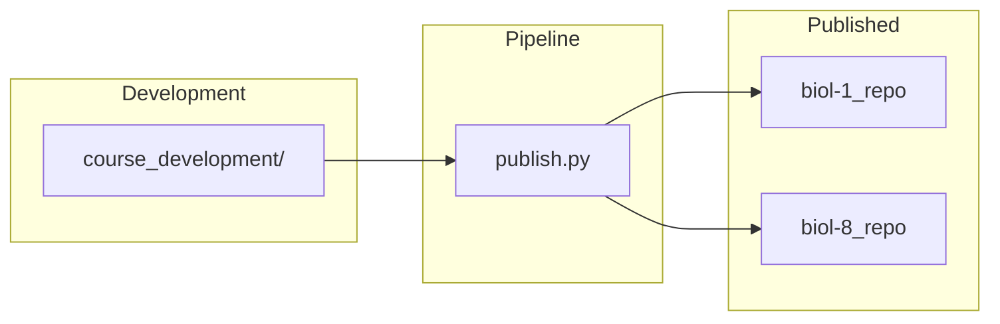

# Course Structure Reference

> **Navigation**: [← README](README.md) | [Lab Format](LAB_FORMAT.md) | [Dashboard Format](DASHBOARD_FORMAT.md) | [Architecture](ARCHITECTURE.md)

Complete reference for the cr-bio course content directory layout, file organization, and the development-to-publication pipeline.

---

## Two-Tier Architecture



| Tier | Repository | Visibility | Contents |
|------|-----------|-----------|----------|
| **Development** | `cr-bio` (this repo) | Private | Source Markdown, software, exams, answer keys |
| **Published** | `biol-1`, `biol-8` | Public | Generated PDF/DOCX/MD study guides plus labs, dashboards, slides, and practice tests |

The pipeline transforms source content into multiple output formats and pushes to the public repositories. Teacher-only materials (exams, answer keys) are **never published**.

---

## Repository Root Structure

```
cr-bio/
├── course_development/            # Active course content
│   └── biol-1/                    # General Biology (Pelican Bay, Fall 2026)
│
├── software/                      # Processing pipeline
│   ├── src/                       # 16 Python packages
│   ├── tests/                     # Pytest suite (run --collect-only for current count)
│   ├── scripts/                   # CLI orchestrators
│   └── docs/                      # Documentation (YOU ARE HERE)
│
├── PUBLISHED/                     # Generated output tracked for subtree publishing
│   └── biol-1/                    # Published BIOL-1 content
│
├── archive/
│   └── spring-2026/               # Historical BIOL-1 and BIOL-8 source + PUBLISHED snapshots
│
├── publish.py                     # Top-level publish script
├── publish.toml                   # Pipeline configuration
└── .cursorrules                   # Real Methods Policy
```

---

## Course Directory Anatomy

Each active course follows this structure:

```
course_development/biol-X/
├── course/                        # Core course content
│   ├── module-01-topic-name/      # Module directories (15-17)
│   ├── labs/                      # Lab protocols & dashboards
│   ├── exams/                     # Teacher-only assessments
│   └── quizzes/                   # Per-module quizzes
│
├── syllabus/                      # Syllabus & schedule
├── resources/                     # Supplementary materials
└── private/                       # Facility-specific content
```

---

## Module Structure

### Naming Convention

```
module-XX-topic-name/
```

Zero-padded two-digit number + kebab-case topic slug.

### Contents

```
module-01-exploring-life-science/
├── keys-to-success.md             # Study guide
├── questions.md                   # Review questions
├── resources/                     # Module-specific resources
│   └── *.pdf                      # Lecture slides, readings
└── output/                        # Generated outputs
    ├── study-guides/              # PDF, DOCX, MD by default; HTML/TXT/MP3 optional
    └── website/                   # index.html (interactive)
```

| File | Purpose | Output Formats |
|------|---------|----------------|
| `keys-to-success.md` | Student study guide | PDF, DOCX, MD by default; HTML/TXT/MP3 optional |
| `questions.md` | Review questions | PDF, DOCX, MD by default; HTML/TXT/MP3 optional |

---

## Lab Structure

Paths below are relative to `course_development/biol-1/`. BIOL-1 has **17** numbered protocols and uses the standard folder layout (`course/labs/`, `course/labs/dashboards/`, `course/labs/output/`). Spring 2026 BIOL-8 examples remain in the archive for reference.

### Source Files

```
course/labs/
├── lab-01_measurement-methods.md
├── lab-02_probability-statistics.md
├── lab-03_microscopy.md
├── lab-04_diffusion-membranes.md
├── lab-05_ph-solutions.md
├── lab-06_central-dogma.md
├── lab-07_cell-division.md
├── lab-08_enzymes.md
├── lab-09_inheritance.md
├── lab-10_review.md
├── lab-11_skeletal-system.md
├── lab-12_muscular-system.md
├── lab-13_nervous-system.md
├── lab-14_microbiology.md
├── lab-14_microbiology-followup.md
├── lab-15_cardiopulmonary-system.md
├── lab-16_exam-03-review.md
├── lab-15_population-systems-ecology.md
├── lab-16_capstone-systems-synthesis.md
├── dashboards/
│   ├── lab-01_measurement-methods-dashboard.html
│   └── …
└── output/
```

### File Naming

| Type | Pattern | Example |
|------|---------|---------|
| **Lab protocol** | `lab-XX_topic-name.md` | `lab-07_cell-division.md` |
| **Dashboard** | `lab-XX_topic-dashboard.html` | `lab-07_cell-division-dashboard.html` |

See [LAB_FORMAT.md](LAB_FORMAT.md) and [DASHBOARD_FORMAT.md](DASHBOARD_FORMAT.md) for authoring guides.

---

## Assessment Structure

### Exams (Teacher-Only)

Common on-disk layout under `course_development/biol-X/course/exams/`:

```
course/exams/
├── exam-NN.md
├── exam-NN_key.md
└── output/                        # Local renders (PDF, DOCX, etc.); never published publicly
```

**BIOL-1:** On-disk unit exams **`exam-01`**, **`exam-02`**, **`exam-03`** (with keys); cumulative **`final-exam.md`** + key; **`exam-template.md`** scaffold. Naming vs unit order is course-specific ([`course/exams/AGENTS.md`](../../course_development/biol-1/course/exams/AGENTS.md)). BIOL-1 `publish.toml` does not set `include_exams` — local renders follow whatever the generation script includes.

**Archived BIOL-8:** Spring 2026 BIOL-8 exams are preserved under [`archive/spring-2026/course_development/biol-8/course/exams/`](../../archive/spring-2026/course_development/biol-8/course/exams/README.md). They are historical reference material and are not an active publish target.

> ⚠️ Exams and answer keys are **never published** to public student-facing repositories.

### Quiz point layouts

Per-quiz totals **vary by file**. BIOL-1 currently ships a quiz template rather than a full per-module quiz set.

### Quizzes (Teacher-Only)

**Archived BIOL-8** — full Spring 2026 per-module quiz set:

```
course/quizzes/
├── module-01_quiz.md
├── module-01_quiz_key.md
├── ...
└── (17 modules × 2 files)
```

**BIOL-1** — `course/quizzes/` is **template-only** (e.g. `quiz-template.md`). Routine practice sits in each module **`questions.md`**, not in parallel `module-NN_quiz` files per module.

---

## Syllabus Structure

```
syllabus/
├── BIOL-X_Spring-2026_Syllabus.md   # Course syllabus
├── Schedule.md                       # Week-by-week schedule
└── output/                           # Flat output (no subdirs)
    ├── BIOL-X_Spring-2026_Syllabus.pdf
    ├── BIOL-X_Spring-2026_Syllabus.docx
    ├── BIOL-X_Spring-2026_Syllabus.html
    ├── Schedule.pdf
    ├── Schedule.docx
    └── Schedule.html
```

> **Note**: Syllabus outputs use a **flat** structure (files directly in `output/`, no subdirectories).

---

## Published directory structure {#published-directory-structure}

After **`publish_all.py`** (steps **7–8**) and root **`publish.py`** aggregation, each `PUBLISHED/biol-1/` tree is **category-first**, not nested `modules/` websites:

```
PUBLISHED/biol-X/
├── homework/           # flattened *questions* study-guide artifacts
├── module_keys/        # flattened *keys-to-success* artifacts
├── labs/               # lab PDF/HTML (and related) copies
├── dashboards/         # lab dashboard HTML
├── slides/             # slide PDF mirrors
├── practice_tests/     # copied practice assessments
├── course/             # syllabus + schedule outputs (merged from published syllabus/)
├── ALL_FILES/          # optional duplicate flat mirror (`publish.toml` pipeline.all_files)
└── …                   # other copies as the publish scripts evolve
```

- Per-module **`index.html`** sites exist under **`course_development/.../module-*/output/website/`** after generation. **`reorganize_to_categories()`** deletes `index.html` from temporary `module-*` folders inside `PUBLISHED/` while building **`homework/`** and **`module_keys/`**, so student-facing repos do **not** retain those interactive bundle files unless the pipeline changes.
- Exact folder set can drift slightly; authoritative behavior is **`software/src/publish/copy_extras.py`** (`reorganize_to_categories`) and **`publish.py`** (`flatten_all_files`).

---

## BIOL-1 vs Archived BIOL-8 Differences

| Feature | BIOL-1 | BIOL-8 |
|---------|--------|--------|
| **Setting** | Pelican Bay | CR Del Norte Campus |
| **Content modules (`module-*`)** | 15 | 17 |
| **Slides** | Central `resources/slides/` (numbered `module-N-*` pairs; modules **12**, **13**, and **15** are documented gaps) | Central `resources/slides/` (+ optional PDFs under `module-*/resources/`) |
| **Labs (+ dashboards)** | 17 protocols + dashboards | 18 protocols + dashboards |
| **Exams (on disk)** | Unit `exam-01`–`exam-03`, cumulative `final-exam`, keys (+ template) | `exam-01`–`exam-03`, `final-exam`, keys |
| **Quizzes (`course/quizzes/`)** | Template(s) only | 17 × 2 (student + key) |
| **Practice tests** | 5 + keys | 12 + keys (archived snapshot; verify before reuse) |
| **Private directory** | Includes facility-specific material | Standard private layout |

---

## Related Documentation

| Document | Description |
|----------|-------------|
| [README.md](README.md) | Course parity + config index |
| [DASHBOARD_FORMAT.md](DASHBOARD_FORMAT.md) | Dashboard format guide |
| [ARCHITECTURE.md](ARCHITECTURE.md) | Software architecture |
| [ORCHESTRATION.md](ORCHESTRATION.md#the-publish-pipeline) | Canonical `publish_all.py` steps and root `publish.py` behavior |
| [QUICKSTART.md](QUICKSTART.md) | Setup and quick commands |
