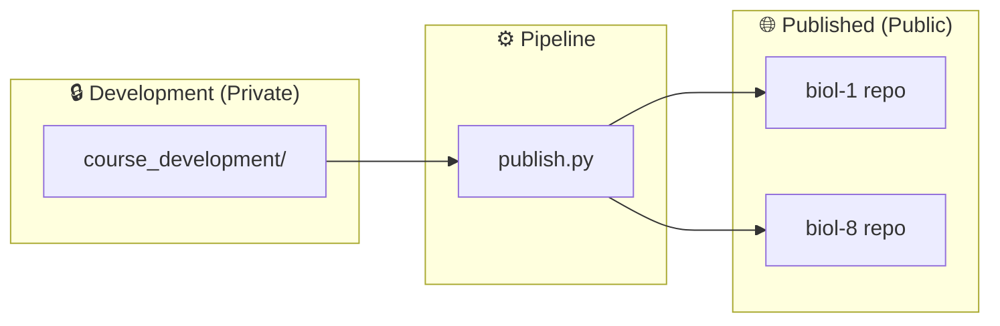

# Course Structure Reference

> **Navigation**: [← README](README.md) | [Lab Format](LAB_FORMAT.md) | [Dashboard Format](DASHBOARD_FORMAT.md) | [Architecture](ARCHITECTURE.md)

Complete reference for the cr-bio course content directory layout, file organization, and the development-to-publication pipeline.

---

## Two-Tier Architecture



| Tier | Repository | Visibility | Contents |
|------|-----------|-----------|----------|
| **Development** | `cr-bio` (this repo) | Private | Source Markdown, software, exams, answer keys |
| **Published** | `biol-1`, `biol-8` | Public | Generated PDFs, DOCX, HTML, MP3, websites |

The pipeline transforms source content into multiple output formats and pushes to the public repositories. Teacher-only materials (exams, answer keys) are **never published**.

---

## Repository Root Structure

```
cr-bio/
├── course_development/            # All course content
│   ├── biol-1/                    # General Biology (Pelican Bay)
│   └── biol-8/                    # Human Biology (College of the Redwoods)
│
├── software/                      # Processing pipeline
│   ├── src/                       # 15 source modules
│   ├── tests/                     # Test suite (614+ tests)
│   ├── scripts/                   # CLI orchestrators
│   └── docs/                      # Documentation (YOU ARE HERE)
│
├── PUBLISHED/                     # Generated output (gitignored)
│   ├── biol-1/                    # Published BIOL-1 content
│   └── biol-8/                    # Published BIOL-8 content
│
├── publish.py                     # Top-level publish script
├── publish.toml                   # Pipeline configuration
└── .cursorrules                   # Real Methods Policy
```

---

## Course Directory Anatomy

Each course follows an identical structure:

```
course_development/biol-X/
├── course/                        # Core course content
│   ├── module-01-topic-name/      # Module directories (15-17)
│   ├── labs/                      # Lab protocols & dashboards
│   ├── exams/                     # Teacher-only assessments
│   └── quizzes/                   # Per-module quizzes
│
├── syllabus/                      # Syllabus & schedule
├── resources/                     # Supplementary materials
└── private/                       # Facility-specific content
```

---

## Module Structure

### Naming Convention

```
module-XX-topic-name/
```

Zero-padded two-digit number + kebab-case topic slug.

### Contents

```
module-01-exploring-life-science/
├── keys-to-success.md             # Study guide
├── questions.md                   # Review questions
├── resources/                     # Module-specific resources
│   └── *.pdf                      # Lecture slides, readings
└── output/                        # Generated outputs
    ├── study-guides/              # PDF, DOCX, HTML, TXT, MP3
    └── website/                   # index.html (interactive)
```

| File | Purpose | Output Formats |
|------|---------|----------------|
| `keys-to-success.md` | Student study guide | PDF, DOCX, HTML, TXT, MP3 |
| `questions.md` | Review questions | PDF, DOCX, HTML, TXT, MP3 |

---

## Lab Structure

### Source Files

```
course/labs/
├── lab-01_measurement-methods.md
├── lab-02_probability-statistics.md
├── lab-03_microscopy.md
├── lab-04_diffusion-membranes.md
├── lab-05_ph-solutions.md
├── lab-06_central-dogma.md
├── lab-07_cell-division.md
├── lab-08_inheritance.md
├── lab-09_enzymes.md
├── lab-10_tissues.md
├── lab-11_skeletal-system.md
├── lab-12_muscular-system.md
├── lab-13_nervous-system.md
├── lab-14_microbiology.md
├── lab-15_cardiopulmonary.md
├── lab-16_exam-03-review.md
├── dashboards/                    # Interactive HTML dashboards
│   ├── lab-01_measurement-methods-dashboard.html
│   ├── ...
│   └── lab-16_exam-03-review-dashboard.html
└── output/                        # Generated PDFs and HTML
```

### File Naming

| Type | Pattern | Example |
|------|---------|---------|
| **Lab protocol** | `lab-XX_topic-name.md` | `lab-07_cell-division.md` |
| **Dashboard** | `lab-XX_topic-dashboard.html` | `lab-07_cell-division-dashboard.html` |

See [LAB_FORMAT.md](LAB_FORMAT.md) and [DASHBOARD_FORMAT.md](DASHBOARD_FORMAT.md) for authoring guides.

---

## Assessment Structure

### Exams (Teacher-Only)

```
course/exams/
├── exam-01.md                     # Modules 01-07
├── exam-01_key.md                 # Answer key
├── exam-02.md                     # Modules 08-11
├── exam-02_key.md
├── exam-03.md                     # Modules 12-15
├── exam-03_key.md
├── final-exam.md                  # Comprehensive (150 pts)
├── final-exam_key.md
└── output/                        # Local PDF/DOCX only
```

> ⚠️ Exams and answer keys are **never published** to public repositories.

### Exam Point Structure

| Component | Points | Count |
|-----------|--------|-------|
| Multiple Choice | 50 | 50 questions × 1 pt |
| Short Answer | 30 | 10 questions × 3 pts |
| Essay | 20 | 2 questions × 10 pts |
| **Total** | **100** | per exam |

Final exam: 150 points (comprehensive).

### Quizzes (Teacher-Only)

```
course/quizzes/
├── module-01_quiz.md
├── module-01_quiz_key.md
├── module-02_quiz.md
├── module-02_quiz_key.md
└── ... (15 modules)
```

| Component | Points | Count |
|-----------|--------|-------|
| Multiple Choice | 7 | 7 × 1 pt |
| Free Response | 3 | 1 × 3 pts |
| **Total** | **10** | per quiz |

---

## Syllabus Structure

```
syllabus/
├── BIOL-X_Spring-2026_Syllabus.md   # Course syllabus
├── Schedule.md                       # Week-by-week schedule
└── output/                           # Flat output (no subdirs)
    ├── BIOL-X_Spring-2026_Syllabus.pdf
    ├── BIOL-X_Spring-2026_Syllabus.docx
    ├── BIOL-X_Spring-2026_Syllabus.html
    ├── Schedule.pdf
    ├── Schedule.docx
    └── Schedule.html
```

> **Note**: Syllabus outputs use a **flat** structure (files directly in `output/`, no subdirectories).

---

## Published Directory Structure

After the publish pipeline runs, the `PUBLISHED/` directory contains:

```
PUBLISHED/
├── biol-1/
│   ├── modules/                   # Study guides and questions
│   │   ├── module-01/
│   │   │   ├── keys-to-success.pdf
│   │   │   ├── keys-to-success.docx
│   │   │   ├── questions.pdf
│   │   │   └── questions.docx
│   │   └── ...
│   ├── labs/                      # Lab protocols
│   ├── syllabus/                  # Syllabus and schedule
│   ├── slides/                    # Lecture slides
│   └── websites/                  # Interactive websites
│
└── biol-8/
    ├── modules/
    ├── labs/
    ├── syllabus/
    ├── slides/
    └── websites/
```

The `flatten` pipeline stage reorganizes outputs into these categories.

---

## BIOL-1 vs BIOL-8 Differences

| Feature | BIOL-1 | BIOL-8 |
|---------|--------|--------|
| **Setting** | Pelican Bay Prison | CR Del Norte Campus |
| **Modules** | 17 | 15 |
| **Slide format** | 2 versions per module (full + notes) | 1 per module |
| **Slide location** | `resources/slides/` | `course/module-XX/resources/` |
| **Labs complete** | 11 | 11 |
| **Exams** | Templates only | 4 complete + keys |
| **Quizzes** | Templates only | 15 complete + keys |
| **Dashboards** | None | 17 |
| **Private directory** | Facility-specific docs | Standard |

---

## Related Documentation

| Document | Description |
|----------|-------------|
| [LAB_FORMAT.md](LAB_FORMAT.md) | Lab protocol authoring guide |
| [DASHBOARD_FORMAT.md](DASHBOARD_FORMAT.md) | Dashboard format guide |
| [ARCHITECTURE.md](ARCHITECTURE.md) | Software architecture |
| [ORCHESTRATION.md](ORCHESTRATION.md) | Pipeline workflows |
| [QUICKSTART.md](QUICKSTART.md) | Setup and quick commands |
