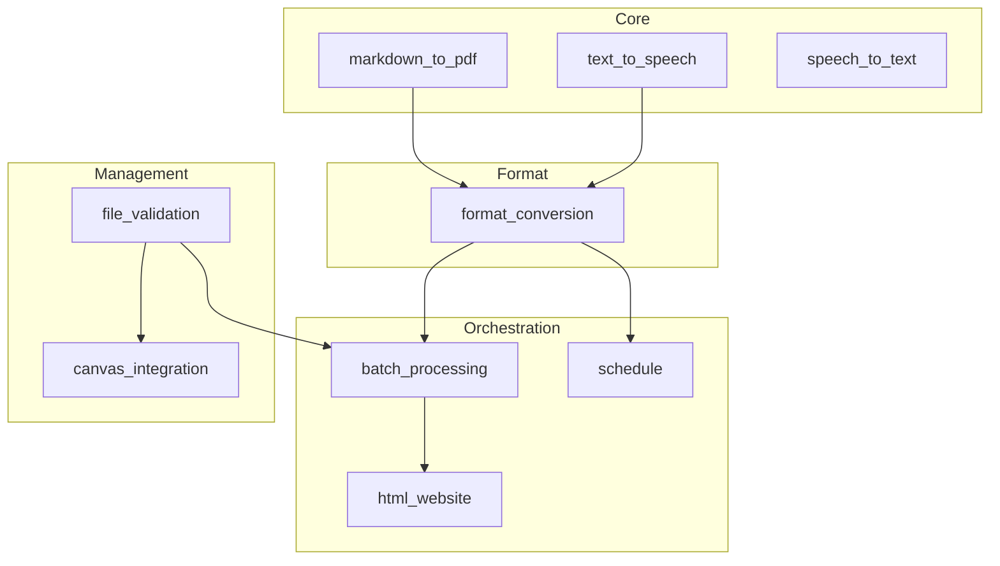

# Module Orchestration Guide

> **Navigation**: [← Quick Start](QUICKSTART.md) | [README](README.md) | [Architecture](ARCHITECTURE.md) | [API Reference](../AGENTS.md)

This guide demonstrates how to combine multiple modules for complex workflows.

---

## 🎯 Orchestration Patterns

### 1. Complete Module Lifecycle

Create, validate, and generate all outputs for a module:

```python
from src.module_organization.main import create_module_structure
from src.file_validation.main import validate_module_files
from src.batch_processing.main import generate_module_media, process_module_by_type
from src.html_website.main import generate_module_website

# Step 1: Create module structure
module_path = create_module_structure(
    course_path="/path/to/biol-8",
    module_number=4
)
print(f"Created: {module_path}")

# Step 2: Add content files manually or programmatically
# ...

# Step 3: Validate module structure
validation = validate_module_files(module_path)
if not validation["valid"]:
    print(f"Validation errors: {validation['errors']}")
    raise ValueError("Module validation failed")

# Step 4: Generate all format outputs
results = process_module_by_type(module_path, f"{module_path}/output")
print(f"Generated: {results['summary']}")

# Step 5: Generate interactive website
website = generate_module_website(module_path, f"{module_path}/output/website")
print(f"Website: {website}")
```

---

### 2. Format Conversion Chain

Convert a single Markdown file to multiple formats:

```python
from src.markdown_to_pdf.main import render_markdown_to_pdf
from src.format_conversion.main import convert_file
from src.text_to_speech.main import generate_speech
from src.text_to_speech.utils import extract_text_from_markdown
from pathlib import Path

input_file = "/path/to/content.md"
output_dir = "/path/to/output"

# Markdown → PDF
render_markdown_to_pdf(input_file, f"{output_dir}/content.pdf")

# Markdown → HTML
convert_file(input_file, "html", f"{output_dir}/content.html")

# Markdown → DOCX
convert_file(input_file, "docx", f"{output_dir}/content.docx")

# Markdown → Plain Text
content = Path(input_file).read_text()
text = extract_text_from_markdown(content)
Path(f"{output_dir}/content.txt").write_text(text)

# Text → Audio (MP3)
generate_speech(text, f"{output_dir}/content.mp3")

print(f"Generated 5 files in {output_dir}")
```

---

### 3. Schedule Processing Pipeline {#3-schedule-processing-pipeline-schedule-processing-pipeline}

Process schedule files into multiple formats:

```python
from src.schedule.main import process_schedule, batch_process_schedules

# Single schedule file → all formats
results = process_schedule(
    schedule_path="/path/to/biol-8/syllabus/Schedule.md",
    output_dir="/path/to/biol-8/syllabus/output",
    formats=["pdf", "html", "docx", "txt", "mp3"]
)

print(f"Generated files:")
for fmt, count in results["summary"].items():
    print(f"  {fmt}: {count}")

if results["errors"]:
    print(f"Errors: {results['errors']}")

# Batch process all schedules in a directory
batch_results = batch_process_schedules(
    directory="/path/to/all-schedules",
    output_dir="/path/to/output",
    formats=["pdf", "html"]
)

print(f"Processed {len(batch_results['processed_files'])} schedule files")
```

---

### 4. HTML Website Generation {#4-html-website-generation-html-website-generation}

Generate interactive HTML websites with embedded audio and quizzes:

```python
from src.html_website.main import generate_module_website
from src.batch_processing.main import process_module_by_type

module_path = "/path/to/biol-8/course/module-1"

# Step 1: Generate all format outputs (including audio)
results = process_module_by_type(
    module_path,
    output_dir=f"{module_path}/output"
)
print(f"Generated: {sum(results['summary'].values())} files")

# Step 2: Generate website with embedded content
website_path = generate_module_website(
    module_path,
    output_dir=f"{module_path}/output/website",
    course_name="BIOL-8"
)
print(f"Website: {website_path}")

# Website includes:
# - Dark mode toggle
# - Collapsible sections
# - Embedded audio players
# - Interactive quizzes (from questions/ folder)
# - Mobile responsive design
```

---

### 5. Validation-Driven Processing

Only process modules that pass validation:

```python
from src.file_validation.main import validate_module_files
from src.batch_processing.main import process_module_by_type
from pathlib import Path

course_path = Path("/path/to/biol-8/course")
results = {"processed": [], "skipped": [], "errors": []}

for module_path in sorted(course_path.glob("module-*")):
    # Validate first
    validation = validate_module_files(str(module_path))
    
    if validation["valid"]:
        try:
            output = process_module_by_type(
                str(module_path),
                f"{module_path}/output"
            )
            results["processed"].append(module_path.name)
            print(f"✓ {module_path.name}: {sum(output['summary'].values())} files")
        except Exception as e:
            results["errors"].append((module_path.name, str(e)))
            print(f"✗ {module_path.name}: {e}")
    else:
        results["skipped"].append((module_path.name, validation.get("errors", [])))
        print(f"⊘ {module_path.name}: Skipped (validation failed)")

print(f"\nSummary: {len(results['processed'])} processed, {len(results['skipped'])} skipped")
```

---

### 6. Text-to-Speech Round Trip

Generate audio and transcribe back for verification:

```python
from src.text_to_speech.main import generate_speech
from src.speech_to_text.main import transcribe_audio
import tempfile
from pathlib import Path

original_text = "This is a sample lecture about cell biology."

# Generate audio
with tempfile.TemporaryDirectory() as tmpdir:
    audio_file = Path(tmpdir) / "lecture.mp3"
    text_file = Path(tmpdir) / "transcription.txt"
    
    # Text → Audio
    generate_speech(original_text, str(audio_file))
    print(f"Audio generated: {audio_file.stat().st_size} bytes")
    
    # Audio → Text
    transcribed = transcribe_audio(str(audio_file), str(text_file))
    print(f"Transcribed: {transcribed}")
    
    # Compare
    print(f"\nOriginal:    {original_text}")
    print(f"Transcribed: {text_file.read_text()}")
```

---

### 7. Course-Wide Generation

Generate outputs for an entire course:

```python
from pathlib import Path
from src.batch_processing.main import (
    process_module_by_type,
    process_syllabus,
    clear_all_outputs
)
from src.html_website.main import generate_module_website

course_path = Path("/path/to/biol-8")

# Step 1: Clear existing outputs
clear_results = clear_all_outputs(course_path)
print(f"Cleared {clear_results['total_files_removed']} files")

# Step 2: Process all modules
for module_path in sorted((course_path / "course").glob("module-*")):
    output_dir = module_path / "output"
    
    # Generate all formats
    results = process_module_by_type(str(module_path), str(output_dir))
    print(f"{module_path.name}: {sum(results['summary'].values())} files")
    
    # Generate website
    generate_module_website(str(module_path), str(output_dir / "website"))

# Step 3: Process syllabus
syllabus_path = course_path / "syllabus"
if syllabus_path.exists():
    results = process_syllabus(str(syllabus_path), str(syllabus_path / "output"))
    print(f"Syllabus: {sum(results['summary'].values())} files")
```

---

## 💡 Best Practices

### Error Handling Pattern

```python
def safe_process_module(module_path: str, output_dir: str) -> dict:
    """Process module with comprehensive error handling."""
    try:
        results = process_module_by_type(module_path, output_dir)
        return {
            "success": True,
            "results": results,
            "errors": results.get("errors", [])
        }
    except FileNotFoundError as e:
        return {"success": False, "error": f"Path not found: {e}"}
    except ValueError as e:
        return {"success": False, "error": f"Invalid input: {e}"}
    except Exception as e:
        return {"success": False, "error": f"Unexpected error: {e}"}
```

### Validate-First Pattern

```python
def process_with_validation(module_path: str, output_dir: str) -> dict:
    """Always validate before processing."""
    from src.file_validation.main import validate_module_files
    
    validation = validate_module_files(module_path)
    if not validation["valid"]:
        return {
            "success": False,
            "validation_errors": validation.get("errors", []),
            "missing_files": validation.get("missing_files", [])
        }
    
    return safe_process_module(module_path, output_dir)
```

### Progress Reporting Pattern

```python
def process_with_progress(course_path: str) -> None:
    """Process course with progress updates."""
    from pathlib import Path
    
    modules = list(Path(course_path).glob("course/module-*"))
    total = len(modules)
    
    for i, module in enumerate(sorted(modules), 1):
        print(f"[{i}/{total}] Processing {module.name}...")
        result = safe_process_module(str(module), f"{module}/output")
        status = "✓" if result["success"] else "✗"
        print(f"  {status} {result.get('error', 'Complete')}")
```

---

## 🔗 Module Dependency Graph



---

## 🔧 Troubleshooting

| Issue | Cause | Solution |
|-------|-------|----------|
| PDF generation fails | Missing WeasyPrint deps | `brew install cairo pango gdk-pixbuf glib` |
| Audio generation fails | gTTS rate limit | Wait a few minutes, process smaller batches |
| Module not found | Wrong directory | Run from `software/` directory |
| Validation errors | Missing files | Check required files in module structure |
| Website missing audio | Audio not generated first | Run `process_module_by_type` before `generate_module_website` |

---

## 📖 Related Documentation

| Document | Description |
|----------|-------------|
| [QUICKSTART.md](QUICKSTART.md) | Basic setup and commands |
| [ARCHITECTURE.md](ARCHITECTURE.md) | System design diagrams |
| [../AGENTS.md](../AGENTS.md) | Complete API reference |
| [../tests/README.md](../tests/README.md) | Test suite documentation |
