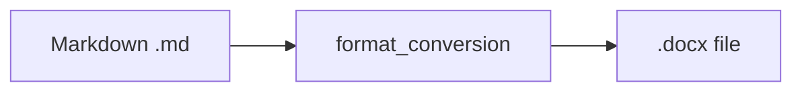

# Output Format: DOCX

> **Navigation**: [README](README.md) | [Orchestration](ORCHESTRATION.md) | [PDF](OUTPUT_PDF.md) | [DOCX](OUTPUT_DOCX.md) | [HTML](OUTPUT_HTML.md) | [Audio](OUTPUT_AUDIO.md)

Detailed specification for Microsoft Word (DOCX) output generated by the cr-bio pipeline.

---

## Overview

| Property | Value |
|----------|-------|
| **Extension** | `.docx` |
| **Generator Module** | `format_conversion` |
| **Key Dependency** | `python-docx >= 1.1.0` |
| **Requires Internet** | No |

---

## Generation Pipeline



The `convert_file()` function handles Markdown → DOCX conversion using the `python-docx` library.

---

## Usage

### Python API

```python
from src.format_conversion.main import convert_file

convert_file("input.md", "docx", "output.docx")
```

### CLI

```bash
cd software && uv run python -c "
from src.format_conversion.main import convert_file
convert_file('input.md', 'docx', 'output.docx')
"
```

### Pipeline Configuration

In `publish.toml`:

```toml
[publish.formats]
docx = true  # Enabled by default
```

---

## Formatting Preservation

| Markdown Feature | DOCX Rendering |
|-----------------|----------------|
| `# Heading` | Heading 1 |
| `## Heading` | Heading 2 |
| `**bold**` | Bold |
| `*italic*` | Italic |
| `- list item` | Bulleted list |
| `1. item` | Numbered list |
| `[link](url)` | Hyperlink |
| Simple tables | Table |

## Known Limitations

| Limitation | Impact | Workaround |
|-----------|--------|------------|
| Complex Markdown tables | May lose structure/alignment | Simplify table markup |
| Inline HTML | Not rendered | Use standard Markdown |
| Code blocks | Basic formatting only | Minimal syntax highlighting |
| Images | Relative paths may not resolve | Use absolute paths |
| Lab directives | Not processed | Use `lab_manual` module for lab content |

---

## Use Cases

| Use Case | Why DOCX |
|----------|----------|
| **Student handouts** | Editable by students in Word/Google Docs |
| **Accessibility** | Screen readers work well with DOCX |
| **Institutional submission** | Many institutions require Word format |
| **Content editing** | Instructors can modify before distributing |

---

## Output Structure

```
module-XX/output/
└── study-guides/
    ├── keys-to-success.docx   ← Word version
    ├── keys-to-success.md     ← Normalized Markdown when md enabled
    ├── questions.docx
    └── questions.md
```

> `.md` study-guide mirrors are gated by `[publish.formats].md`; see [OUTPUT_HTML.md#normalized-markdown-study-guides-not-html](OUTPUT_HTML.md#normalized-markdown-study-guides-not-html).

---

## Related Documentation

| Document | Description |
|----------|-------------|
| [README.md](README.md) | Documentation index and course parity |
| [ORCHESTRATION.md](ORCHESTRATION.md) | Batch generation and publish pipeline |
| [ARCHITECTURE.md](ARCHITECTURE.md) | System architecture |
| [OUTPUT_PDF.md](OUTPUT_PDF.md) | PDF output |
| [OUTPUT_HTML.md](OUTPUT_HTML.md) | HTML, websites, labs, dashboards, MD copies |
| [OUTPUT_AUDIO.md](OUTPUT_AUDIO.md) | MP3 output |
| [QUICKSTART.md](QUICKSTART.md) | Environment setup |
