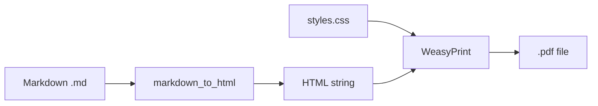

# Output Format: PDF

> **Navigation**: [← README](README.md) | [Audio](OUTPUT_AUDIO.md) | [DOCX](OUTPUT_DOCX.md) | [HTML](OUTPUT_HTML.md)

Detailed specification for PDF output generated by the cr-bio pipeline.

---

## Overview

| Property | Value |
|----------|-------|
| **Extension** | `.pdf` |
| **Generator Module** | `markdown_to_pdf` (via WeasyPrint) |
| **Lab PDF Generator** | `lab_manual` (via WeasyPrint) |
| **Key Dependency** | `weasyprint >= 60.0` |
| **System Dependencies** | `cairo`, `pango`, `gdk-pixbuf`, `glib` |

---

## Generation Pipeline



### Standard PDF (Study Guides, Questions)

Generated by `markdown_to_pdf.main.render_markdown_to_pdf()`:

1. Markdown → HTML via the `markdown` library
2. Custom CSS applied from `src/markdown_to_pdf/styles.css`
3. HTML + CSS → PDF via WeasyPrint's `HTML.write_pdf()`

### Lab PDF (Fillable Worksheets)

Generated by `lab_manual.main.render_lab_manual()`:

1. Lab directives parsed and expanded to HTML (data tables, reflection boxes, etc.)
2. `{fill:text}` and `{fill:textarea}` expanded to styled input fields
3. Lab header (name, date, course) prepended
4. Custom lab CSS from `src/lab_manual/config.py` applied
5. HTML + CSS → PDF via WeasyPrint

---

## Styling

### Standard PDF CSS

Located at `src/markdown_to_pdf/styles.css`. Features:

- Letter-size pages (8.5" × 11")
- 0.75" margins on all sides
- Clean serif body font
- Bold accent headers
- Styled tables with alternating row colors

### Lab PDF CSS

Defined in `src/lab_manual/config.py` as `LAB_MANUAL_CSS`. Features:

- Black/white/gray with red accents (`#c41e3a`)
- Fillable input fields with underlines
- Data tables with numbered rows
- Reflection/calculation boxes with left-border accents
- Print-optimized: fills become white for pen writing

---

## Inline HTML Support

WeasyPrint renders inline HTML and CSS in Markdown files. This enables:

- Styled chromosome cutouts with colored borders
- Grid layouts for manipulatives
- Custom page breaks (`page-break-before: always`)
- Colored text and backgrounds

> **Important**: Use inline `style` attributes only. External stylesheets referenced in Markdown HTML are not loaded.

See [LAB_FORMAT.md#inline-html](LAB_FORMAT.md#inline-html-for-special-rendering) for examples.

---

## Print Settings

```python
DEFAULT_PDF_OPTIONS = {
    "page_size": "letter",
    "margin_top": "0.75in",
    "margin_bottom": "0.75in",
    "margin_left": "0.75in",
    "margin_right": "0.75in",
}
```

---

## Quick Commands

```bash
# Single file
cd software && uv run python -c "
from src.markdown_to_pdf.main import render_markdown_to_pdf
render_markdown_to_pdf('input.md', 'output.pdf')
"

# Lab manual
cd software && uv run python -c "
from src.lab_manual.main import render_lab_manual
render_lab_manual('lab-01.md', 'lab-01.pdf', output_format='pdf')
"
```

---

## Troubleshooting

| Problem | Cause | Solution |
|---------|-------|----------|
| `OSError: cannot load library 'pangocairo'` | Missing system deps | `brew install cairo pango gdk-pixbuf glib` |
| Blank pages | Empty Markdown sections | Check for content in source file |
| `WARNING:weasyprint:Ignored property` | Unsupported CSS | Cosmetic only — output is correct |
| Images not rendering | Relative path issues | Use absolute paths in Markdown |

### macOS Library Path

```bash
export DYLD_LIBRARY_PATH="/opt/homebrew/lib:$DYLD_LIBRARY_PATH"
```

---

## Related Documentation

| Document | Description |
|----------|-------------|
| [LAB_FORMAT.md](LAB_FORMAT.md) | Lab protocol authoring guide |
| [OUTPUT_HTML.md](OUTPUT_HTML.md) | HTML output format |
| [QUICKSTART.md](QUICKSTART.md) | Installation and setup |
| [ARCHITECTURE.md](ARCHITECTURE.md) | System architecture |
