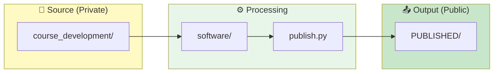

# Software Documentation

> **Quick Navigation**: [Quick Start](QUICKSTART.md) | [Architecture](ARCHITECTURE.md) | [Orchestration](ORCHESTRATION.md) | [Standards](AGENTS.md) | [API Reference](../AGENTS.md)

## Overview

CR-BIO is an automated curriculum management system for Biology courses at College of the Redwoods. It transforms Markdown source files into multiple output formats (PDF, MP3, HTML, DOCX, TXT) and interactive websites for two courses:

- **BIOL-1**: General Biology (17 modules) — Pelican Bay Prison
- **BIOL-8**: Human Anatomy & Physiology (15 modules) — College of the Redwoods



---

## Project Statistics

| Metric | Value | Last Updated |
|--------|-------|--------------|
| **Total Tests** | 609 passed, 6 skipped | 2026-02-03 |
| **Modules** | 15 source modules | 2026-02-03 |
| **Code Coverage** | 81% overall | 2026-02-03 |

### Supported Courses

- **BIOL-1**: 17 modules (Spring 2026)
- **BIOL-8**: 15 modules (Spring 2026)

---

## Documentation Guide

### By Audience

| If you are a... | Start with... | Then explore... |
|-----------------|---------------|-----------------|
| **New User** | [QUICKSTART.md](QUICKSTART.md) | [ORCHESTRATION.md](ORCHESTRATION.md) |
| **Content Author** | [../../CONTRIBUTING.md](../../CONTRIBUTING.md) | [ARCHITECTURE.md](ARCHITECTURE.md) |
| **Developer** | [ARCHITECTURE.md](ARCHITECTURE.md) | [../AGENTS.md](../AGENTS.md) |
| **AI Assistant** | [../../CLAUDE.md](../../CLAUDE.md) | [AGENTS.md](AGENTS.md) |

### By Topic

| Topic | Document | Description |
|-------|----------|-------------|
| **Getting Started** | [QUICKSTART.md](QUICKSTART.md) | Installation, setup, quick commands |
| **Architecture** | [ARCHITECTURE.md](ARCHITECTURE.md) | System design, module layers, document types |
| **Workflows** | [ORCHESTRATION.md](ORCHESTRATION.md) | Multi-module patterns, publish pipeline, lab generation |
| **Standards** | [AGENTS.md](AGENTS.md) | Documentation standards, output format reference |
| **API Reference** | [../AGENTS.md](../AGENTS.md) | All function signatures |
| **Configuration** | [../../publish.toml](../../publish.toml) | Pipeline configuration options |
| **Contributing** | [../../CONTRIBUTING.md](../../CONTRIBUTING.md) | How to add labs, assessments, content |
| **Testing** | [../tests/README.md](../tests/README.md) | Test suite documentation |

---

## Documentation Index

### Getting Started

| Document | Description | Audience |
|----------|-------------|----------|
| **[QUICKSTART.md](QUICKSTART.md)** | Installation, setup, quick commands | New users |
| **[../README.md](../README.md)** | Project overview and setup | All users |

### Technical Reference

| Document | Description | Audience |
|----------|-------------|----------|
| **[ARCHITECTURE.md](ARCHITECTURE.md)** | System design, module diagrams, document types | Developers |
| **[ORCHESTRATION.md](ORCHESTRATION.md)** | Multi-module workflows, publish pipeline | Developers |
| **[AGENTS.md](AGENTS.md)** | Documentation standards, output format reference | Contributors |
| **[../AGENTS.md](../AGENTS.md)** | API reference (all functions) | Developers |

### Source and Tests

| Document | Description | Audience |
|----------|-------------|----------|
| **[../src/README.md](../src/README.md)** | Source code overview | Developers |
| **[../src/AGENTS.md](../src/AGENTS.md)** | Module-level docs | Developers |
| **[../tests/README.md](../tests/README.md)** | Test suite overview | Contributors |
| **[../tests/AGENTS.md](../tests/AGENTS.md)** | Testing standards | Contributors |

---

## Modular Architecture

The software is built on a modular architecture where each module is:

- **Self-contained**: Contains all code, configuration, and logic needed for its purpose
- **Independently usable**: Can be imported and used without other modules
- **Clearly bounded**: Public API (`main.py`) vs internal implementation (`utils.py`)
- **Minimally dependent**: Only essential inter-module dependencies
- **Composable**: Modules can be combined in various workflows

See [ARCHITECTURE.md](ARCHITECTURE.md) for detailed design principles and [ORCHESTRATION.md](ORCHESTRATION.md) for composition patterns.

## Module Reference

### Content Generation

| Module | Purpose | Key Function | Standalone | Dependencies |
|--------|---------|--------------|------------|--------------|
| [markdown_to_pdf](../src/markdown_to_pdf/) | Markdown → PDF via WeasyPrint | `render_markdown_to_pdf()` | Yes | WeasyPrint only |
| [text_to_speech](../src/text_to_speech/) | Text → MP3 via gTTS | `generate_speech()` | Yes | gTTS only |
| [speech_to_text](../src/speech_to_text/) | Audio → Text transcription | `transcribe_audio()` | Yes | SpeechRecognition only |
| [format_conversion](../src/format_conversion/) | Multi-format conversion | `convert_file()` | Yes | Core converters |
| [batch_processing](../src/batch_processing/) | Batch module processing | `process_module_by_type()` | Yes | Core/format modules |
| [html_website](../src/html_website/) | Interactive HTML websites | `generate_module_website()` | Yes | batch_processing, format_conversion |
| [schedule](../src/schedule/) | Schedule file processing | `process_schedule()` | Yes | Core/format modules |
| [lab_manual](../src/lab_manual/) | Rich lab manual rendering | `render_lab_manual()` | Yes | markdown, weasyprint |

### Course Management

| Module | Purpose | Key Function | Standalone | Dependencies |
|--------|---------|--------------|------------|--------------|
| [module_organization](../src/module_organization/) | Create module structures | `create_module_structure()` | Yes | None |
| [file_validation](../src/file_validation/) | Validate content | `validate_module_files()` | Yes | None |
| [validation](../src/validation/) | Validate published outputs | `validate_outputs()` | Yes | None |
| [canvas_integration](../src/canvas_integration/) | Upload to Canvas LMS | `upload_module_to_canvas()` | Yes | file_validation |
| [content_processing](../src/content_processing/) | Question renumbering | `renumber_questions_in_course()` | Yes | None |
| [legacy_import](../src/legacy_import/) | Import legacy formats | `import_legacy_course()` | Yes | None |
| [publish](../src/publish/) | Export to PUBLISHED/ | `publish_course()` | Yes | None |

---

## CLI Scripts

Scripts in `scripts/` are thin orchestrators that call src modules:

| Script | Purpose | Primary Module(s) |
|--------|---------|-------------------|
| `publish_all.py` | **Top-level pipeline** | `batch_processing`, `publish`, `validation` |
| `generate_all_outputs.py` | Generate all course outputs | `batch_processing` |
| `generate_module_renderings.py` | Single module processing | `batch_processing` |
| `generate_module_website.py` | Website generation | `html_website` |
| `generate_syllabus_renderings.py` | Syllabus processing | `schedule`, `batch_processing` |
| `publish_course.py` | Publish to PUBLISHED/ | `publish` |
| `validate_outputs.py` | Validate outputs | `validation` |
| `flatten_published.py` | Flatten directories | `publish.utils` |
| `renumber_questions.py` | Question renumbering | `content_processing` |
| `import_legacy_materials.py` | Import legacy | `legacy_import` |

See [../scripts/README.md](../scripts/README.md) for detailed documentation.

---

## Course Parity Matrix

| Document Type | BIOL-1 | BIOL-8 | Status |
|---------------|--------|--------|--------|
| **keys-to-success.md** | 17 | 15 | ✅ Complete |
| **questions.md** | 17 | 15 | ✅ Complete |
| **Labs (complete)** | 3 | 6 | ✅ Labs 1-6 implemented for BIOL-8, 1-3 for BIOL-1 |
| **Labs (stubs)** | 14 | 9 | ✅ Both have stubs |
| **Exams** | Templates | 4 + keys | ❌ BIOL-1 needs content |
| **Quizzes** | Templates | 15 + keys | ❌ BIOL-1 needs content |
| **Syllabus** | 2 files | 2 files | ✅ Complete |
| **Schedule** | 1 file | 1 file | ✅ Complete |
| **Slides** | 30 PDFs (modules 9, 17 missing) | 15 PDFs | ⚠️ BIOL-1 missing 2 modules |
| **Module Resources** | Empty | 15 PDFs | ⚠️ BIOL-1 dirs empty |
| **Website Output** | All modules | All modules | ✅ Complete |

### Priority Actions

1. **CRITICAL:** Create BIOL-1 exams (5 exams + 5 keys)
2. **CRITICAL:** Create BIOL-1 quizzes (17 quizzes + 17 keys)
3. **HIGH:** Develop remaining lab stubs into complete protocols
4. **MEDIUM:** Add BIOL-1 slides for modules 9 and 17
5. **LOW:** Populate BIOL-1 module resource directories

---

## Configuration Reference

### publish.toml

The main configuration file controls the entire pipeline:

```toml
[publish]
clean = true        # Clear outputs before generation
verbose = false     # Enable verbose logging

[publish.formats]
pdf  = true         # PDF files (via WeasyPrint)
docx = true         # Word documents
html = true         # HTML files
txt  = true         # Plain text
mp3  = false        # Audio narration (slower, ~30s per file)

[publish.courses.biol-1]
enabled = true
include_labs = true
include_syllabus = true

[publish.courses.biol-8]
enabled = true
include_labs = true
# Note: Exams are NOT published (teacher-only materials)

[publish.pipeline]
generate = true     # Generate outputs from source
publish  = true     # Copy to PUBLISHED/
flatten  = true     # Flatten and reorganize to categories
validate = true     # Validate all outputs
```

### Key Settings

| Setting | Purpose | Default |
|---------|---------|---------|
| `publish.clean` | Clear existing outputs first | `true` |
| `publish.formats.mp3` | Generate audio (slow) | `false` |
| `publish.courses.*.enabled` | Enable/disable specific course | `true` |
| `publish.pipeline.validate` | Run validation after generation | `true` |

---

## Real Methods Policy

> ⚠️ **Important**: This repository follows a strict Real Methods Policy.

**All code uses real implementations—no mocks, stubs, or fake methods.**

This applies to:

- ✅ All library implementations (WeasyPrint, gTTS, etc.)
- ✅ All file operations (real file system)
- ✅ All validation logic
- ✅ All tests (no mocking)

See [../../.cursorrules](../../.cursorrules) for the complete policy statement.

---

## Documentation Map

```
software/
├── README.md              ← Project entry point
├── AGENTS.md              ← API reference (function signatures)
├── docs/
│   ├── README.md          ← YOU ARE HERE
│   ├── QUICKSTART.md      → Installation and quick commands
│   ├── ARCHITECTURE.md    → System design, document types, diagrams
│   ├── ORCHESTRATION.md   → Multi-module workflows, publish pipeline
│   └── AGENTS.md          → Documentation standards, output formats
├── src/
│   ├── README.md          → Source code overview
│   └── AGENTS.md          → Module implementations
├── tests/
│   ├── README.md          → Test suite overview
│   └── AGENTS.md          → Testing standards
└── scripts/
    ├── generate_all_outputs.py   → Generate all course outputs
    └── generate_module_website.py → Generate single module website
```

---

## Quick Links

### By Task

| I want to... | Go to... |
|--------------|----------|
| **Install the software** | [QUICKSTART.md#prerequisites](QUICKSTART.md#-prerequisites) |
| **Convert Markdown to PDF** | [QUICKSTART.md#convert-markdown-to-pdf](QUICKSTART.md#convert-markdown-to-pdf) |
| **Generate audio from text** | [QUICKSTART.md#generate-audio](QUICKSTART.md#generate-audio) |
| **Process schedule files** | [ORCHESTRATION.md#schedule-processing-pipeline](ORCHESTRATION.md#3-schedule-processing-pipeline-schedule-processing-pipeline) |
| **Generate HTML website** | [ORCHESTRATION.md#html-website-generation](ORCHESTRATION.md#4-html-website-generation-html-website-generation) |
| **Combine modules in workflows** | [ORCHESTRATION.md](ORCHESTRATION.md) |
| **Understand the architecture** | [ARCHITECTURE.md](ARCHITECTURE.md) |
| **Run tests** | [QUICKSTART.md#running-tests](QUICKSTART.md#running-tests) |
| **Look up a function** | [../AGENTS.md](../AGENTS.md) |
| **Generate lab manuals** | [ORCHESTRATION.md#lab-manual-generation](ORCHESTRATION.md#lab-manual-generation) |
| **Run full publish pipeline** | [QUICKSTART.md#full-publish-pipeline](QUICKSTART.md#full-publish-pipeline-recommended) |

### By Module

| Module | Quick Start | API | Tests |
|--------|-------------|-----|-------|
| markdown_to_pdf | [QUICKSTART](QUICKSTART.md) | [API](../AGENTS.md#markdown-to-pdf-rendering) | [Tests](../tests/test_markdown_to_pdf_main.py) |
| text_to_speech | [QUICKSTART](QUICKSTART.md) | [API](../AGENTS.md#text-to-speech-generation) | [Tests](../tests/test_text_to_speech_main.py) |
| schedule | [QUICKSTART](QUICKSTART.md) | [API](../AGENTS.md#schedule-processing) | [Tests](../tests/test_schedule_main.py) |
| html_website | [QUICKSTART](QUICKSTART.md) | [API](../AGENTS.md#html-website-generation) | [Tests](../tests/test_html_website_features.py) |
| batch_processing | [ORCHESTRATION](ORCHESTRATION.md) | [API](../AGENTS.md#batch-processing) | [Tests](../tests/test_batch_processing_main.py) |
| format_conversion | [ORCHESTRATION](ORCHESTRATION.md) | [API](../AGENTS.md#format-conversion) | [Tests](../tests/test_format_conversion_utils.py) |

---

## Troubleshooting Quick Links

| Problem | Solution |
|---------|----------|
| `OSError: cannot load library 'pangocairo'` | [QUICKSTART.md#pdf-generation-fails](QUICKSTART.md#pdf-generation-fails) |
| `ModuleNotFoundError: No module named 'src'` | [QUICKSTART.md#module-not-found](QUICKSTART.md#module-not-found) |
| `gTTSError: 429 (Too Many Requests)` | [QUICKSTART.md#audio-generation-fails](QUICKSTART.md#audio-generation-fails) |
| Pipeline fails mid-way | [ORCHESTRATION.md#error-recovery-patterns](ORCHESTRATION.md#error-recovery-patterns) |
| Slow processing | [ORCHESTRATION.md#batch-processing-tips](ORCHESTRATION.md#batch-processing-tips) |
| Environment setup issues | [QUICKSTART.md#environment-verification-checklist](QUICKSTART.md#environment-verification-checklist) |

---

## Documentation Standards

1. **Navigation Headers**: Every doc links to related docs
2. **Consistent Structure**: Standardized sections across all docs
3. **Working Code Examples**: All examples are tested and runnable
4. **Current Statistics**: Test counts and coverage updated regularly
5. **Cross-References**: Links between related content

See [AGENTS.md](AGENTS.md) for complete documentation standards.

---

## External Links

| Resource | URL |
|----------|-----|
| BIOL-1 Public Repository | [github.com/docxology/biol-1](https://github.com/docxology/biol-1) |
| BIOL-8 Public Repository | [github.com/docxology/biol-8](https://github.com/docxology/biol-8) |
| Dr. Daniel Ari Friedman | [@docxology](https://github.com/docxology) |

---

## Version History

**Current Version**: `0.1.0` (pre-release)

> 📋 For detailed versioning information including semantic versioning policy, module stability, and function signatures, see [ARCHITECTURE.md#versioning](ARCHITECTURE.md#versioning).

| Version | Date | Changes |
|---------|------|---------|
| 0.1.0 | 2026-02-08 | Documentation consolidation (absorbed HOW_IT_WORKS, GENERATION, DOCUMENT_TYPES) |
| 0.1.0 | 2026-02-04 | Documentation synchronization (date updates, module count correction) |
| 0.1.0 | 2026-02-03 | Documentation improvements (15 modules, scripts README, cross-references) |
| 0.1.0 | 2026-02-02 | Added versioning documentation to ARCHITECTURE.md and QUICKSTART.md |
| 0.1.0 | 2026-02-01 | Updated statistics (420 tests, 74% coverage), added validation module |
| 0.1.0 | 2026-01-15 | Updated statistics, corrected module count |
| 0.1.0 | 2026-01-09 | Updated test counts and coverage tracking |
| 0.1.0 | 2026-01-08 | Enhanced documentation modularity and signposting |
| 0.1.0 | 2026-01-01 | Initial comprehensive documentation |

### Version Locations

| Location | Purpose |
|----------|---------|
| `pyproject.toml` | Package metadata (`version = "0.1.0"`) |
| `src/__init__.py` | Runtime access (`__version__ = "0.1.0"`) |
