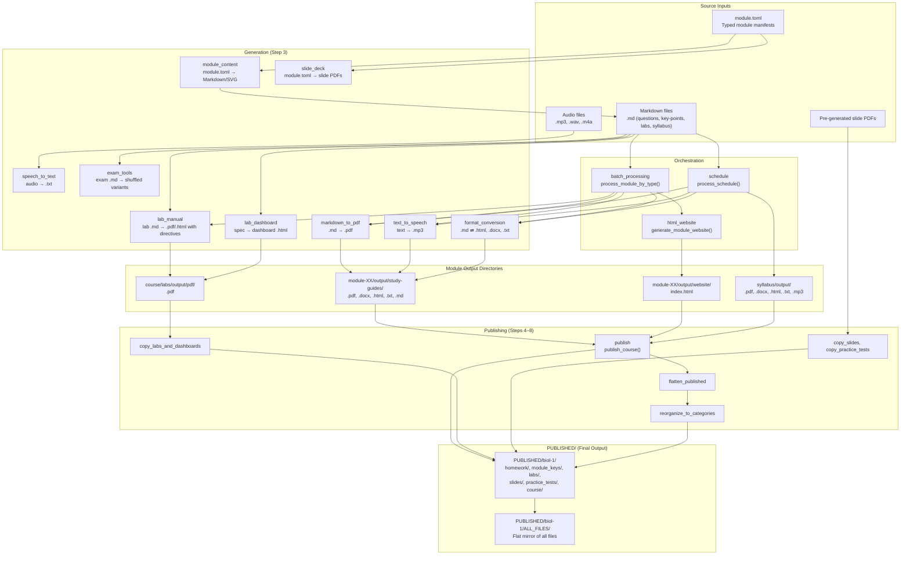
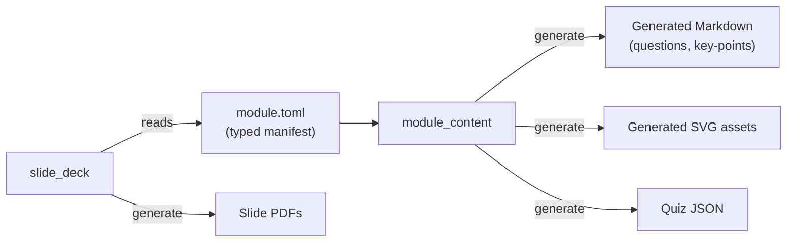
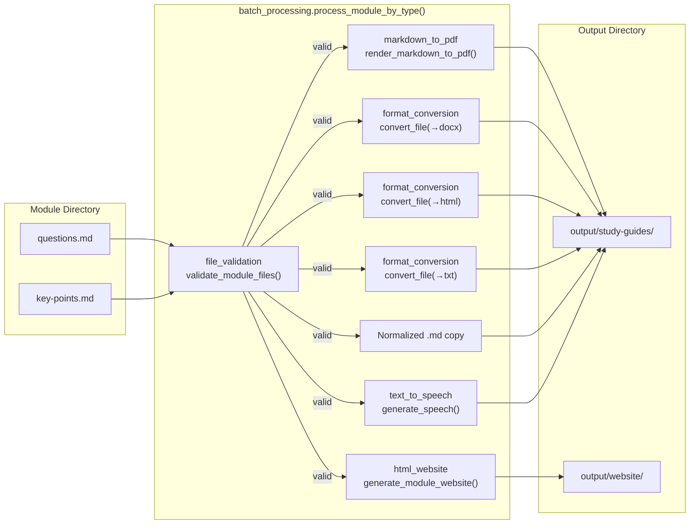
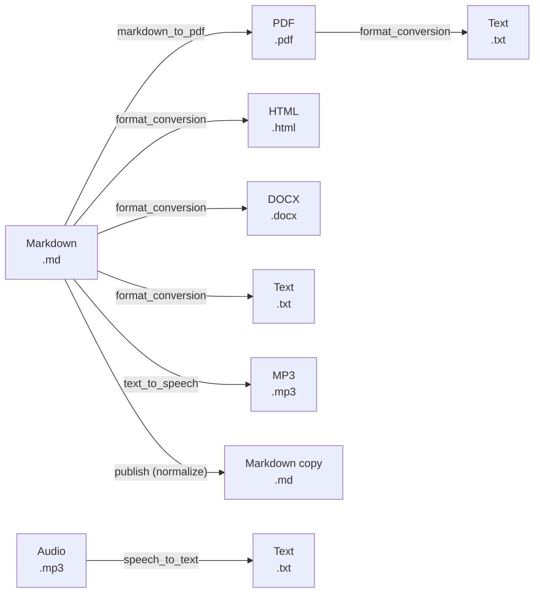

# Data Flow

> **Navigation**: [← Layers](LAYERS.md) | [Dependency Graph →](DEPENDENCY_GRAPH.md) | [Architecture README](README.md)

## Overview

This document traces data flow from source inputs (Markdown files, `module.toml` manifests) through the processing pipeline to published outputs in `PUBLISHED/`. The pipeline is driven by `publish.py` (repo root) configured via `publish.toml`, executing `software/scripts/publish_all.py` internally.

---

## Full Pipeline Flow



---

## Stage 1: Source Inputs

Content lives under `course_development/<course>/` and is the only place humans edit content.

### Input Types

| Input | Location | Format | Consumed By |
|-------|----------|--------|------------|
| Module Markdown | `course/module-NN-*/questions.md`, `key-points.md` | Markdown | `batch_processing`, `format_conversion`, `markdown_to_pdf` |
| Lab Protocols | `course/labs/lab-NN_*.md` | Markdown with lab directives | `lab_manual` |
| Syllabus | `syllabus/BIOL-X_*.md` | Markdown | `batch_processing`, `schedule` |
| Schedule | `syllabus/Schedule.md` | Markdown table | `schedule` |
| Exams | `course/exams/exam-XX.md` | Markdown | `exam_tools` |
| Module Manifest | `module.toml` | TOML | `module_content`, `slide_deck` |
| Audio | `*.mp3`, `*.wav`, `*.m4a` | Binary audio | `speech_to_text` |
| Pre-generated Slides | `resources/slides/*.pdf` | PDF | `publish` (copy only) |

### Module Manifest Flow (`module.toml`)



---

## Stage 2: Content Generation

The `generate_all_outputs.py` script (Step 3 of the publish pipeline) iterates over modules, labs, syllabus, practice tests, and exams per course, rendering requested formats.

### Per-Module Processing



### Format Conversion Chain



---

## Stage 3: Publish Pipeline (Steps 4–8)

After generation, the publish pipeline copies and reorganizes artifacts into `PUBLISHED/`.

```mermaid
flowchart LR
    GEN["Step 3:<br/>Generate outputs"] --> PUB["Step 4:<br/>publish_course()"]
    PUB --> LBD["Step 5:<br/>Copy labs & dashboards"]
    LBD --> SPT["Step 6:<br/>Copy slides & practice tests"]
    SPT --> FLAT["Step 7:<br/>Flatten module files"]
    FLAT --> REO["Step 8:<br/>Reorganize to categories"]
    REO --> VAL["Step 9:<br/>Validate outputs"]
    VAL --> ALLF["Step 10:<br/>Aggregate ALL_FILES/"]
    ALLF --> GIT["Step 11:<br/>Git commit & subtree push"]
```



### Publish Steps Detail

| Step | Function | What Happens |
|------|----------|-------------|
| 1 | `clean_published` | Clears `PUBLISHED/` when `--clean` is passed |
| 2 | `clear_all_outputs` | Clears `course_development/**/output/` when `--clean-source-outputs` is passed |
| 3 | `generate_all_outputs.py` | Renders modules, syllabus, labs, practice tests, exams per course toggles |
| 4 | `publish_course.py` | Copies artifacts into `PUBLISHED/<course>/` (initial module-centric tree) |
| 5 | `copy_labs_and_dashboards` | Copies `course/labs/output/` + `dashboards/` into `PUBLISHED` |
| 6 | `copy_slides`, `copy_practice_tests` | Copies slide PDFs and practice tests (exams are teacher-only) |
| 7 | `flatten_published` | Moves nested study-guide files upward inside each `module-*` folder |
| 8 | `reorganize_to_categories` | Builds `homework/`, `module_keys/`, `course/` folders; removes stray `index.html` |
| 9 | `validate_outputs.py` | Validates expected artifacts for in-scope modules/labs |
| 10 | Root `publish.py` | Aggregates `ALL_FILES/` (flat mirror of all published files) |
| 11 | Root `publish.py` | Git commit + subtree push to public course repos |

---

## Output Format Matrix

| Input Type | PDF | DOCX | HTML | TXT | MD copy | MP3 | Website |
|------------|-----|------|------|-----|---------|-----|---------|
| **Markdown (.md)** | ✅ | ✅ | ✅ | ✅ | ✅* | ✅ | ✅ |
| **Plain Text (.txt)** | ✅ | — | ✅ | — | — | ✅ | — |
| **HTML (.html)** | ✅ | — | — | — | — | — | — |
| **PDF (.pdf)** | — | — | — | ✅ | — | — | — |
| **Audio (.mp3/.wav/.m4a)** | — | — | — | ✅ | — | — | — |

\*Normalized `.md` copies under `study-guides/` when `[publish.formats].md = true`; see `publish.toml`.

---

## Published Directory Structure

After the full pipeline completes:

```
PUBLISHED/
└── biol-1/
    ├── homework/           # questions.{pdf,docx,md}
    ├── module_keys/        # key-points.{pdf,docx,md}
    ├── labs/               # lab PDFs + HTML
    ├── dashboards/         # lab dashboard HTML
    ├── slides/             # pre-generated slide PDFs
    ├── practice_tests/     # practice test files
    ├── course/             # syllabus, schedule
    └── ALL_FILES/          # flat mirror of all files above
```

> `PUBLISHED/` is generated and tracked for subtree publishing; never edit it by hand.

---

## Data Flow Example: Single Module

```python
# 1. Source: course_development/biol-1/course/module-12-darwin-evolution/
#    ├── questions.md
#    └── key-points.md

# 2. Validation
from src.file_validation.main import validate_module_files
validation = validate_module_files(module_path)
# → {"valid": True, "errors": []}

# 3. Generation (batch_processing composes Layer 1–2)
from src.batch_processing.main import process_module_by_type
results = process_module_by_type(module_path, f"{module_path}/output")
# → {"summary": {"pdf": 2, "docx": 2, "html": 2, "txt": 2, "md": 2, "mp3": 2},
#    "errors": [],
#    "processed_files": [...]}

# 4. Website generation
from src.html_website.main import generate_module_website
website_path = generate_module_website(module_path, f"{module_path}/output/website")
# → "module-12-darwin-evolution/output/website/index.html"

# 5. Publishing
from src.publish.main import publish_course
result = publish_course(
    course_path="course_development/biol-1",
    publish_root="PUBLISHED",
)
# → {"total_files": 120, "courses": {...}}

# 6. Validation
from src.validation import validate_published_directory
validation = validate_published_directory("PUBLISHED")
# → {"valid": True, ...}
```

---

## Related Documentation

| Document | Description |
|----------|-------------|
| [../ORCHESTRATION.md](../ORCHESTRATION.md) | Publish pipeline details, composition patterns |
| [../ARCHITECTURE.md](../ARCHITECTURE.md) | Document types, input → output matrix |
| [LAYERS.md](LAYERS.md) | Layer architecture and dependency rules |
| [DEPENDENCY_GRAPH.md](DEPENDENCY_GRAPH.md) | Complete inter-package dependencies |
