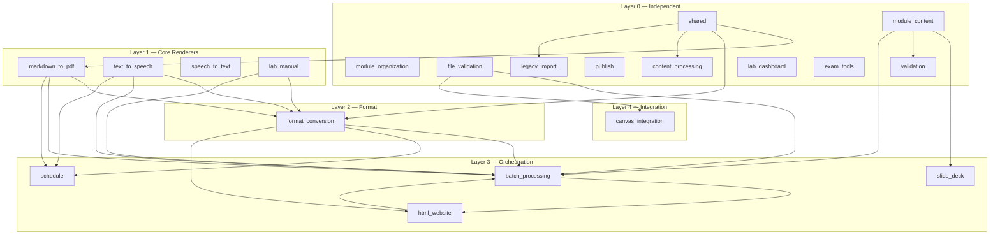

# Dependency Graph

> **Navigation**: [← README](README.md) | [Layers](LAYERS.md) | [Data Flow](DATA_FLOW.md) | [../ARCHITECTURE.md](../ARCHITECTURE.md)

Complete inter-package dependency graph for all 20 `src/` packages.

---

## Full Dependency Graph

---

## Dependency Table

| Package | Layer | Depends On (internal) | Depends On (external) |
|---------|-------|----------------------|----------------------|
| `shared` | 0 | — | stdlib |
| `module_content` | 0 | — | stdlib, `tomllib` |
| `module_organization` | 0 | — | stdlib |
| `file_validation` | 0 | — | stdlib |
| `validation` | 0 | `module_content`, `shared` | stdlib, `tomllib` |
| `publish` | 0 | — | stdlib |
| `legacy_import` | 0 | `shared` | stdlib |
| `content_processing` | 0 | `shared` | stdlib |
| `lab_dashboard` | 0 | — | stdlib, `html` |
| `exam_tools` | 0 | — | stdlib, `random`, `re` |
| `markdown_to_pdf` | 1 | `shared` | `weasyprint`, `markdown` |
| `text_to_speech` | 1 | `shared` | macOS `say`, `ffmpeg` |
| `speech_to_text` | 1 | `text_to_speech` (utils) | `speech_recognition`, `pydub` |
| `lab_manual` | 1 | `shared` | `markdown`, `weasyprint` |
| `format_conversion` | 2 | `markdown_to_pdf`, `text_to_speech`, `shared` | `python-docx`, `pypdf`, `markdown2` |
| `batch_processing` | 3 | `format_conversion`, `markdown_to_pdf`, `text_to_speech`, `lab_manual`, `html_website`, `file_validation`, `module_content`, `shared` | stdlib |
| `schedule` | 3 | `markdown_to_pdf`, `text_to_speech`, `format_conversion` | stdlib |
| `html_website` | 3 | `batch_processing`, `format_conversion` | `markdown2` |
| `slide_deck` | 3 | `module_content` | `weasyprint`, `markdown` |
| `canvas_integration` | 4 | `file_validation` | `requests` |

---

## Dependency Rules

1. **Layer 0** packages may only import from `shared` (or stdlib).
2. **Layer 1** packages may import from `shared` and external libraries.
3. **Layer 2** may import from Layer 1 and `shared`.
4. **Layer 3** may import from any lower layer.
5. **Layer 4** may import from any lower layer.
6. No package may import from a higher layer.

Violations are caught by the `validate_repo_contracts` check and the
`test_dependencies.py` test suite.

---

## Related Documentation

| Document | Description |
|----------|-------------|
| [LAYERS.md](LAYERS.md) | Layer architecture deep dive |
| [DATA_FLOW.md](DATA_FLOW.md) | Data flow through the pipeline |
| [../ARCHITECTURE.md](../ARCHITECTURE.md) | System architecture overview |
| [../../src/AGENTS.md](../../src/AGENTS.md) | Package index |
