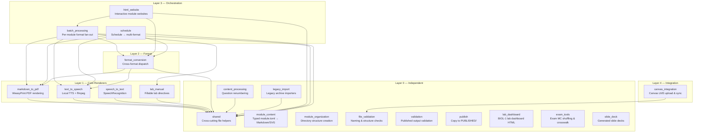

# Layer Architecture

> **Navigation**: [← Architecture README](README.md) | [Data Flow →](DATA_FLOW.md) | [Dependency Graph →](DEPENDENCY_GRAPH.md) | [Testing Strategy →](TESTING_STRATEGY.md)

## Overview

The cr-bio software organizes its 20 packages into a strict 5-layer hierarchy. The layer number indicates the dependency hierarchy: a package may only import from packages at **strictly lower layers** (or `shared`). This prevents circular dependencies and keeps the codebase composable.

---

## Full Layer Stack



---

## Layer 0 — Independent

Foundation packages with **no imports from sibling packages** (stdlib and `shared` only among themselves).

| Package | Purpose | Imports Allowed |
|---------|---------|-----------------|
| `shared` | Cross-cutting file and runtime helpers (`file_utils.py`, `runtime.py`) | stdlib only |
| `module_content` | Typed BIOL-1 module manifests, generated Markdown, quizzes, SVG assets | stdlib, `shared` |
| `module_organization` | Create and inspect course module folders | stdlib, `shared` |
| `file_validation` | Per-file naming and structure checks | stdlib, `shared` |
| `validation` | Output completeness checks for published courses | stdlib, `shared` |
| `publish` | Copy generated artifacts into `PUBLISHED/` | stdlib, `shared` |
| `legacy_import` | One-off importers for older lesson archives | stdlib, `shared` |
| `content_processing` | Text transformations (question renumbering, normalization) | stdlib, `shared` |
| `lab_dashboard` | BIOL-1 lab dashboard HTML generation from structured specs | stdlib, `shared` |
| `exam_tools` | Final exam MC shuffling, parsing, rendering, crosswalk verification | stdlib, `shared` |
| `slide_deck` | Generated slide decks from `module.toml` | stdlib, `shared` |

### Dependency Rules

- **No sibling imports except `shared`**: Layer 0 packages do not import other Layer 0 packages (except `shared`, which is the cross-cutting helper package).
- **Stdlib + external libraries only**: These packages rely solely on Python standard library and their declared external dependencies.
- **`shared` is the lowest-level package**: It provides `ensure_output_directory()`, `read_markdown_file()`, `find_files()`, and runtime environment configuration.

### Example Import (Layer 0)

```python
# src/content_processing/main.py
from src.shared.file_utils import read_markdown_file  # ← allowed: shared
# No other src.* imports
```

---

## Layer 1 — Core Renderers

Single-purpose conversion packages that depend on external libraries plus `shared`.

| Package | Purpose | External Dependencies | Imports Allowed |
|---------|---------|----------------------|-----------------|
| `markdown_to_pdf` | Markdown → PDF via WeasyPrint | WeasyPrint, Markdown | Layer 0 (`shared`) |
| `text_to_speech` | Text → audio via local TTS and ffmpeg | macOS `say`, `ffmpeg`, gTTS | Layer 0 (`shared`) |
| `speech_to_text` | Audio → text | SpeechRecognition, pydub | Layer 0 (`shared`) |
| `lab_manual` | Lab manual rendering with fillable directives | WeasyPrint, Markdown | Layer 0 (`shared`) |

### Dependency Rules

- **External libraries + `shared` only**: Layer 1 packages import their declared external libraries and `shared` helpers.
- **No Layer 2+ imports**: Core renderers never import orchestration or format packages.
- **Standalone usage**: Each Layer 1 package can be used independently if its external library is installed.

### Example Import (Layer 1)

```python
# src/markdown_to_pdf/main.py
from src.shared.file_utils import ensure_output_directory  # ← Layer 0
import weasyprint  # ← external library
# No imports from format_conversion, batch_processing, etc.
```

---

## Layer 2 — Format

| Package | Purpose | Imports Allowed |
|---------|---------|-----------------|
| `format_conversion` | Cross-format dispatch (md ⇄ html ⇄ pdf ⇄ docx; pdf → txt; audio → txt) | Layer 0 (`shared`), Layer 1 (`markdown_to_pdf`, `text_to_speech`) |

### Dependency Rules

- **Depends on Layer 1**: `format_conversion` dispatches to core converters for actual format transformations.
- **Can be used independently**: If Layer 1 modules are available, `format_conversion` works standalone.
- **No Layer 3+ imports**: Format conversion never imports orchestration packages.

### Example Import (Layer 2)

```python
# src/format_conversion/main.py
from src.markdown_to_pdf.main import render_markdown_to_pdf  # ← Layer 1
from src.text_to_speech.main import generate_speech          # ← Layer 1
from src.shared.file_utils import ensure_output_directory     # ← Layer 0
# No imports from batch_processing, html_website, schedule
```

---

## Layer 3 — Orchestration

Packages that compose multiple lower-layer modules to create workflows.

| Package | Purpose | Dependencies | Imports Allowed |
|---------|---------|--------------|-----------------|
| `batch_processing` | Per-module fan-out across formats | `markdown_to_pdf`, `text_to_speech`, `format_conversion`, `file_validation`, `lab_manual` | Layer 0–2 |
| `html_website` | Per-module HTML site with quizzes/audio | `batch_processing`, `format_conversion`, markdown2 | Layer 0–2 (and sibling Layer 3 via `batch_processing`) |
| `schedule` | Schedule markdown → multi-format outputs | `markdown_to_pdf`, `text_to_speech`, `format_conversion` | Layer 0–2 |

### Dependency Rules

- **Composes lower layers**: Orchestration packages call Layer 1 and Layer 2 functions to produce multi-format outputs.
- **`html_website` depends on `batch_processing`**: This is the one intra-layer dependency; `html_website` calls `batch_processing` to generate intermediate outputs before building the website.
- **Can use any combination of lower-layer modules**: Orchestration packages are free to compose any subset of Layer 0–2 packages.

### Example Import (Layer 3)

```python
# src/batch_processing/main.py
from src.markdown_to_pdf.main import render_markdown_to_pdf  # ← Layer 1
from src.format_conversion.main import convert_file          # ← Layer 2
from src.text_to_speech.main import generate_speech          # ← Layer 1
from src.file_validation.main import validate_module_files   # ← Layer 0
from src.shared.file_utils import ensure_output_directory     # ← Layer 0
```

```python
# src/html_website/main.py
from src.batch_processing.main import process_module_by_type  # ← Layer 3 (sibling)
from src.format_conversion.main import convert_file             # ← Layer 2
from src.shared.file_utils import ensure_output_directory       # ← Layer 0
```

---

## Layer 4 — Integration

| Package | Purpose | Dependencies | Imports Allowed |
|---------|---------|--------------|-----------------|
| `canvas_integration` | Canvas LMS upload and structure sync | `file_validation`, Canvas API client, `requests` | Layer 0 (`file_validation`) |

### Dependency Rules

- **External service integration**: Layer 4 packages talk to outside services (Canvas LMS).
- **Uses `file_validation`**: Validates module readiness before external upload.
- **Network calls handle their own retries** and surface meaningful error messages.

### Example Import (Layer 4)

```python
# src/canvas_integration/main.py
from src.file_validation.main import validate_module_files  # ← Layer 0
import requests  # ← external library
```

---

## Import Constraints Summary

| From → To | Layer 0 | Layer 1 | Layer 2 | Layer 3 | Layer 4 |
|-----------|---------|---------|---------|---------|---------|
| **Layer 0** | `shared` only | ✗ | ✗ | ✗ | ✗ |
| **Layer 1** | ✅ | ✗ | ✗ | ✗ | ✗ |
| **Layer 2** | ✅ | ✅ | ✗ | ✗ | ✗ |
| **Layer 3** | ✅ | ✅ | ✅ | `html_website` → `batch_processing` only | ✗ |
| **Layer 4** | ✅ | ✗ | ✗ | ✗ | ✗ |

> ✅ = imports allowed, ✗ = imports forbidden, `shared` only = Layer 0 packages may only import `shared` among siblings.

---

## Adding a New Package

1. **Determine the layer**: Identify the lowest layer that satisfies the package's dependency needs.
2. **Create the package**: `software/src/<package>/` with `__init__.py`, `main.py`, `utils.py`, optional `config.py`.
3. **Add documentation**: `README.md` (purpose + usage) and `AGENTS.md` (signatures + dependencies).
4. **Keep imports flowing only from lower layers**: If you find yourself reaching back up, refactor instead.
5. **Add tests**: `software/tests/test_<package>_*.py` — prefer content-asserting tests over file-existence checks.
6. **Update indexes**: Add the package to `software/src/AGENTS.md` and `software/AGENTS.md`.

---

## Related Documentation

| Document | Description |
|----------|-------------|
| [../ARCHITECTURE.md](../ARCHITECTURE.md) | Top-level architecture overview |
| [DEPENDENCY_GRAPH.md](DEPENDENCY_GRAPH.md) | Complete inter-package dependency graph |
| [DATA_FLOW.md](DATA_FLOW.md) | Data flow from source through pipeline |
| [MODULAR_DESIGN.md](MODULAR_DESIGN.md) | 5 core design principles |
| [INTERFACE_CONTRACTS.md](INTERFACE_CONTRACTS.md) | Interface contracts between packages |
