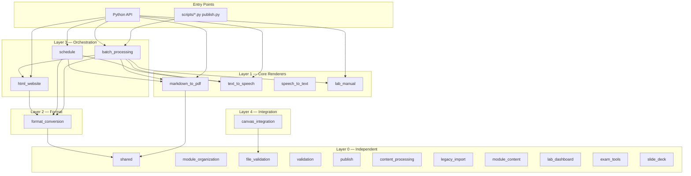

# Architecture Documentation

> **Navigation**: [← README](../README.md) | [Architecture](../ARCHITECTURE.md) | [Orchestration](../ORCHESTRATION.md) | [Quick Start](../QUICKSTART.md) | [API Reference](../../AGENTS.md)

## Overview

The cr-bio software follows a **5-layer modular architecture** with clear separation of concerns. Each of the 20 packages is self-contained with its own `main.py` (public API), `utils.py` (internal utilities), and `config.py` (constants). Packages may only import from strictly lower layers.

This subfolder provides deep-dive documentation for each architectural concern:

| Document | Description |
|----------|-------------|
| [LAYERS.md](LAYERS.md) | Deep dive into the 5-layer architecture (Layer 0–4), packages, dependency rules, and import constraints |
| [DATA_FLOW.md](DATA_FLOW.md) | Data flow from source (`module.toml`, Markdown) through the pipeline to `PUBLISHED/` outputs |
| [DEPENDENCY_GRAPH.md](DEPENDENCY_GRAPH.md) | Complete inter-package dependency graph with Mermaid diagrams and a full dependency table |
| [TESTING_STRATEGY.md](TESTING_STRATEGY.md) | Testing architecture: file naming, categories, markers, Real Methods Policy, coverage targets, and fixtures |
| [MODULAR_DESIGN.md](MODULAR_DESIGN.md) | The 5 core design principles with codebase examples |
| [INTERFACE_CONTRACTS.md](INTERFACE_CONTRACTS.md) | Interface contracts: public API conventions, return dict shapes, error handling, side effect rules |

---

## Quick Architecture Summary

---

## Layer Summary Table

| Layer | Name | Packages | Dependency Rule |
|-------|------|----------|-----------------|
| **0** | Independent | `shared`, `module_content`, `module_organization`, `file_validation`, `validation`, `publish`, `legacy_import`, `content_processing`, `lab_dashboard`, `exam_tools`, `slide_deck` | No imports from sibling packages (stdlib / `shared` only) |
| **1** | Core Renderers | `markdown_to_pdf`, `text_to_speech`, `speech_to_text`, `lab_manual` | External libraries + `shared` |
| **2** | Format | `format_conversion` | Layer 1 modules + `shared` |
| **3** | Orchestration | `batch_processing`, `html_website`, `schedule` | Composes Layers 1–2 |
| **4** | Integration | `canvas_integration` | External LMS; uses `file_validation` |

> **Rule**: A package may only import from packages at **strictly lower layers** (or `shared`). If you find yourself reaching back up, refactor instead.

---

## Related Documentation

| Document | Description |
|----------|-------------|
| [../ARCHITECTURE.md](../ARCHITECTURE.md) | Top-level system design, module structure, document types |
| [../ORCHESTRATION.md](../ORCHESTRATION.md) | Multi-module workflows, publish pipeline, composition patterns |
| [../AGENTS.md](../AGENTS.md) | Documentation standards and output format reference |
| [../../AGENTS.md](../../AGENTS.md) | Complete API reference with all module signatures |
| [../../src/AGENTS.md](../../src/AGENTS.md) | Source code package index |
