# Content Types Reference

> **Navigation**: [← README](../README.md) | [Lab Format](../LAB_FORMAT.md) | [Dashboard Format](../DASHBOARD_FORMAT.md) | [Module Format](MODULE_FORMAT.md) | [Exam Format](EXAM_FORMAT.md) | [Practice Test Format](PRACTICE_TEST_FORMAT.md) | [Syllabus Format](SYLLABUS_FORMAT.md) | [Slides Format](SLIDES_FORMAT.md) | [Course Structure](../COURSE_STRUCTURE.md) | [Architecture](../ARCHITECTURE.md)

Index of all content types in the cr-bio course system. Each content type has a dedicated format guide covering file naming, directory structure, authoring conventions, and generation commands.

---

## Content Type Hierarchy

```mermaid
flowchart TD
    COURSE["course_development/biol-X/"]

    COURSE --> MOD["Module Study Guides"]
    COURSE --> LAB["Labs & Dashboards"]
    COURSE --> EXAM["Exams (teacher-only)"]
    COURSE --> PT["Practice Tests"]
    COURSE --> QUIZ["Quizzes (template-only)"]
    COURSE --> SYL["Syllabus & Schedule"]
    COURSE --> REV["Review Materials"]
    COURSE --> SLIDES["Slides"]

    LAB --> LABMD["lab-NN_topic.md"]
    LAB --> LABDASH["lab-NN_topic-dashboard.html"]

    MOD --> MODTOML["module.toml (source of truth)"]
    MODTOML --> MODKEYS["keys-to-success.md"]
    MODTOML --> MODQ["questions.md"]
    MODTOML --> MODPQ["practice-quiz.md"]
    MODTOML --> MODSVG["Generated SVGs"]

    SLIDES --> SLFULL["module-N-slides-full.pdf"]
    SLIDES --> SLNOTES["module-N-slides-notes.pdf"]

    EXAM --> UNIT["exam-NN.md + _key.md"]
    EXAM --> FINAL["final-exam.md + _key.md"]
    EXAM --> TEMPL["exam-template.md"]

    PT --> PT01["practice-test-01 (Modules 1–4)"]
    PT --> PT02["practice-test-02 (Modules 5–6)"]
    PT --> PT03["practice-test-03 (Modules 7–11)"]
    PT --> PT04["practice-test-04 (Modules 12–16)"]
    PT --> PT05["practice-test-05 (Comprehensive)"]
```

---

## Comparison Table

| Content Type | Source Location | File Pattern | Published? | Format Guide |
|-------------|-----------------|--------------|-------------|-------------|
| **Modules** | `course/module-NN-name/` | `module.toml` → generated `.md` | Yes (study guides) | [MODULE_FORMAT.md](MODULE_FORMAT.md) |
| **Labs** | `course/labs/` | `lab-XX_topic-name.md` | Yes (PDF/HTML) | [LAB_FORMAT.md](../LAB_FORMAT.md) |
| **Lab Dashboards** | `course/labs/dashboards/` | `lab-XX_topic-dashboard.html` | Yes (HTML) | [DASHBOARD_FORMAT.md](../DASHBOARD_FORMAT.md) |
| **Exams** | `course/exams/` | `exam-NN.md` + `exam-NN_key.md` | **Never** (teacher-only) | [EXAM_FORMAT.md](EXAM_FORMAT.md) |
| **Practice Tests** | `course/practice_tests/` | `practice-test-NN.md` + `_key.md` | Yes (PDF/DOCX) | [PRACTICE_TEST_FORMAT.md](PRACTICE_TEST_FORMAT.md) |
| **Quizzes** | `course/quizzes/` | `quiz-template.md` (BIOL-1) | **Never** (teacher-only) | — |
| **Syllabus** | `syllabus/` | `BIOL-X_Fall-2026_Syllabus.md` | Yes (PDF/DOCX/MD) | [SYLLABUS_FORMAT.md](SYLLABUS_FORMAT.md) |
| **Slides** | `resources/slides/` | `module-N-slides-{full,notes}.pdf` | Yes (PDF) | [SLIDES_FORMAT.md](SLIDES_FORMAT.md) |
| **Review Materials** | `course/review_materials/` | Various `.md` worksheets | Yes (PDF/DOCX) | — |

---

## Content Type Details

### Module Study Guides

The core content unit. Each module has a `module.toml` source-of-truth file that drives generation of `keys-to-success.md`, `questions.md`, `practice-quiz.md`, and three SVG visualizations. BIOL-1 has **16** content modules.

See [MODULE_FORMAT.md](MODULE_FORMAT.md) for the full schema and authoring guide.

### Labs

Hands-on lab protocols rendered to fillable PDFs and interactive HTML. BIOL-1 has **17** numbered protocols (labs 01–16 plus supplemental). Each lab may have a companion dashboard.

See [LAB_FORMAT.md](../LAB_FORMAT.md) for the protocol format, directive syntax, and templates.

### Lab Dashboards

Standalone interactive HTML pages with Canvas-based visualizations and simulations. Zero external dependencies — all CSS and JavaScript are inline.

See [DASHBOARD_FORMAT.md](../DASHBOARD_FORMAT.md) for the architecture, CSS design system, and JavaScript patterns.

### Exams

Teacher-only unit exams and comprehensive final. **Never published** to public repositories. Unit exams use a 50-point layout; the final uses 100 points.

See [EXAM_FORMAT.md](EXAM_FORMAT.md) for point structure, Part A/B/C layout, and the exam inventory.

### Practice Tests

Optional exam-preparation assessments with student + key pairs. Five practice tests covering progressively wider module ranges.

See [PRACTICE_TEST_FORMAT.md](PRACTICE_TEST_FORMAT.md) for naming, key format, and module coverage mapping.

### Syllabus & Schedule

Course syllabus and weekly schedule rendered to PDF, DOCX, and MD. Flat output structure (no subdirectories).

See [SYLLABUS_FORMAT.md](SYLLABUS_FORMAT.md) for source files, schedule table format, and Fall 2026 schedule.

### Slides

Generated lecture slide decks — 11 slides per module with full and notes variants. Driven by `module.toml` via the `slide_deck` package. Do not hand-edit.

See [SLIDES_FORMAT.md](SLIDES_FORMAT.md) for the generation pipeline, slide spine, and naming conventions.

---

## Related Documentation

| Document | Description |
|----------|-------------|
| [../README.md](../README.md) | Software documentation index |
| [../COURSE_STRUCTURE.md](../COURSE_STRUCTURE.md) | Course directory layout reference |
| [../ARCHITECTURE.md](../ARCHITECTURE.md) | System architecture and module layers |
| [../ORCHESTRATION.md](../ORCHESTRATION.md) | Publish pipeline and workflows |
