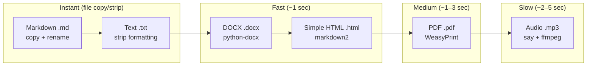

# Output Format Comparison Matrix

> **Navigation**: [Output Index](README.md) | [PDF](PDF.md) | [DOCX](DOCX.md) | [HTML](HTML.md) | [Markdown](MARKDOWN.md) | [Text](TEXT.md) | [Audio](AUDIO.md)

Complete comparison of all six output formats produced by the cr-bio publish pipeline.

---

## At a Glance

| Property | PDF | DOCX | HTML | Markdown | Text | Audio (MP3) |
|----------|-----|------|------|----------|------|-------------|
| **Extension** | `.pdf` | `.docx` | `.html` | `.md` | `.txt` | `.mp3` |
| **Generator Module** | `markdown_to_pdf` / `lab_manual` | `format_conversion` | `format_conversion` / `html_website` / `lab_manual` | `format_conversion` | `format_conversion` | `text_to_speech` |
| **Key Dependency** | `weasyprint >= 60.0` | `python-docx >= 1.1.0` | `markdown2` | None | None | macOS `say`, `ffmpeg` |
| **System Dependencies** | `cairo`, `pango`, `gdk-pixbuf`, `glib` | None | None | None | None | `say`, `ffmpeg` |
| **Requires Internet** | No | No | No | No | No | No |
| **Generation Speed** | ~1–3 sec/file | ~0.5–1 sec/file | ~0.5–1 sec/file | Instant (copy) | Instant (strip) | ~2–5 sec/file |
| **Relative File Size** | Medium | Medium | Small | Smallest | Smallest | Largest |
| **`publish.toml` Toggle** | `pdf = true` | `docx = true` | `html = false` | `md = false` | `txt = false` | `mp3 = false` |
| **Default Status** | ✅ Enabled | ✅ Enabled | ❌ Disabled | ❌ Disabled | ❌ Disabled | ❌ Disabled |
| **Platform** | Cross-platform | Cross-platform | Web | Cross-platform | Cross-platform | macOS (primary) |

---

## Use Case Matrix

| Use Case | PDF | DOCX | HTML | Markdown | Text | Audio |
|----------|-----|------|------|----------|------|-------|
| **Printable handouts** | ✅ Best | ✅ Good | ❌ | ❌ | ❌ | ❌ |
| **Student editing** | ❌ | ✅ Best | ❌ | ✅ Good | ❌ | ❌ |
| **Interactive content** | ❌ | ❌ | ✅ Best | ❌ | ❌ | ❌ |
| **Audio narration** | ❌ | ❌ | ❌ | ❌ | ❌ | ✅ Only |
| **Screen reader accessibility** | ✅ Good | ✅ Good | ✅ Good | ❌ | ✅ Best | ✅ Good |
| **GitHub rendering** | ❌ | ❌ | ❌ | ✅ Best | ✅ Good | ❌ |
| **Version control diffs** | ❌ | ❌ | ❌ | ✅ Best | ✅ Good | ❌ |
| **Low-bandwidth sharing** | ❌ | ❌ | ✅ Good | ✅ Best | ✅ Best | ❌ |
| **Institutional submission** | ✅ Good | ✅ Best | ❌ | ❌ | ❌ | ❌ |
| **Lab fillable worksheets** | ✅ Good | ❌ | ✅ Best | ❌ | ❌ | ❌ |
| **Content portability** | ✅ Good | ✅ Good | ✅ Good | ✅ Best | ✅ Best | ✅ Good |
| **Terminal/CLI reading** | ❌ | ❌ | ❌ | ✅ Good | ✅ Best | ❌ |

---

## Generation Complexity



---

## Dependency Summary

### External Python Packages

| Format | Package | Version | Purpose |
|--------|---------|---------|---------|
| PDF | `weasyprint` | `>= 60.0` | HTML/CSS → PDF rendering |
| DOCX | `python-docx` | `>= 1.1.0` | Word document generation |
| HTML | `markdown2` | — | Markdown → HTML conversion |
| Markdown | — | — | No external packages |
| Text | — | — | No external packages |
| Audio | — | — | No Python packages (uses system `say` + `ffmpeg`) |

### System-Level Dependencies

| Format | System Dependency | Install Command |
|--------|------------------|-----------------|
| PDF | `cairo`, `pango`, `gdk-pixbuf`, `glib` | `brew install cairo pango gdk-pixbuf glib` |
| Audio | `say` (macOS), `ffmpeg` | `brew install ffmpeg` |
| DOCX | None | — |
| HTML | None | — |
| Markdown | None | — |
| Text | None | — |

---

## Pipeline Toggle Summary

All formats are controlled in [`publish.toml`](../../../publish.toml) under `[publish.formats]`:

```toml
[publish.formats]
pdf  = true    # ✅ Default on — printable study guides
docx = true    # ✅ Default on — editable Word handouts
html = false   # ❌ Default off — enable for static HTML pages
md   = false   # ❌ Default off — enable for normalized Markdown copies
txt  = false   # ❌ Default off — enable for accessibility text
mp3  = false   # ❌ Default off — enable for audio narration
```

### CLI Override

```bash
# Full output (all formats)
python publish.py --override-formats pdf,docx,html,md,txt,mp3

# Quick iteration (fastest formats only)
python publish.py --override-formats pdf,md,txt

# Minimal output (PDF only)
python publish.py --override-formats pdf
```

---

## Output Directory Layout

All formats for a single module are generated into the same `study-guides/` directory:

```
module-XX-name/output/
└── study-guides/
    ├── module-XX-name-questions.pdf       ← PDF (default)
    ├── module-XX-name-questions.docx      ← DOCX (default)
    ├── module-XX-name-questions.html      ← HTML (optional)
    ├── module-XX-name-questions.md        ← Markdown (optional)
    ├── module-XX-name-questions.txt       ← Text (optional)
    ├── module-XX-name-questions.mp3       ← Audio (optional)
    ├── module-XX-name-key-points.pdf
    ├── module-XX-name-key-points.docx
    ├── module-XX-name-key-points.html
    ├── module-XX-name-key-points.md
    ├── module-XX-name-key-points.txt
    └── module-XX-name-key-points.mp3
```

---

## Related Documentation

| Document | Description |
|----------|-------------|
| [README.md](README.md) | Output formats index and decision tree |
| [PDF.md](PDF.md) | PDF output — WeasyPrint, lab worksheets |
| [DOCX.md](DOCX.md) | DOCX output — editable Word handouts |
| [HTML.md](HTML.md) | HTML output — websites, labs, dashboards |
| [MARKDOWN.md](MARKDOWN.md) | Markdown output — normalized study-guide copies |
| [TEXT.md](TEXT.md) | Text output — accessibility plain-text versions |
| [AUDIO.md](AUDIO.md) | Audio output — MP3 narration via local TTS |
| [../README.md](../README.md) | Documentation index |
| [../ORCHESTRATION.md](../ORCHESTRATION.md) | Publish pipeline and batch generation |
