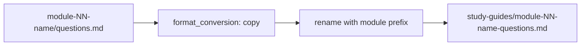

# Output Format: Markdown (Normalized Study-Guide Copies)

> **Navigation**: [Output Index](README.md) | [PDF](PDF.md) | [DOCX](DOCX.md) | [HTML](HTML.md) | [Text](TEXT.md) | [Audio](AUDIO.md) | [Comparison](COMPARISON.md)

Detailed specification for normalized Markdown (`.md`) output — student-facing Markdown mirrors with stable filenames alongside PDF/DOCX.

---

## Overview

| Property | Value |
|----------|-------|
| **Extension** | `.md` |
| **Generator Module** | `format_conversion` (copy + transform) |
| **Key Dependency** | None (pure Python file copy/transform) |
| **Requires Internet** | No |
| **Typical Speed** | Instant (file copy) |
| **Default in `publish.toml`** | ❌ Disabled |
| **Purpose** | Normalized study-guide copies alongside other formats |

---

## What Are Normalized Markdown Study Guides?

The publish pipeline generates Markdown copies of course materials (questions, key-points) with **normalized filenames** that match the flattened output naming convention. These are not raw source files — they are **renamed copies** placed alongside PDF, DOCX, HTML, and TXT outputs in the same `study-guides/` directory.

### Naming Convention

Source files in `course_development/biol-1/course/module-NN-name/` use simple names (`questions.md`, `key-points.md`). The pipeline renames them using the module folder name as a prefix:

```
module-12-darwin-evolution/questions.md
  → module-12-darwin-evolution-questions.md       (normalized copy)

module-12-darwin-evolution/key-points.md
  → module-12-darwin-evolution-key-points.md  (normalized copy)
```

### Pattern

```
{module-folder-name}-{content-type}.md
```

Where `content-type` is one of:

| Content Type | Source File | Output Filename Example |
|-------------|-------------|------------------------|
| Questions | `questions.md` | `module-12-darwin-evolution-questions.md` |
| Key Points | `key-points.md` | `module-12-darwin-evolution-key-points.md` |

---

## Generation Pipeline



1. **Source Detection**: The pipeline scans `module-*/` folders for `questions.md` and `key-points.md`
2. **Copy**: `format_conversion` reads the source Markdown
3. **Rename**: The output filename is prefixed with the module folder name
4. **Write**: The normalized copy is written to `module-*/output/study-guides/`

---

## Usage

### Pipeline Configuration

In `publish.toml`:

```toml
[publish.formats]
md = false  # Set to true to enable Markdown output
```

### CLI Override

```bash
# Include Markdown copies
python publish.py --override-formats pdf,docx,md

# Quick iteration with Markdown only (fastest — just file copies)
python publish.py --override-formats md
```

### Python API (Direct)

```python
import shutil
from pathlib import Path

# The format_conversion module copies and renames
source = Path("module-12-darwin-evolution/questions.md")
output = Path("module-12-darwin-evolution/output/study-guides/module-12-darwin-evolution-questions.md")

shutil.copy2(source, output)
```

---

## Output Structure

```
module-XX/output/
└── study-guides/
    ├── key-points.pdf       ← PDF (default on)
    ├── key-points.docx      ← DOCX (default on)
    ├── key-points.md        ← Markdown (when enabled)
    ├── key-points.txt       ← Text (when enabled)
    ├── questions.pdf
    ├── questions.docx
    ├── questions.md              ← Normalized Markdown copy
    └── questions.txt
```

After publishing to `PUBLISHED/`, Markdown files are flattened into category folders:

```
PUBLISHED/biol-1/
├── homework/
│   ├── module-12-darwin-evolution-questions.md
│   └── module-12-darwin-evolution-questions.pdf
└── module_keys/
    ├── module-12-darwin-evolution-key-points.md
    └── module-12-darwin-evolution-key-points.pdf
```

---

## Use Cases

| Use Case | Why Markdown |
|----------|-------------|
| **Version control diffs** | Markdown diffs are human-readable in git |
| **GitHub rendering** | `.md` files render natively on GitHub |
| **Cross-platform sharing** | Universal format readable in any text editor |
| **Pipeline debugging** | Quick verification that content rendered correctly |
| **Student reference** | Accessible on any device without special software |
| **Content portability** | Easy to paste into LMS, wikis, or other tools |

---

## Key Properties

- **No rendering**: Markdown copies are not rendered or transformed beyond filename normalization — the content is identical to the source
- **No dependencies**: Pure file copy, no external libraries or system tools required
- **Fastest format**: Instant generation — just a file copy and rename
- **Companion format**: Sits alongside PDF/DOCX/HTML/TXT in `study-guides/`

> **Note**: These are **not** the source files in `course_development/`. They are normalized copies placed in the output directory for publishing. Always edit source files in `course_development/`, never the output copies.

---

## Related Documentation

| Document | Description |
|----------|-------------|
| [README.md](README.md) | Output formats index |
| [COMPARISON.md](COMPARISON.md) | Full format comparison matrix |
| [../README.md](../README.md) | Documentation index and course parity |
| [../ORCHESTRATION.md](../ORCHESTRATION.md) | Batch generation and publish pipeline |
| [../ARCHITECTURE.md](../ARCHITECTURE.md) | System architecture |
| [PDF.md](PDF.md) | PDF output |
| [DOCX.md](DOCX.md) | DOCX output |
| [HTML.md](HTML.md) | HTML output (includes normalized MD mention) |
| [TEXT.md](TEXT.md) | Plain text output (Markdown stripped) |
| [AUDIO.md](AUDIO.md) | MP3 output |
