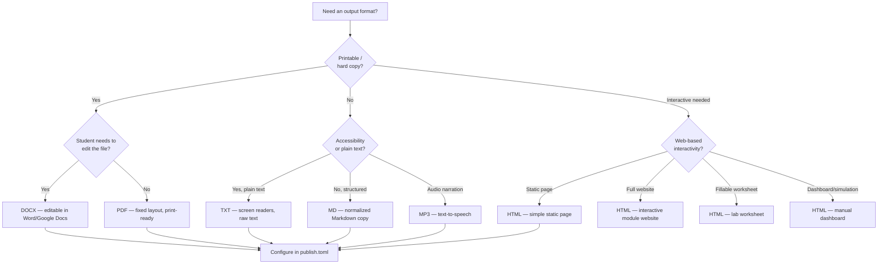

# Output Formats

> **Navigation**: [← docs/](../README.md) | [PDF](PDF.md) | [DOCX](DOCX.md) | [HTML](HTML.md) | [Markdown](MARKDOWN.md) | [Text](TEXT.md) | [Audio](AUDIO.md) | [Comparison](COMPARISON.md)

Index and decision guide for all output formats produced by the cr-bio publish pipeline.

---

## Supported Formats

| Format | Extension | Generator | Default | Purpose |
|--------|-----------|-----------|---------|---------|
| **PDF** | `.pdf` | `markdown_to_pdf` / `lab_manual` | ✅ Yes | Printable study guides, lab worksheets |
| **DOCX** | `.docx` | `format_conversion` | ✅ Yes | Editable Word handouts |
| **HTML** | `.html` | `format_conversion` / `html_website` / `lab_manual` | ❌ No | Interactive websites, lab worksheets, dashboards |
| **Markdown** | `.md` | `format_conversion` | ❌ No | Normalized study-guide copies alongside other formats |
| **Text** | `.txt` | `format_conversion` | ❌ No | Accessibility plain-text versions |
| **Audio (MP3)** | `.mp3` | `text_to_speech` | ❌ No | Audio narration of course materials |

---

## Format Decision Tree



---

## Pipeline Toggle

All formats are controlled by `[publish.formats]` in [`publish.toml`](../../../publish.toml):

```toml
[publish.formats]
pdf  = true    # enabled by default
docx = true    # enabled by default
html = false   # disabled by default
md   = false   # disabled by default
txt  = false   # disabled by default
mp3  = false   # disabled by default (slowest)
```

Override from the CLI:

```bash
# Generate specific formats only
python publish.py --override-formats pdf,docx,html,txt,mp3

# Quick iteration (skip slow formats)
python publish.py --override-formats pdf,html
```

---

## Output Directory Structure

All format outputs for a module are generated into `module-XX/output/study-guides/`:

```
module-XX/output/
├── study-guides/
│   ├── key-points.pdf       ← PDF (default)
│   ├── key-points.docx      ← DOCX (default)
│   ├── key-points.html      ← HTML (when enabled)
│   ├── key-points.md        ← Markdown (when enabled)
│   ├── key-points.txt       ← Text (when enabled)
│   ├── key-points.mp3       ← Audio (when enabled)
│   ├── questions.pdf
│   ├── questions.docx
│   ├── questions.html
│   ├── questions.md
│   ├── questions.txt
│   └── questions.mp3
└── website/
    └── index.html                ← Interactive module website (separate)
```

---

## Related Documentation

| Document | Description |
|----------|-------------|
| [PDF.md](PDF.md) | PDF output — WeasyPrint, lab worksheets |
| [DOCX.md](DOCX.md) | DOCX output — editable Word handouts |
| [HTML.md](HTML.md) | HTML output — websites, labs, dashboards |
| [MARKDOWN.md](MARKDOWN.md) | Markdown output — normalized study-guide copies |
| [TEXT.md](TEXT.md) | Text output — accessibility plain-text versions |
| [AUDIO.md](AUDIO.md) | Audio output — MP3 narration via local TTS |
| [COMPARISON.md](COMPARISON.md) | Full comparison matrix of all formats |
| [../README.md](../README.md) | Documentation index |
| [../ORCHESTRATION.md](../ORCHESTRATION.md) | Publish pipeline and batch generation |
