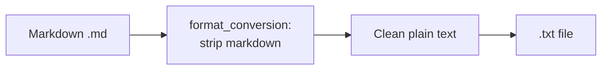

# Output Format: Plain Text (TXT)

> **Navigation**: [Output Index](README.md) | [PDF](PDF.md) | [DOCX](DOCX.md) | [HTML](HTML.md) | [Markdown](MARKDOWN.md) | [Audio](AUDIO.md) | [Comparison](COMPARISON.md)

Detailed specification for plain text (`.txt`) output — accessibility-focused plain-text versions of course materials.

---

## Overview

| Property | Value |
|----------|-------|
| **Extension** | `.txt` |
| **Generator Module** | `format_conversion` (markdown strip) |
| **Key Dependency** | None (pure Python text processing) |
| **Requires Internet** | No |
| **Typical Speed** | Instant |
| **Default in `publish.toml`** | ❌ Disabled |
| **Purpose** | Accessibility plain-text versions of course materials |

---

## What Is Plain Text Output?

Plain text (`.txt`) files are Markdown with **all formatting stripped** — no headers, bold, italic, links, code blocks, or HTML tags. The result is clean, readable text suitable for screen readers, plain-text editors, and systems that cannot parse Markdown.

### What Gets Stripped

| Markdown Element | Stripped To |
|-----------------|-------------|
| `# Heading` | `Heading` (text only, no `#`) |
| `**bold**` | `bold` (text only, no `**`) |
| `*italic*` | `italic` (text only, no `*`) |
| `[link](url)` | `link` (link text only, URL removed) |
| `` | `alt` (alt text only, image removed) |
| `` `code` `` | `code` (text only, no backticks) |
| ` ```code block``` ` | Content preserved, fences removed |
| `- list item` | `list item` (text only, no bullet) |
| `1. item` | `item` (text only, no number) |
| `\| Table \|` | Row text, pipes removed |
| HTML tags (`<div>`, `<span>`, etc.) | Removed entirely |

---

## Generation Pipeline



1. **Read Markdown**: Source `.md` file is read
2. **Strip Formatting**: `format_conversion` removes all Markdown syntax, HTML tags, and formatting markers
3. **Clean Whitespace**: Excessive blank lines and trailing spaces are normalized
4. **Write TXT**: Plain text saved to the output path

---

## Naming Convention

Text output follows the same normalized naming convention as other formats:

```
module-12-darwin-evolution/questions.md
  → module-12-darwin-evolution-questions.txt

module-12-darwin-evolution/key-points.md
  → module-12-darwin-evolution-key-points.txt
```

---

## Usage

### Pipeline Configuration

In `publish.toml`:

```toml
[publish.formats]
txt = false  # Set to true to enable text output
```

### CLI Override

```bash
# Include text output
python publish.py --override-formats pdf,docx,html,txt

# Text only (fastest alongside MD — no rendering needed)
python publish.py --override-formats txt,md
```

### Python API

```python
from src.format_conversion.main import convert_file

# Convert Markdown to plain text
convert_file("input.md", "txt", "output.txt")
```

### Text Extraction (Shared with Audio)

The same text extraction logic used for audio narration (`extract_text_from_markdown`) powers the TXT output:

```python
from src.text_to_speech.utils import extract_text_from_markdown

markdown = "# Title\n\n**Bold** text with [link](url).\n\n```code\nblock\n```"
plain = extract_text_from_markdown(markdown)
# Result: "Title\nBold text with link."
```

---

## Output Structure

```
module-XX/output/
└── study-guides/
    ├── key-points.pdf       ← PDF (default on)
    ├── key-points.docx      ← DOCX (default on)
    ├── key-points.txt       ← Text (when enabled)
    ├── questions.pdf
    ├── questions.docx
    └── questions.txt             ← Plain text (when enabled)
```

---

## Use Cases

| Use Case | Why TXT |
|----------|---------|
| **Screen readers** | Plain text is the most accessible format for assistive technology |
| **Terminal/CLI** | Readable in `cat`, `less`, `vim` without rendering |
| **Low-bandwidth** | Smallest file size — no formatting overhead |
| **Legacy systems** | Compatible with systems that cannot parse Markdown or HTML |
| **Copy/paste** | Clean text for pasting into forms, emails, or other documents |
| **Search indexing** | Plain text indexes well in search systems |
| **Accessibility compliance** | Meets WCAG requirements for text alternatives |

---

## Key Properties

- **No formatting**: All Markdown syntax, HTML, and formatting markers are removed
- **No dependencies**: Pure Python text processing — no external libraries
- **Fast generation**: Instant — just text extraction and file write
- **Shared logic**: Uses the same `extract_text_from_markdown()` function as the audio pipeline
- **Accessibility-first**: Designed for screen readers and assistive technology

> **Note**: TXT files contain the same content as Markdown (`.md`) copies but with all formatting removed. Use `.md` if you want to preserve Markdown structure; use `.txt` for pure plain-text accessibility.

---

## Related Documentation

| Document | Description |
|----------|-------------|
| [README.md](README.md) | Output formats index |
| [COMPARISON.md](COMPARISON.md) | Full format comparison matrix |
| [../README.md](../README.md) | Documentation index and course parity |
| [../ORCHESTRATION.md](../ORCHESTRATION.md) | Batch generation and publish pipeline |
| [../ARCHITECTURE.md](../ARCHITECTURE.md) | System architecture |
| [PDF.md](PDF.md) | PDF output |
| [DOCX.md](DOCX.md) | DOCX output |
| [HTML.md](HTML.md) | HTML output |
| [MARKDOWN.md](MARKDOWN.md) | Normalized Markdown copies (formatting preserved) |
| [AUDIO.md](AUDIO.md) | MP3 output (shares text extraction logic) |
