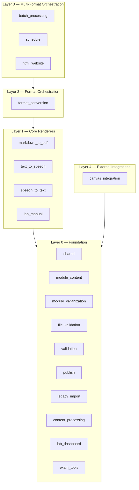

# Package Reference Index

> **Navigation**: [← README](../README.md) | [Architecture](../ARCHITECTURE.md) | [Orchestration](../ORCHESTRATION.md) | [src/ AGENTS.md](../../src/AGENTS.md) | [Standards](../AGENTS.md)

## Overview

This document is the comprehensive reference index for all 20 packages in `software/src/`. Each package is grouped by its dependency layer, with key public functions, standalone status, dependencies, and links to per-package documentation. For full function signatures, see each package's own `AGENTS.md`.

---

## Contents

- [Layer Architecture](#layer-architecture)
- [Layer 0 — Foundation](#layer-0--foundation)
- [Layer 1 — Core Renderers](#layer-1--core-renderers)
- [Layer 2 — Format Orchestration](#layer-2--format-orchestration)
- [Layer 3 — Multi-Format Orchestration](#layer-3--multi-format-orchestration)
- [Layer 4 — External Integrations](#layer-4--external-integrations)
- [Using Packages Independently](#using-packages-independently)
- [Related Documentation](#related-documentation)

---

## Layer Architecture

Packages are organized into five layers. A package may only import from packages at strictly lower layers (or `shared`). This ensures a clean dependency graph with no cycles.



**Dependency rule**: A package at layer *N* may only import from packages at layer *< N* (or from `shared` at layer 0). Violations must be refactored.

---

## Layer 0 — Foundation

These packages have no dependencies on sibling modules. They form the base of the dependency graph.

| Package | Purpose | Key Public Function | Standalone | Dependencies | Docs |
|---|---|---|---|---|---|
| `shared` | Cross-cutting file and runtime helpers. | `ensure_output_directory(output_path: Path) -> None` | Yes | None (stdlib only) | [`shared/AGENTS.md`](../../src/shared/AGENTS.md) |
| `module_content` | Typed BIOL-1 module manifests, generated Markdown, quizzes, and SVG assets. | `load_module_content(module_dir: Path \| str) -> ModuleContent` | Yes | None (stdlib only) | [`module_content/AGENTS.md`](../../src/module_content/AGENTS.md) |
| `module_organization` | Create and inspect course module folders. | `create_module_structure(course_path: str, module_number: int) -> str` | Yes | `file_validation` (validation) | [`module_organization/AGENTS.md`](../../src/module_organization/AGENTS.md) |
| `file_validation` | Per-file naming and structure checks. | `validate_module_files(module_path: str) -> Dict[str, Any]` | Yes | None (stdlib only) | [`file_validation/AGENTS.md`](../../src/file_validation/AGENTS.md) |
| `validation` | Output completeness checks for published courses. | `validate_outputs(course_path: str, formats: Optional[List[str]] = None, ...) -> Dict[str, Any]` | Yes | None (stdlib only) | [`validation/AGENTS.md`](../../src/validation/AGENTS.md) |
| `publish` | Copy generated artifacts into `PUBLISHED/`. | `publish_course(course_path: str, publish_root: str = None) -> Dict[str, Any]` | Yes | None (stdlib only) | [`publish/AGENTS.md`](../../src/publish/AGENTS.md) |
| `legacy_import` | One-off importers for older lesson archives. | `process_chapter_questions(source_dir: Path, course_root: Path, course_dir: Path, dry_run: bool) -> Dict[str, Any]` | No | `batch_processing`, `format_conversion`, `module_organization`, `markdown_to_pdf` | [`legacy_import/AGENTS.md`](../../src/legacy_import/AGENTS.md) |
| `content_processing` | Text transformations (question renumbering, normalization). | `process_questions_file(file_path: Path, dry_run: bool = False, verbose: bool = False) -> tuple[bool, int]` | Yes | None (stdlib only) | [`content_processing/AGENTS.md`](../../src/content_processing/AGENTS.md) |
| `lab_dashboard` | BIOL-1 lab dashboard HTML generation from structured specs. | `render_dashboard(spec: LabDashboardSpec) -> str` | Yes | None (stdlib only) | [`lab_dashboard/AGENTS.md`](../../src/lab_dashboard/AGENTS.md) |
| `exam_tools` | Final exam MC shuffling, parsing, rendering, and crosswalk verification. | `shuffle_exam_markdown(md: str, seed: int = FINAL_MC_SEED) -> tuple[str, list[str]]` | Yes | None (stdlib only) | [`exam_tools/AGENTS.md`](../../src/exam_tools/AGENTS.md) |

---

## Layer 1 — Core Renderers

These packages depend on external libraries plus `shared`. They handle the fundamental format conversions.

| Package | Purpose | Key Public Function | Standalone | Dependencies | Docs |
|---|---|---|---|---|---|
| `markdown_to_pdf` | Markdown → PDF via WeasyPrint. | `render_markdown_to_pdf(input_path: str, output_path: str, css_content: Optional[str] = None, pdf_options: Optional[Dict[str, Any]] = None) -> None` | Yes | `weasyprint`, `markdown` | [`markdown_to_pdf/AGENTS.md`](../../src/markdown_to_pdf/AGENTS.md) |
| `text_to_speech` | Text → audio via local TTS and ffmpeg. | `generate_speech(text: str, output_path: str, voice: str = "default", lang: Optional[str] = None, slow: bool = False) -> None` | Yes | macOS `say`, `ffmpeg` | [`text_to_speech/AGENTS.md`](../../src/text_to_speech/AGENTS.md) |
| `speech_to_text` | Audio → text. | `transcribe_audio(audio_path: str, output_path: str, language: str = "en") -> str` | Yes | `speech_recognition`, `pydub`; `text_to_speech` (utils) | [`speech_to_text/AGENTS.md`](../../src/speech_to_text/AGENTS.md) |
| `lab_manual` | Lab manual rendering with fillable directives. | `render_lab_manual(input_path: str, output_path: str, output_format: str = "pdf", lab_title: Optional[str] = None, course_name: Optional[str] = None) -> str` | Yes | `markdown`, `weasyprint` | [`lab_manual/AGENTS.md`](../../src/lab_manual/AGENTS.md) |

---

## Layer 2 — Format Orchestration

This package dispatches across the Layer 1 renderers for cross-format conversions.

| Package | Purpose | Key Public Function | Standalone | Dependencies | Docs |
|---|---|---|---|---|---|
| `format_conversion` | Cross-format dispatch (md ⇄ html ⇄ pdf ⇄ docx; pdf → txt; audio → txt). | `convert_file(input_path: str, output_format: str, output_path: str) -> None` | Yes | `markdown_to_pdf`, `speech_to_text`, `python-docx`, `pypdf` | [`format_conversion/AGENTS.md`](../../src/format_conversion/AGENTS.md) |

---

## Layer 3 — Multi-Format Orchestration

These packages compose lower layers for per-module and course-wide multi-format output generation.

| Package | Purpose | Key Public Function | Standalone | Dependencies | Docs |
|---|---|---|---|---|---|
| `batch_processing` | Per-module fan-out across formats. | `process_module_by_type(module_path: str, output_dir: str) -> Dict[str, Any]` | Yes* | `markdown_to_pdf`, `text_to_speech`, `format_conversion`, `file_validation` | [`batch_processing/AGENTS.md`](../../src/batch_processing/AGENTS.md) |
| `schedule` | Schedule markdown → multi-format outputs. | `process_schedule(schedule_path: str, output_dir: str, formats: Optional[List[str]] = None) -> Dict[str, Any]` | Yes* | `markdown_to_pdf`, `format_conversion`, `text_to_speech` | [`schedule/AGENTS.md`](../../src/schedule/AGENTS.md) |
| `html_website` | Per-module HTML site with quizzes/audio. | `generate_module_website(module_path: str, output_dir: Optional[str] = None, course_name: Optional[str] = None) -> str` | Yes* | `markdown`, `batch_processing` (assumes outputs exist) | [`html_website/AGENTS.md`](../../src/html_website/AGENTS.md) |

> *Layer 3 packages are "standalone" in the sense that they can be called independently, but they require their Layer 1–2 dependencies to be available at runtime.

---

## Layer 4 — External Integrations

This package talks to outside services.

| Package | Purpose | Key Public Function | Standalone | Dependencies | Docs |
|---|---|---|---|---|---|
| `canvas_integration` | Canvas LMS upload and structure sync. | `upload_module_to_canvas(module_path: str, course_id: str, api_key: str, domain: str = "canvas.instructure.com") -> Dict[str, Any]` | Yes | `file_validation`, `requests`, Canvas API | [`canvas_integration/AGENTS.md`](../../src/canvas_integration/AGENTS.md) |

---

## Using Packages Independently

Each package can be used on its own (subject to its dependencies being available). Below are the most common standalone usage patterns.

### Markdown → PDF

```python
from src.markdown_to_pdf.main import render_markdown_to_pdf

render_markdown_to_pdf("input.md", "output.pdf")

# With custom CSS
custom_css = "body { font-family: Georgia; }"
render_markdown_to_pdf("input.md", "output.pdf", css_content=custom_css)
```

**Requirements**: WeasyPrint + system libraries (cairo, pango).

### Batch PDF for a Directory

```python
from src.markdown_to_pdf.main import batch_render_markdown

output_files = batch_render_markdown("module-01/", "output/pdf/")
print(f"Generated {len(output_files)} PDF files")
```

### Text → Speech (MP3)

```python
from src.text_to_speech.main import generate_speech

generate_speech("This is the text to speak.", "output.mp3")

# From a Markdown file
from src.text_to_speech.utils import read_text_file, extract_text_from_markdown
md_content = read_text_file(Path("questions.md"))
plain_text = extract_text_from_markdown(md_content)
generate_speech(plain_text, "questions.mp3")
```

**Requirements**: macOS `say` command + `ffmpeg`.

### Audio → Text Transcription

```python
from src.speech_to_text.main import transcribe_audio

transcribed = transcribe_audio("lecture.mp3", "lecture.txt", language="en")
print(f"Transcribed {len(transcribed)} characters")
```

**Requirements**: `speech_recognition` + `pydub`.

### Cross-Format Conversion

```python
from src.format_conversion.main import convert_file, get_supported_formats

# Markdown → DOCX
convert_file("questions.md", "docx", "questions.docx")

# Markdown → HTML
convert_file("questions.md", "html", "questions.html")

# PDF → TXT
convert_file("questions.pdf", "txt", "questions.txt")

# See all supported conversions
formats = get_supported_formats()
```

### Lab Manual Rendering

```python
from src.lab_manual.main import render_lab_manual

# PDF output
render_lab_manual("lab-01.md", "lab-01.pdf", output_format="pdf")

# HTML output with custom title
render_lab_manual(
    "lab-01.md", "lab-01.html",
    output_format="html",
    lab_title="Microscopy Lab",
    course_name="BIOL-1"
)
```

### Batch Module Processing

```python
from src.batch_processing.main import process_module_by_type

results = process_module_by_type(
    "course_development/biol-1/course/module-01-introduction",
    "output/"
)

print(f"Generated: {results['summary']}")
for error in results.get("errors", []):
    print(f"  Error: {error}")
```

### Schedule Processing

```python
from src.schedule.main import process_schedule

results = process_schedule(
    "course_development/biol-1/course/schedule.md",
    "output/schedule/",
    formats=["pdf", "docx", "html", "txt", "mp3"]
)

for fmt, files in results["outputs"].items():
    print(f"{fmt}: {len(files)} files generated")
```

### HTML Website Generation

```python
from src.html_website.main import generate_module_website

html_path = generate_module_website(
    "course_development/biol-1/course/module-01-introduction",
    course_name="BIOL-1"
)
print(f"Website generated: {html_path}")
```

### File Validation

```python
from src.file_validation.main import validate_module_files

result = validate_module_files("course_development/biol-1/course/module-01-introduction")

if result["valid"]:
    print("Module is valid")
else:
    print(f"Missing files: {result.get('missing_files', [])}")
    print(f"Naming violations: {result.get('naming_violations', [])}")
```

### Output Validation

```python
from src.validation import validate_outputs

results = validate_outputs(
    "course_development/biol-1",
    formats=["pdf", "docx", "md"],
)

print(f"Modules valid: {results['modules_valid']}/{results['modules_checked']}")
if results["labs"]:
    labs = results["labs"]
    print(f"Labs: {labs['source_labs']} markdown ({labs['source_labs_numbered']} numbered)")
```

### Lab Dashboard Generation

```python
from src.lab_dashboard.main import render_all_dashboards, SPECS

# Render all 17 dashboards
paths = render_all_dashboards(Path("PUBLISHED/biol-1/dashboards/"))
print(f"Generated {len(paths)} dashboards")

# Render a single dashboard
from lab_dashboard.main import SPECS, render_dashboard
html = render_dashboard(SPECS[0])
```

### Exam MC Shuffling

```python
from src.exam_tools.main import shuffle_exam_markdown, histogram_report

md = Path("exam.md").read_text()
shuffled_md, keyed_letters = shuffle_exam_markdown(md)
Path("exam_shuffled.md").write_text(shuffled_md)
print(histogram_report(keyed_letters))
```

### Course Publishing

```python
from src.publish.main import publish_course
from src.publish.utils import flatten_published, copy_slides_to_modules

# Publish a course
results = publish_course("course_development/biol-1")
print(f"Published {results['modules_published']} modules, {results['total_files']} files")

# Flatten published directory
flatten_published(Path("PUBLISHED"))

# Copy slides into module folders
copy_slides_to_modules(Path("/path/to/repo"))
```

### Module Content Rendering

```python
from src.module_content.main import render_module_materials

results = render_module_materials(
    "course_development/biol-1/course/module-01-introduction",
    dry_run=False,
)
print(f"Generated: {results}")
```

### Content Processing (Question Renumbering)

```python
from pathlib import Path
from src.content_processing.main import process_questions_file

was_changed, count = process_questions_file(
    Path("module-01/questions.md"),
    dry_run=False,
    verbose=True,
)
print(f"Changed: {was_changed}, Questions: {count}")
```

### Canvas LMS Upload

```python
from src.canvas_integration.main import upload_module_to_canvas

results = upload_module_to_canvas(
    module_path="course_development/biol-1/course/module-01-introduction",
    course_id="12345",
    api_key="your-api-key",
    domain="canvas.instructure.com",
)

print(f"Uploaded: {len(results['uploaded_files'])} files")
for err in results.get("errors", []):
    print(f"  Error: {err}")
```

**Requirements**: `requests` + Canvas API access.

---

## Related Documentation

| Document | Purpose |
|---|---|
| [Architecture](../ARCHITECTURE.md) | System design, module layers, content directory structure |
| [Orchestration](../ORCHESTRATION.md) | Publish pipeline, workflow composition patterns |
| [Quick Start](../QUICKSTART.md) | Installation and quick commands |
| [Standards](../AGENTS.md) | Documentation standards and output format reference |
| [src/ AGENTS.md](../../src/AGENTS.md) | Per-package index with layer assignments |
| [Software AGENTS.md](../../AGENTS.md) | Full module API reference |
