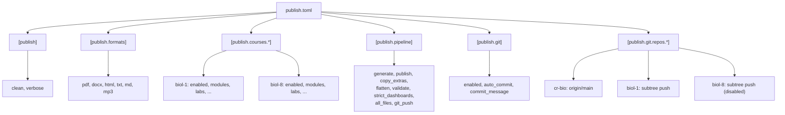

# Configuration

> **Navigation**: [← Pipeline Index](README.md) | [Publish Pipeline](PUBLISH_PIPELINE.md) | [Generation Flow](GENERATION_FLOW.md) | [Validation Flow](VALIDATION_FLOW.md) | [Git Subtree](GIT_SUBTREE.md) | [Orchestration](../ORCHESTRATION.md)

## Overview

The publish pipeline is configured by a single TOML file at the repository root: [`publish.toml`](../../../publish.toml). This file controls formats, courses, pipeline stages, and git repository targets.

**File**: `publish.toml` (repo root)
**Loaded by**: `publish.py:load_config()` using `tomllib`

---

## Configuration Structure



---

## `[publish]` — Top-Level Settings

| Key | Type | Default | Description |
|-----|------|---------|-------------|
| `clean` | bool | `true` | Clean `PUBLISHED/` and source `output/` directories before generation. Wires to `--clean` and `--clean-source-outputs` flags. |
| `verbose` | bool | `true` | Enable verbose logging. Wires to `--verbose` flag. |

**Example**:
```toml
[publish]
clean = true
verbose = true
```

---

## `[publish.formats]` — Output Format Toggles

Controls which output formats are generated. Each format maps to an internal renderer.

| Key | Type | Default | Renderer Module | Description |
|-----|------|---------|-----------------|-------------|
| `pdf` | bool | `true` | `markdown_to_pdf` (WeasyPrint) | PDF files |
| `docx` | bool | `true` | `format_conversion` (python-docx) | Word documents |
| `html` | bool | `false` | `format_conversion` (markdown2) | HTML study-guide copies |
| `txt` | bool | `false` | `format_conversion` | Plain text |
| `md` | bool | `true` | Direct copy (normalized names) | Markdown copies with standardized filenames |
| `mp3` | bool | `false` | `text_to_speech` (local TTS + ffmpeg) | Audio narration (slow) |

**Example**:
```toml
[publish.formats]
pdf  = true
docx = true
html = false
txt  = false
md   = true
mp3  = false
```

> **Note**: MP3 generation is time-consuming (local TTS + ffmpeg). Keep it disabled for routine publish runs.

---

## `[publish.courses.*]` — Per-Course Configuration

Each course has its own configuration section. Courses can be enabled/disabled independently.

### Common Keys

| Key | Type | Default | Description |
|-----|------|---------|-------------|
| `enabled` | bool | `true` | Whether the course is included in publish runs |
| `modules` | int | — | Expected module count (informational) |
| `max_module` | int | — | Generate modules 1 through `max_module` only |
| `max_lab` | int | — | Generate labs 1 through `max_lab` only |
| `path` | string | — | Source path relative to repo root (e.g. `course_development/biol-1`) |
| `archive_path` | string | — | Path to archived version (e.g. `archive/spring-2026/course_development/biol-8`) |
| `input_types` | list | `["key-points", "practice-quiz", "questions"]` | Which study-guide source files to process |
| `include_syllabus` | bool | `true` | Render syllabus/schedule outputs |
| `include_labs` | bool | `true` | Render lab manuals |
| `include_dashboards` | bool | `true` | Include lab dashboards |
| `include_slides` | bool | `true` | Include slide decks |
| `include_practice_tests` | bool | `true` | Include practice tests |
| `include_exams` | bool | `false` | Render exams locally (teacher-only, never published) |

### `[publish.courses.biol-1]`

```toml
[publish.courses.biol-1]
enabled = true
modules = 16
max_module = 16      # Generate modules 1 through 16
max_lab = 16         # Generate labs 1 through 16
path = "course_development/biol-1"
input_types = ["key-points", "practice-quiz", "questions"]
include_syllabus = true
include_labs = true
include_dashboards = true
include_slides = true
include_practice_tests = true
```

### `[publish.courses.biol-8]`

```toml
[publish.courses.biol-8]
enabled = false
max_module = 17
max_lab = 18
path = "course_development/biol-8"
archive_path = "archive/spring-2026/course_development/biol-8"
input_types = ["key-points", "practice-quiz", "questions"]
include_syllabus = true
include_labs = true
include_dashboards = true
include_exams = true      # Teacher-only, never published
include_slides = true
include_practice_tests = true
```

### Lab Skip Logic

If **all** enabled courses have `include_labs = false`, the pipeline automatically passes `--skip-labs` to generation:

```python
# From publish.py:build_args()
enabled_courses = {k: v for k, v in courses.items() if v.get("enabled", True)}
if enabled_courses and all(not c.get("include_labs", True) for c in enabled_courses.values()):
    args.append("--skip-labs")
```

---

## `[publish.pipeline]` — Pipeline Stage Toggles

Controls which pipeline stages run. Useful for debugging or partial runs.

| Key | Type | Default | Stage | Description |
|-----|------|---------|-------|-------------|
| `generate` | bool | `true` | 3 | Generate outputs from source Markdown |
| `publish` | bool | `true` | 4 | Copy outputs to `PUBLISHED/` directory |
| `copy_extras` | bool | `true` | 5-6 | Copy labs, dashboards, slides, practice tests |
| `flatten` | bool | `true` | 7-8 | Flatten and reorganize into category folders |
| `validate` | bool | `true` | 9 | Validate all outputs exist and are correct |
| `strict_dashboards` | bool | `false` | 9 | Enforce per-numbered-lab dashboard invariant |
| `all_files` | bool | `true` | 10 | Flatten all files into `ALL_FILES/` per course |
| `git_push` | bool | `false` | 11 | Push to configured git repos after publish |

**Example**:
```toml
[publish.pipeline]
generate  = true
publish   = true
copy_extras = true
flatten   = true
validate  = true
strict_dashboards = true
all_files = true
git_push  = true
```

### Stage-to-Flag Mapping

When a stage is set to `false`, `publish.py` passes the corresponding skip flag to `publish_all.py`:

| Config Key | When `false` → Flag |
|------------|---------------------|
| `generate` | `--skip-generation` |
| `publish` | `--skip-publish` |
| `copy_extras` | `--skip-copy-extras` |
| `flatten` | `--skip-flatten` |
| `validate` | `--skip-validate` |
| `strict_dashboards` | When `true` → `--strict-dashboards` |

---

## `[publish.git]` — Git Configuration

### Top-Level Git Settings

| Key | Type | Default | Description |
|-----|------|---------|-------------|
| `enabled` | bool | `true` | Master toggle for all git operations |
| `auto_commit` | bool | `true` | Automatically commit `PUBLISHED/` changes |
| `commit_message` | string | `"Update published course materials"` | Commit message for PUBLISHED changes |

**Example**:
```toml
[publish.git]
enabled = true
auto_commit = true
commit_message = "Update published course materials"
```

---

## `[publish.git.repos.*]` — Repository Configuration

Each repository target is configured as a separate section. Repositories without a `prefix` are pushed directly; repositories with a `prefix` are pushed via `git subtree split`.

### Repository Keys

| Key | Type | Default | Description |
|-----|------|---------|-------------|
| `remote` | string | Section name | Git remote name |
| `url` | string | — | Git remote URL |
| `branch` | string | `main` | Target branch |
| `prefix` | string | — | Subtree prefix (e.g. `PUBLISHED/biol-1`). If absent, a regular push is performed. |
| `push` | bool | `true` | Whether to push to this repo |
| `force` | bool | `false` | Use `--force` on push |

### `[publish.git.repos.cr-bio]` — Private Source Repository

```toml
[publish.git.repos.cr-bio]
remote = "origin"
url = "https://github.com/docxology/cr-bio.git"
branch = "main"
push = true
# No prefix → regular push (not subtree)
```

### `[publish.git.repos.biol-1]` — Public Course Repository (Subtree)

```toml
[publish.git.repos.biol-1]
remote = "biol-1"
url = "https://github.com/docxology/biol-1.git"
branch = "main"
prefix = "PUBLISHED/biol-1"    # Subtree prefix
push = true
force = true                     # Force push (subtree produces new tree each time)
```

### `[publish.git.repos.biol-8]` — Disabled Course Repository

```toml
[publish.git.repos.biol-8]
remote = "biol-8"
url = "https://github.com/docxology/biol-8.git"
branch = "main"
prefix = "PUBLISHED/biol-8"
push = false                     # Disabled — won't push
force = true
```

---

## Example Configurations

### Quick Test (Fast Iteration)

Minimal formats, single course, no git:

```toml
[publish]
clean = true
verbose = true

[publish.formats]
pdf  = true
docx = false
html = false
txt  = false
md   = false
mp3  = false

[publish.courses.biol-1]
enabled = true
max_module = 3        # Only first 3 modules
max_lab = 2            # Only first 2 labs
path = "course_development/biol-1"
include_labs = true
include_syllabus = false
include_slides = false
include_practice_tests = false

[publish.courses.biol-8]
enabled = false

[publish.pipeline]
generate = true
publish = true
copy_extras = true
flatten = true
validate = true
strict_dashboards = false
all_files = false
git_push = false       # No git operations

[publish.git]
enabled = false
```

```bash
python publish.py
```

### Full Publish (Production)

All formats, all courses, with git push:

```toml
[publish]
clean = true
verbose = true

[publish.formats]
pdf  = true
docx = true
html = false
txt  = false
md   = true
mp3  = false

[publish.courses.biol-1]
enabled = true
max_module = 16
max_lab = 16
path = "course_development/biol-1"
include_syllabus = true
include_labs = true
include_dashboards = true
include_slides = true
include_practice_tests = true

[publish.courses.biol-8]
enabled = false

[publish.pipeline]
generate = true
publish = true
copy_extras = true
flatten = true
validate = true
strict_dashboards = true
all_files = true
git_push = true

[publish.git]
enabled = true
auto_commit = true
commit_message = "Update published course materials"

[publish.git.repos.cr-bio]
remote = "origin"
url = "https://github.com/docxology/cr-bio.git"
branch = "main"
push = true

[publish.git.repos.biol-1]
remote = "biol-1"
url = "https://github.com/docxology/biol-1.git"
branch = "main"
prefix = "PUBLISHED/biol-1"
push = true
force = true
```

```bash
python publish.py
```

### PDF-Only (Quick Validation)

Generate only PDFs for quick validation:

```bash
# Using CLI override without editing publish.toml
python publish.py --override-formats pdf --skip-git
```

Or via `publish.toml`:

```toml
[publish.formats]
pdf  = true
docx = false
html = false
txt  = false
md   = false
mp3  = false
```

### Generation + Validation Only (No Publish or Git)

For testing generation without touching `PUBLISHED/`:

```toml
[publish.pipeline]
generate = true
publish = false
copy_extras = false
flatten = false
validate = true
all_files = false
git_push = false
```

### Git-Only (Commit and Push Existing PUBLISHED/)

When `PUBLISHED/` is already generated and you just need to commit and push:

```bash
python publish.py --git-only
```

This skips all generation and filesystem stages, running only:
1. `git_commit()` — commit `PUBLISHED/` changes
2. `git_push_repos()` — subtree push to public repos

---

## CLI Overrides

These flags override `publish.toml` settings at runtime:

| Flag | Overrides | Description |
|------|-----------|-------------|
| `--dry-run` | — | Show resolved config and command without executing |
| `--override-formats` | `[publish.formats]` | Comma-separated formats (e.g. `pdf,docx,md`) |
| `--skip-git` | `[publish.pipeline].git_push` | Skip git operations even if enabled in config |
| `--git-only` | `[publish.pipeline].generate` | Skip generation; only run git commit and push |
| `--setup-git` | — | Set up git remotes from config and exit |

---

## Related Documentation

| Document | Description |
|----------|-------------|
| [PUBLISH_PIPELINE.md](PUBLISH_PIPELINE.md) | 9-stage pipeline overview |
| [GIT_SUBTREE.md](GIT_SUBTREE.md) | Git subtree workflow details |
| [../ORCHESTRATION.md](../ORCHESTRATION.md) | Orchestration patterns and CLI scripts |
| [../../../publish.toml](../../../publish.toml) | Live configuration file |
