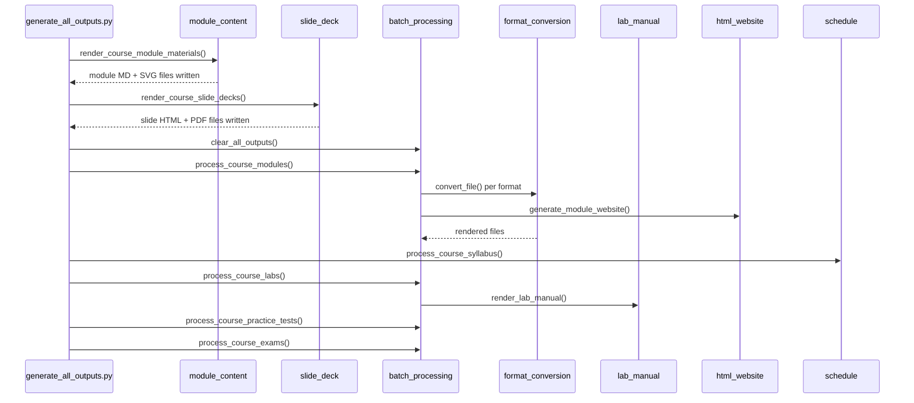
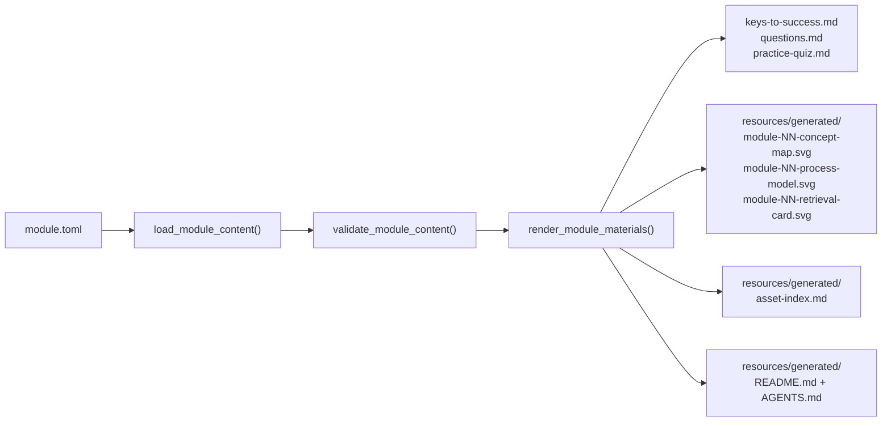
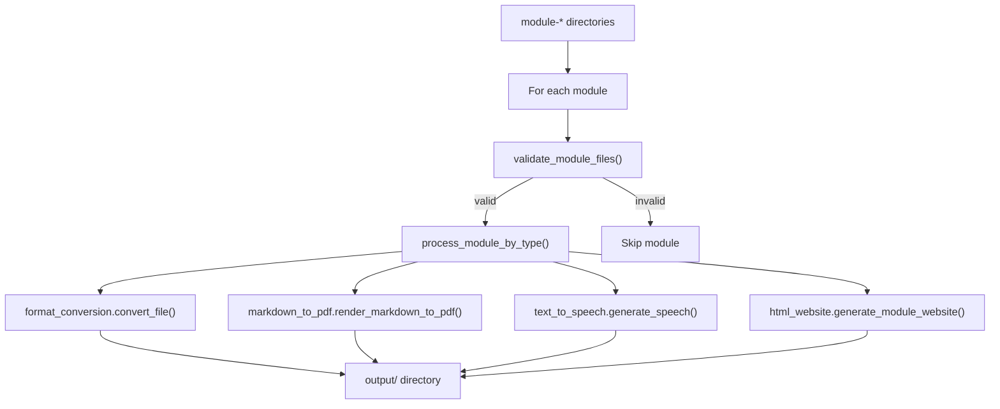
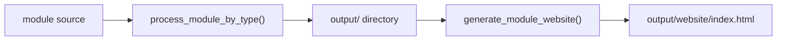

# Generation Flow

> **Navigation**: [← Pipeline Index](README.md) | [Publish Pipeline](PUBLISH_PIPELINE.md) | [Validation Flow](VALIDATION_FLOW.md) | [Git Subtree](GIT_SUBTREE.md) | [Configuration](CONFIGURATION.md) | [Orchestration](../ORCHESTRATION.md)

## Overview

Stage 3 of the publish pipeline (Generate) is the most complex stage. It transforms Markdown sources into multi-format outputs by orchestrating several internal sub-systems. This document traces the internal generation mechanics.

**Entry point**: `software/scripts/generate_all_outputs.py`



---

## Module Materials Generation

### Source: `module.toml`

Each BIOL-1 module has a `module.toml` manifest that is the canonical source for structured module content. The `module_content` package loads, validates, and renders this into student-facing Markdown and deterministic SVG visual assets.

**Package**: `src/module_content`
**Key functions**:
- `load_module_content(module_dir)` — parse and validate `module.toml`
- `render_module_materials(module_dir, dry_run=False)` — render generated module files
- `render_course_module_materials(course_root, module_filter=None)` — render all modules for a course
- `describe_course_module_materials(course_root, module_filter=None)` — dry-run report

### TOML → MD/SVG Flow



**Generated Markdown files** (overwritten on each run):

| File | Content |
|------|---------|
| `keys-to-success.md` | Learning objectives, topics, key terms, core contents, study tips, connected lab, generated visuals index |
| `questions.md` | Numbered learning questions |
| `practice-quiz.md` | Multiple-choice quiz with answers and explanations |

**Generated SVG assets** (three per module, deterministic):

| Asset | Requirements |
|-------|-------------|
| `module-NN-concept-map.svg` | `central_claim`, ≥3 `nodes`, non-dangling `edges` |
| `module-NN-process-model.svg` | ≥3 ordered `stages`, `inputs`, `outputs`, `feedbacks` |
| `module-NN-retrieval-card.svg` | ≥4 `prompts`, ≥3 `terms`, `lab_connection` |

The renderer wraps text, uses stable high-design palettes, embeds SVG accessibility metadata, and never calls external image services.

---

## Batch Processing Fan-Out

### `process_course_modules()`

After module materials are rendered, `generate_all_outputs.py` calls `process_course_modules()` from `src.batch_processing.main` to fan out each module's Markdown into multiple output formats.

**Package**: `src.batch_processing`
**Key function**: `process_course_modules(course_path, course_name, module_filter, generate_website, formats, max_module=None)`



For each module, `process_module_by_type()` dispatches to format-specific renderers based on the requested formats:

| Format | Renderer Module | Output |
|--------|----------------|--------|
| `pdf` | `markdown_to_pdf` (WeasyPrint) | `.pdf` files |
| `docx` | `format_conversion` (python-docx) | `.docx` files |
| `html` | `format_conversion` (markdown2) | `.html` files |
| `txt` | `format_conversion` | `.txt` files |
| `md` | Direct copy (normalized names) | `.md` files |
| `mp3` | `text_to_speech` (local TTS + ffmpeg) | `.mp3` files |

Output naming convention: `{module-folder-name}-{source-file-stem}.{ext}`

Example: `module-12-darwin-evolution/questions.md` → `module-12-darwin-evolution-questions.{pdf,docx,md}`

---

## Format Conversion Dispatch

The `format_conversion` module (`src.format_conversion`) is the central dispatch hub for cross-format conversions. It sits at Layer 2 in the module hierarchy, composing Layer 1 core renderers.

**Package**: `src.format_conversion`
**Key function**: `convert_file(input_path, output_format, output_path)`

| Input | Output Format | Underlying Engine |
|-------|--------------|-------------------|
| `.md` | `pdf` | WeasyPrint (via `markdown_to_pdf`) |
| `.md` | `docx` | python-docx |
| `.md` | `html` | markdown2 |
| `.md` | `txt` | Markdown text extraction |
| `.md` | `md` | Direct normalized copy |
| `.md` | `mp3` | Local TTS + ffmpeg (via `text_to_speech`) |
| `.pdf` | `txt` | pypdf text extraction |

`batch_processing` calls `convert_file()` for each (source file, format) pair, collecting results into a summary dict with per-format counts.

---

## Lab Manual Rendering

Lab protocols use a directive syntax for interactive elements (fillable fields, data tables, etc.). The `lab_manual` package renders these to PDF and HTML.

**Package**: `src.lab_manual`
**Key function**: `render_lab_manual(input_path, output_path, output_format="pdf")`

### Lab Directive Syntax

All labs use the standardized `{fill:text}` notation for student identification:

```markdown
**Name:** {fill:text} **Date:** {fill:text}
```

- This line appears immediately after the course subtitle/header.
- The PDF renderer strips this exact line to avoid duplicating the auto-generated PDF header.
- It is preserved in raw markdown for readability.

### Batch Lab Generation

Labs run when `--skip-labs` is **omitted** and `--module` is **not set** (whole-course pass). Outputs go under `course/labs/output/<pdf|html>/`.

```python
# Called by generate_all_outputs.py
process_course_labs(course_path, course_name, formats, max_lab=max_lab)
```

### Lab Dashboard Generation

Interactive lab HTML dashboards live under `course/labs/dashboards/` (`*-dashboard.html`). They complement protocol PDF/HTML in `course/labs/output/`. The batch pipeline validates dashboard counts against course config when `strict_dashboards` is enabled.

| Course | Default per lab | Overrides |
|--------|----------------|-----------|
| BIOL-1 | 1 dashboard | — |
| BIOL-8 | 1 dashboard | Lab 15: 2 (cardiovascular + respiratory) |

---

## Website Generation

Per-module interactive HTML websites are generated by `src.html_website`.

**Package**: `src.html_website`
**Key function**: `generate_module_website(module_path, output_dir, course_name=None)`

Website generation happens inside `process_course_modules()` when `generate_website=True` (i.e., when `--no-website` is not passed and `html` is in the formats list).

### Website Features

- Dark mode toggle
- Collapsible sections
- Embedded audio players (requires MP3 generation first)
- Interactive quizzes (from `questions/` folder)
- Mobile responsive design



---

## Slide Deck Generation

Active BIOL-1 Fall 2026 slide decks are rendered from structured module manifests by the `slide_deck` package, which is called by `generate_all_outputs.py` after structured module materials are refreshed.

**Package**: `src.slide_deck`
**Key functions**:
- `build_slide_deck(module_dir)` — build in-memory 10-12 slide deck from `module.toml`
- `render_module_slide_deck(module_dir, slides_root)` — write full + notes HTML and PDF outputs
- `render_course_slide_decks(course_root, module_filter=None)` — render every active module deck

### Output Contract

| Output | Location |
|--------|----------|
| `module-N-slides-full.pdf` | `course_development/biol-1/resources/slides/` |
| `module-N-slides-notes.pdf` | `course_development/biol-1/resources/slides/` |
| `module-N-slides-full.html` | `resources/slides/generated/` |
| `module-N-slides-notes.html` | `resources/slides/generated/` |

Slide decks embed module SVG visuals (concept maps, process models) and render print-ready HTML via WeasyPrint.

---

## Syllabus Processing

Syllabus/schedule documents are processed by `src.schedule` composed with `src.batch_processing`.

**Package**: `src.schedule`
**Key function**: `process_schedule(schedule_path, output_dir, formats=["pdf", "html", "txt"])`

```python
# Called by generate_all_outputs.py
process_course_syllabus(course_path, course_name, formats)
```

---

## Other Course-Level Generation

`generate_all_outputs.py` also processes:

| Type | Function | Output Location |
|------|----------|-----------------|
| Practice tests | `process_course_practice_tests()` | `course/practice_tests/output/` |
| Exams (teacher-only) | `process_course_exams()` | `course/exams/output/` |

> **Note**: Exams are rendered locally for teacher use but are **never** published to public git repositories. They are excluded from `PUBLISHED/` and subtree pushes.

---

## Related Documentation

| Document | Description |
|----------|-------------|
| [PUBLISH_PIPELINE.md](PUBLISH_PIPELINE.md) | 9-stage pipeline overview |
| [VALIDATION_FLOW.md](VALIDATION_FLOW.md) | Validation architecture |
| [../ORCHESTRATION.md](../ORCHESTRATION.md) | Orchestration patterns and module dependencies |
| [../ARCHITECTURE.md](../ARCHITECTURE.md) | System design, module layers |
