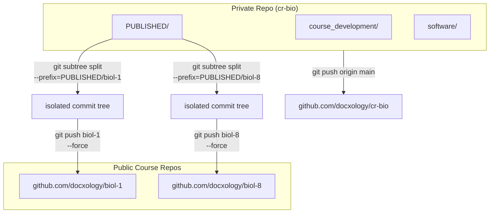
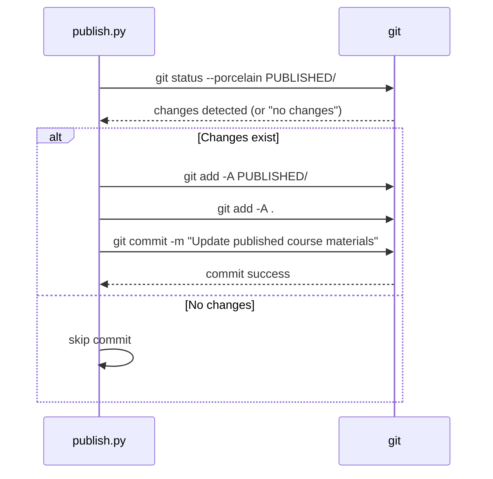
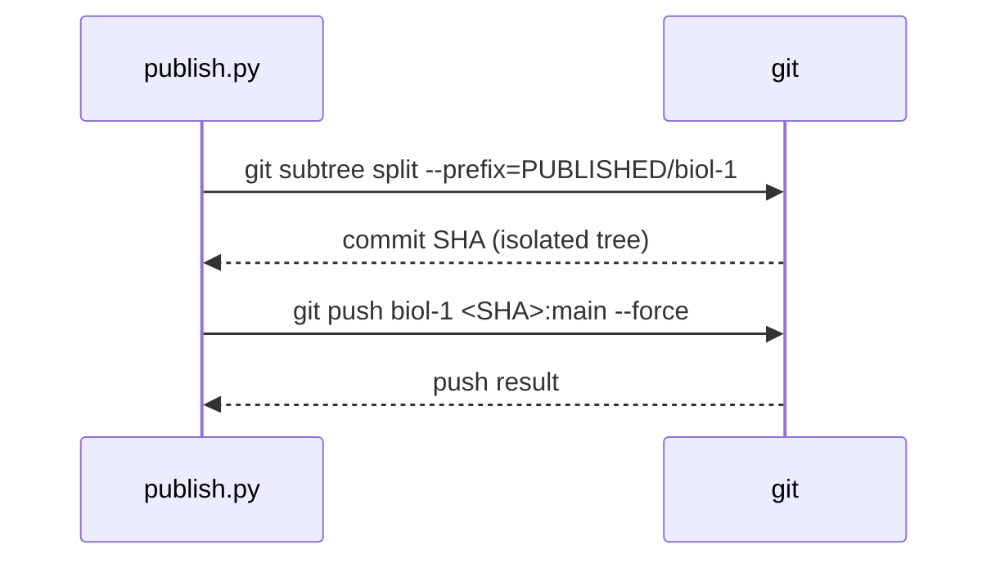
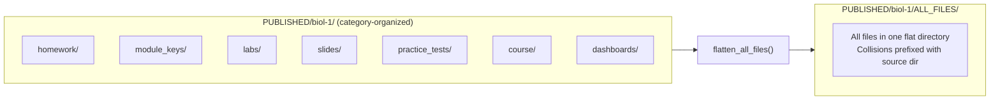

# Git Subtree Publishing

> **Navigation**: [← Pipeline Index](README.md) | [Publish Pipeline](PUBLISH_PIPELINE.md) | [Generation Flow](GENERATION_FLOW.md) | [Validation Flow](VALIDATION_FLOW.md) | [Configuration](CONFIGURATION.md) | [Orchestration](../ORCHESTRATION.md)

## Overview

After the publish pipeline generates and validates `PUBLISHED/`, Stage 11 commits changes to the private `cr-bio` repository and pushes active course subtrees to their public repos. The subtree mechanism allows each public course repo to contain only its own `PUBLISHED/<course>/` content, extracted from the monorepo.

**Entry point**: `publish.py` (`git_commit()` + `git_push_repos()`)
**Configuration**: `[publish.git]` and `[publish.git.repos.*]` in `publish.toml`

---

## Architecture



---

## Repository Configuration

Each repository is configured in `publish.toml` under `[publish.git.repos.<name>]`:

```toml
[publish.git]
enabled = true
auto_commit = true
commit_message = "Update published course materials"

# Private source-of-truth repository
[publish.git.repos.cr-bio]
remote = "origin"
url = "https://github.com/docxology/cr-bio.git"
branch = "main"
push = true

# Public course repository (subtree push)
[publish.git.repos.biol-1]
remote = "biol-1"
url = "https://github.com/docxology/biol-1.git"
branch = "main"
prefix = "PUBLISHED/biol-1"    # Subtree prefix
push = true
force = true                     # Force push for subtree

# Disabled course (push = false)
[publish.git.repos.biol-8]
remote = "biol-8"
url = "https://github.com/docxology/biol-8.git"
branch = "main"
prefix = "PUBLISHED/biol-8"
push = false
force = true
```

### Repo Configuration Keys

| Key | Description | Default |
|-----|-------------|---------|
| `remote` | Git remote name | The repo name (e.g. `biol-1`) |
| `url` | Git remote URL | — |
| `branch` | Target branch | `main` |
| `prefix` | Subtree prefix (e.g. `PUBLISHED/biol-1`). If absent, a regular push is performed instead. | — |
| `push` | Whether to push to this repo | `true` |
| `force` | Use `--force` on push | `false` |

---

## Git Remote Setup

### One-time Setup

```bash
# Set up all remotes from publish.toml and exit
python publish.py --setup-git
```

This calls `setup_git_remotes()` which:
1. Reads `[publish.git.repos.*]` from config
2. Checks `git remote -v` for existing remotes
3. Adds any missing remotes via `git remote add <name> <url>`

### Manual Setup

```bash
# Add remote for cr-bio (private)
git remote add origin https://github.com/docxology/cr-bio.git

# Add remote for biol-1 (public)
git remote add biol-1 https://github.com/docxology/biol-1.git

# Add remote for biol-8 (public)
git remote add biol-8 https://github.com/docxology/biol-8.git

# Verify
git remote -v
```

---

## Git Command Sequence

### Step 1: Commit PUBLISHED/ Changes



**Commands executed**:
```bash
git status --porcelain PUBLISHED/          # Check for changes
git add -A PUBLISHED/                       # Stage PUBLISHED changes
git add -A .                                 # Stage any other tracked changes
git commit -m "Update published course materials"
```

### Step 2: Push to Private Repo

For repos **without** a `prefix` (regular push):

```bash
git push origin main
```

### Step 3: Subtree Push to Public Course Repos

For repos **with** a `prefix` (subtree push):



**Commands executed per course repo**:
```bash
# Stage 1: Subtree split — extracts PUBLISHED/<course>/ as a standalone commit tree
git subtree split --prefix=PUBLISHED/biol-1

# Stage 2: Push the isolated commit to the public repo
git push biol-1 <commit-sha>:main --force
```

The `git subtree split` command creates a new synthetic commit containing only the contents of `PUBLISHED/biol-1/` at the repository root. This isolated commit is then force-pushed to the public course repo, replacing its entire history with the current published state.

---

## ALL_FILES/ Flattening

Before git operations, `publish.py` optionally flattens all published files into an `ALL_FILES/` directory per course. This runs at Stage 10 (controlled by `pipeline.all_files`).

### How It Works



### Collision Handling

When filenames collide across subdirectories, the source subdirectory name is prepended:

| Source | Original filename | Flattened filename |
|--------|------------------|--------------------|
| `homework/` | `module-01-questions.pdf` | `module-01-questions.pdf` |
| `labs/` | `module-01-questions.pdf` | `labs_module-01-questions.pdf` |

### What Gets Flattened

- Every file from every subdirectory of `PUBLISHED/<course>/` (except `ALL_FILES/` itself)
- Recursively walks all subdirectories
- Uses `shutil.copy2` to preserve metadata
- Cleans and recreates `ALL_FILES/` on each run

---

## Force Push Considerations

Subtree pushes use `--force` by default for course repos (`force = true` in config). This is intentional because:

1. `git subtree split` produces a **new** commit tree each time — it does not build on the public repo's history.
2. Force push replaces the public repo's entire content with the current published state.
3. This ensures the public repo always exactly mirrors `PUBLISHED/<course>/`.

> **Warning**: Force push rewrites public repo history. This is acceptable for course material repos where the private `cr-bio` is the source of truth. Do **not** use force push for the private `cr-bio` repo.

---

## Pipeline Summary

After all git operations complete, `publish.py` prints a summary:

```text
==================================================
GIT PUSH SUMMARY
==================================================
  Pushed:  2 repos
           ✓ cr-bio
           ✓ biol-1
  Skipped: 1 repos
           ⏭  biol-8
==================================================
```

Followed by a per-course file count summary showing unique files vs. `ALL_FILES/` duplicates:

```text
======================================================================
  PUBLISH COMPLETE
======================================================================
  PUBLISHED/ total files (recursive, includes ALL_FILES/ duplicates): 845
    biol-1: 845 files total (421 unique + 424 duplicated in ALL_FILES/)
======================================================================
```

---

## CLI Flags for Git Operations

| Flag | Description |
|------|-------------|
| `--skip-git` | Run the full pipeline but skip git commit and push |
| `--git-only` | Skip generation entirely; only run git commit and push |
| `--setup-git` | Set up git remotes from `publish.toml` and exit |

```bash
# Run pipeline but don't push
python publish.py --skip-git

# Only commit and push (no generation)
python publish.py --git-only

# Configure remotes
python publish.py --setup-git
```

---

## Related Documentation

| Document | Description |
|----------|-------------|
| [PUBLISH_PIPELINE.md](PUBLISH_PIPELINE.md) | 9-stage pipeline overview |
| [CONFIGURATION.md](CONFIGURATION.md) | `publish.toml` deep dive including `[publish.git]` |
| [../ORCHESTRATION.md](../ORCHESTRATION.md) | Orchestration patterns |
