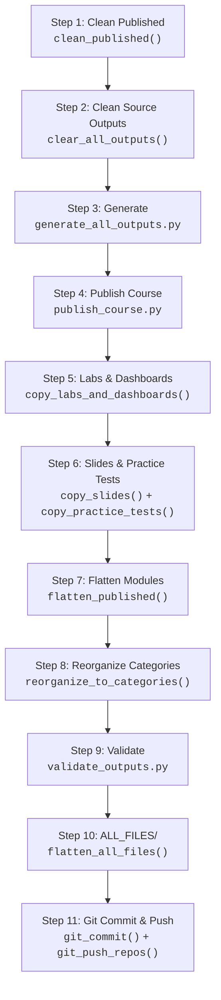

# Publish Pipeline

> **Navigation**: [← Pipeline Index](README.md) | [Generation Flow](GENERATION_FLOW.md) | [Validation Flow](VALIDATION_FLOW.md) | [Git Subtree](GIT_SUBTREE.md) | [Configuration](CONFIGURATION.md) | [Orchestration](../ORCHESTRATION.md)

## Overview

The publish pipeline is the automated path from Markdown sources to `PUBLISHED/` artifacts and public course repositories. It is driven by [`publish.toml`](../../../publish.toml) and executed through two entry points:

| Entry | Responsibility |
|-------|----------------|
| **`python publish.py`** (repo root) | Builds CLI args from TOML, runs `publish_all.py`, then — on success — optionally aggregates `ALL_FILES/` (`pipeline.all_files`) and runs git commit / subtree push (`pipeline.git_push`). |
| **`software/scripts/publish_all.py`** | Executes Steps 1–9: clean → generate → filesystem layout → validate. |

---

## Stage Flow



Steps 1–9 run inside `publish_all.py`. Steps 10–11 are root-only, executed by `publish.py` after `publish_all.py` returns success.

---

## Stage Details

### Stage 1 — Clean Published

| Field | Value |
|-------|-------|
| **Purpose** | Clear the `PUBLISHED/` directory before generation to avoid stale artifacts. |
| **Script/Module** | `src.publish.utils.clean_published()` |
| **Triggered by** | `--clean` flag (wired from `publish.clean = true` in `publish.toml`) |
| **Inputs** | `PUBLISHED/` directory |
| **Outputs** | Empty `PUBLISHED/` directory |
| **Config** | `[publish].clean` |

### Stage 2 — Clean Source Outputs

| Field | Value |
|-------|-------|
| **Purpose** | Clear `course_development/**/output/` directories to ensure fresh generation. |
| **Script/Module** | `src.batch_processing.main.clear_all_outputs()` |
| **Triggered by** | `--clean-source-outputs` flag (wired from `publish.clean = true`) |
| **Inputs** | `course_development/` tree |
| **Outputs** | Cleared `output/` directories under each module, syllabus, labs, etc. |
| **Config** | `[publish].clean` |

### Stage 3 — Generate

| Field | Value |
|-------|-------|
| **Purpose** | Render all output formats for active courses: modules, syllabus, labs, practice tests, exams, slide decks. |
| **Script/Module** | `software/scripts/generate_all_outputs.py` |
| **Triggered by** | `--skip-generation` flag absent (default: generate) |
| **Inputs** | `course_development/<course>/` source Markdown, `module.toml` manifests |
| **Outputs** | `output/` directories under each module, syllabus, labs, practice tests, exams |
| **Config** | `[publish.pipeline].generate`, `[publish.formats]`, `[publish.courses.*]` |

This is the most complex stage — see [GENERATION_FLOW.md](GENERATION_FLOW.md) for the internal mechanics.

### Stage 4 — Publish Course

| Field | Value |
|-------|-------|
| **Purpose** | Copy generated artifacts from source `output/` directories into `PUBLISHED/<course>/`. |
| **Script/Module** | `software/scripts/publish_course.py` |
| **Triggered by** | `--skip-publish` flag absent (default: publish) |
| **Inputs** | Source `output/` directories across all active courses |
| **Outputs** | `PUBLISHED/<course>/` with module-centric tree structure |
| **Config** | `[publish.pipeline].publish` |

### Stage 5 — Copy Labs & Dashboards

| Field | Value |
|-------|-------|
| **Purpose** | Copy lab protocol PDF/HTML and interactive dashboards into `PUBLISHED/<course>/labs/` and `dashboards/`. |
| **Script/Module** | `src.publish.utils.copy_labs_and_dashboards()` |
| **Triggered by** | `--skip-copy-extras` flag absent (default: copy) |
| **Inputs** | `course_development/<course>/course/labs/output/`, `course/labs/dashboards/` |
| **Outputs** | `PUBLISHED/<course>/labs/`, `PUBLISHED/<course>/dashboards/` |
| **Config** | `[publish.pipeline].copy_extras`, `[publish.courses.*].include_labs`, `[publish.courses.*].include_dashboards` |

### Stage 6 — Copy Slides & Practice Tests

| Field | Value |
|-------|-------|
| **Purpose** | Copy slide PDFs into central and per-module locations; copy practice tests. Exams are **never** published (teacher-only). |
| **Script/Module** | `copy_slides()`, `copy_slides_to_modules()`, `copy_practice_tests()` |
| **Triggered by** | `--skip-copy-extras` flag absent |
| **Inputs** | `course_development/<course>/resources/slides/`, `course/practice_tests/` |
| **Outputs** | `PUBLISHED/<course>/slides/`, per-module slide bundles, `PUBLISHED/<course>/practice_tests/` |
| **Config** | `[publish.pipeline].copy_extras`, `[publish.courses.*].include_slides`, `[publish.courses.*].include_practice_tests` |

### Stage 7 — Flatten Modules

| Field | Value |
|-------|-------|
| **Purpose** | Move nested study-guide files upward inside each `module-*` folder in `PUBLISHED/`. Removes subdirectory nesting for direct browsing. Skips labs, dashboards, syllabus, slides, exams. |
| **Script/Module** | `src.publish.utils.flatten_published()` |
| **Triggered by** | `--skip-flatten` flag absent (default: flatten) |
| **Inputs** | `PUBLISHED/<course>/` with nested module structure |
| **Outputs** | Flattened `PUBLISHED/<course>/` structure |
| **Config** | `[publish.pipeline].flatten` |

### Stage 8 — Reorganize Categories

| Field | Value |
|-------|-------|
| **Purpose** | Build category folders (`homework/`, `module_keys/`, `course/`, etc.) and copy per-module published bundles. Removes stray `index.html` under module folders. |
| **Script/Module** | `src.publish.utils.reorganize_to_categories()` + `copy_module_bundles()` |
| **Triggered by** | `--skip-flatten` flag absent (shares the flatten toggle) |
| **Inputs** | Flattened `PUBLISHED/<course>/` |
| **Outputs** | Category-organized `PUBLISHED/<course>/homework/`, `module_keys/`, `labs/`, `slides/`, `practice_tests/`, `course/`, per-module bundles |
| **Config** | `[publish.pipeline].flatten` |

### Stage 9 — Validate

| Field | Value |
|-------|-------|
| **Purpose** | Verify expected artifacts exist for every in-scope module, lab, syllabus. Optional strict dashboard invariant check. |
| **Script/Module** | `software/scripts/validate_outputs.py` |
| **Triggered by** | `--skip-validate` flag absent (default: validate) |
| **Inputs** | `PUBLISHED/<course>/` and `course_development/<course>/` source tree |
| **Outputs** | Validation report (per-course module validity, lab counts, published file counts) |
| **Config** | `[publish.pipeline].validate`, `[publish.pipeline].strict_dashboards` |

See [VALIDATION_FLOW.md](VALIDATION_FLOW.md) for the full validation architecture.

### Stage 10 — ALL_FILES/ Flattening (root-only)

| Field | Value |
|-------|-------|
| **Purpose** | Copy every file from every subdirectory of `PUBLISHED/<course>/` into a flat `ALL_FILES/` directory for direct browsing. Filename collisions are resolved by prefixing the source subdirectory name. |
| **Script/Module** | `publish.py:flatten_all_files()` |
| **Triggered by** | `pipeline.all_files = true` (default) |
| **Inputs** | `PUBLISHED/<course>/` post-flatten, post-reorganize |
| **Outputs** | `PUBLISHED/<course>/ALL_FILES/` — flat mirror of all files |
| **Config** | `[publish.pipeline].all_files` |

### Stage 11 — Git Commit & Push (root-only)

| Field | Value |
|-------|-------|
| **Purpose** | Commit `PUBLISHED/` changes to cr-bio, then subtree push active course prefixes to their public repos. |
| **Script/Module** | `publish.py:git_commit()` + `publish.py:git_push_repos()` |
| **Triggered by** | `pipeline.git_push = true` **and** not `--skip-git` |
| **Inputs** | `PUBLISHED/` changes, git remote configuration |
| **Outputs** | Commits in cr-bio, pushed subtrees to public course repos |
| **Config** | `[publish.pipeline].git_push`, `[publish.git]` |

See [GIT_SUBTREE.md](GIT_SUBTREE.md) for the full git workflow.

---

## CLI Flags

`publish.py` accepts the following command-line flags:

| Flag | Description | Config Equivalent |
|------|-------------|-------------------|
| `--dry-run` | Show the command that would run and config summary without executing | — |
| `--skip-git` | Run the pipeline but skip git commit and push | Overrides `[publish.pipeline].git_push` |
| `--override-formats` | Override config formats (comma-separated, e.g. `pdf,docx,md`) | Overrides `[publish.formats]` |
| `--setup-git` | Set up git remotes from `publish.toml` and exit | — |
| `--git-only` | Skip generation entirely; only run git commit and push | — |

### Dry Run Output

`--dry-run` prints the resolved configuration without executing:

```text
publish.toml config loaded:
  formats:  ['pdf', 'docx', 'md']
  clean:    True
  verbose:  True
  pipeline: generate=True, publish=True, copy_extras=True, flatten=True, validate=True, git_push=True
  biol-1: enabled=True, labs=True, syllabus=True, dashboards=True, archive=

Git configuration:
  auto_commit: True
  git_push:    True
  cr-bio: origin → main [push]
  biol-1: biol-1 → main [push (force)] [subtree: PUBLISHED/biol-1]
  biol-8: biol-8 → main [skip (force)] [subtree: PUBLISHED/biol-8]

Would run (cwd: software/):
  uv run python scripts/generate_module_materials.py --course all --dry-run
  uv run python scripts/publish_all.py --clean --clean-source-outputs --verbose ...
```

> **Note**: Dry-run does **not** execute the root-only `ALL_FILES/` or git phases. It previews the `publish_all.py` command only.

---

## Pipeline Stage Configuration

Each stage can be individually toggled in `publish.toml` under `[publish.pipeline]`:

```toml
[publish.pipeline]
generate          = true   # Stage 3: Generate outputs
publish           = true   # Stage 4: Publish to PUBLISHED/
copy_extras       = true   # Stages 5-6: Labs, dashboards, slides, practice tests
flatten           = true   # Stages 7-8: Flatten and reorganize
validate          = true   # Stage 9: Validate outputs
strict_dashboards = true   # Stage 9: Enforce per-numbered-lab dashboard invariant
all_files         = true   # Stage 10: Flatten all files into ALL_FILES/
git_push          = true   # Stage 11: Git commit and subtree push
```

See [CONFIGURATION.md](CONFIGURATION.md) for the complete `publish.toml` reference.

---

## Related Documentation

| Document | Description |
|----------|-------------|
| [GENERATION_FLOW.md](GENERATION_FLOW.md) | Internal generation mechanics |
| [VALIDATION_FLOW.md](VALIDATION_FLOW.md) | Validation architecture |
| [GIT_SUBTREE.md](GIT_SUBTREE.md) | Git subtree publishing workflow |
| [CONFIGURATION.md](CONFIGURATION.md) | `publish.toml` deep dive |
| [../ORCHESTRATION.md](../ORCHESTRATION.md) | Orchestration patterns and CLI scripts |
