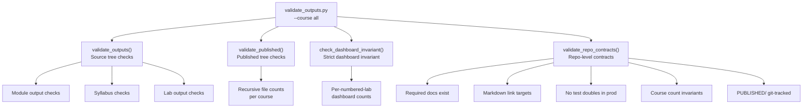

# Validation Flow

> **Navigation**: [← Pipeline Index](README.md) | [Publish Pipeline](PUBLISH_PIPELINE.md) | [Generation Flow](GENERATION_FLOW.md) | [Git Subtree](GIT_SUBTREE.md) | [Configuration](CONFIGURATION.md) | [Orchestration](../ORCHESTRATION.md)

## Overview

Validation runs at Stage 9 of the publish pipeline to verify that all expected artifacts were generated and published correctly. The validation system has four layers, each checking different invariants across the source tree, published tree, and repository contracts.

**Package**: `src.validation`
**Script**: `software/scripts/validate_outputs.py`



---

## validate_outputs — Source Tree Checks

Validates a course's source-tree outputs under `course_development/<course>/`.

**Function**: `validate_outputs(course_path, formats=None, max_module=None, max_lab=None, strict_dashboards=False)` → `dict`

### What It Checks

| Check | Description |
|-------|-------------|
| **Module outputs** | For each `module-*` directory: verifies expected output files exist in `output/` for each requested format. Checks study-guide files (`keys-to-success`, `questions`) in PDF/DOCX/MD as configured. |
| **Syllabus outputs** | Verifies syllabus output files exist in `syllabus/output/` for requested formats. |
| **Lab outputs** | Counts lab source files (`lab-*.md`), verifies rendered outputs exist in `course/labs/output/` for each format. Distinguishes numbered labs from supplemental (follow-up) files. |
| **Website files** | Checks for `output/website/index.html` per module. |

### Return Shape

```python
{
    "valid": bool,
    "formats_validated": ["pdf", "docx", "md"],
    "modules_checked": 16,
    "modules_valid": 16,
    "modules": [
        {"name": "module-01-...", "valid": True, "missing_files": []},
        ...
    ],
    "syllabus_valid": True,
    "labs": {
        "source_labs": 19,
        "source_labs_numbered": 18,
        "source_labs_supplemental": 1,
        "formats_checked": ["pdf", "docx", "md"],
        "output_files": {"pdf": 19, "docx": 19, "md": 19},
        "dashboards": 19,
        "missing_outputs": [],
        "issues": []
    },
    "issues": []
}
```

### Format-Aware Lab Counting

The lab checker honours the `formats` argument:

- When `formats` is `None`, legacy behavior applies (`pdf` + `html` only).
- When `formats` is supplied, it is intersected with `LAB_RENDERABLE_FORMATS = ["pdf", "docx", "html", "md", "txt"]`.

This ensures a publish run with `--formats pdf,docx,md` produces accurate log lines like:

```
Labs (source tree): 19 markdown (18 numbered + 1 supplemental);
outputs: pdf:19, docx:19, md:19; dashboards: 19
```

### Module/Lab Limits

`max_module` and `max_lab` clip the validation scope for partial test runs:

- `max_module=N` — only validate modules 1 through N
- `max_lab=N` — only validate labs whose number ≤ N, but **keeps** supplemental files for in-scope numbers (e.g., `lab-14_microbiology-followup.md` stays when `max_lab=14`)

---

## validate_published — Published Tree Checks

Recursively counts files under `PUBLISHED/<course>/` for each course in `COURSE_CONFIG`.

**Function**: `validate_published(published_path)` → `dict`

### What It Checks

| Check | Description |
|-------|-------------|
| **Per-course file counts** | Recursive count of all files under `PUBLISHED/<course>/` (before `ALL_FILES/` flattening) |
| **Module subdirectory presence** | Counts module subdirectories in the published tree |
| **Issues** | Reports any structural issues found in the published tree |

### Return Shape

```python
{
    "valid": True,
    "courses": {
        "biol-1": {
            "total_files": 421,
            "modules": [...]
        }
    },
    "issues": []
}
```

> **Note**: The total reported is **pre-`ALL_FILES/` flatten** — it does not include the duplicated flat mirror. The final `publish.py` summary shows a higher number because `ALL_FILES/` roughly doubles the count.

---

## validate_repo_contracts — Repository Invariants

Validates repository-level contracts that should hold before publishing. These checks intentionally avoid rendering outputs; they cover documentation, source layout, and git tracking invariants.

**Function**: `validate_repo_contracts(repo_root)` → `RepoContractReport`
**Script**: `software/scripts/validate_repo_contracts.py`

### What It Checks

| Check | Description |
|-------|-------------|
| **Required docs** | Every directory under `course_development/` and `software/src/` must have `README.md` and `AGENTS.md`. Excludes `__pycache__`, `output/`, cache dirs. |
| **Markdown links** | All internal markdown links in `README.md`, `AGENTS.md`, `software/`, `course_development/`, and archive signposts must resolve to existing files. Placeholder links (`parent.md`, `sibling.md`, etc.) are skipped. Fenced code blocks are stripped before checking. |
| **No test doubles in production** | Production code paths (`publish.py`, `software/scripts/`, `software/src/`) must not contain `unittest.mock`, `MagicMock`, `@patch`, or similar test doubles. Enforces the Real-Implementation Policy. |
| **Course counts** | Verifies module and lab counts match expected values per course config. |
| **Active course materials** | Active BIOL-1 courses must not contain forbidden text (e.g., "Spring 2026", "Del Norte", "Pelican Bay State Prison" in non-approved contexts). Verifies lab name/date identification line format. |
| **Archive signposts** | Archived course trees must have proper `README.md` and `AGENTS.md` signposts. |
| **Published tracking** | `PUBLISHED/` directory must be tracked by git (not gitignored). |

### Return Shape

```python
RepoContractReport(
    valid=True,
    issues=[],
    summary={
        "doc_directories_checked": 45,
        "markdown_files_checked": 120,
        ...
    }
)
```

---

## Strict Dashboard Invariant

An opt-in check that enforces, for each numbered protocol `lab-NN_*.md` in the course's `course/labs/`, that `course/labs/dashboards/` contains the expected number of `lab-NN_*-dashboard.html` files.

**Function**: `check_dashboard_invariant(course_path, course_name=None, max_lab=None)` → `dict`

### Configuration

| Course | Default per lab | Overrides | Exempt |
|--------|----------------|-----------|--------|
| BIOL-1 | 1 | — | — |
| BIOL-8 | 1 | `{15: 2}` (cardiovascular + respiratory) | — |

### Activation

| Method | How |
|--------|-----|
| API | `validate_outputs(..., strict_dashboards=True)` |
| CLI | `uv run python scripts/validate_outputs.py --course all --strict-dashboards` |
| Pipeline | `[publish.pipeline].strict_dashboards = true` in `publish.toml` |

When enabled, `validate_outputs` adds a `dashboard_invariant` field with `per_lab` counts and any mismatch issues. Mismatches bubble up into `results["issues"]` and flip `results["valid"]` to `False`.

Supplemental files (e.g., `lab-14_microbiology-followup.md`) and lab numbers without any numbered protocol are skipped — adding a follow-up page never triggers a false positive.

### Output Example

```
Dashboard invariant (biol-1, strict): ✓ 16 numbered labs checked, 0 issue(s)
Dashboard invariant (biol-8, strict): ✓ 18 numbered labs checked, 0 issue(s)
```

---

## Combined Report: generate_validation_report

The `generate_validation_report()` function is a convenience wrapper that calls both `validate_outputs()` and `validate_published()` and returns a combined report.

**Function**: `generate_validation_report(course_name, repo_root=None, formats=None, max_module=None, max_lab=None, strict_dashboards=False)` → `dict`

### Return Shape

```python
{
    "source_validation": { ... },        # validate_outputs() result
    "published_validation": { ... },      # validate_published() result
    "summary": { ... }
}
```

`validate_outputs.py` calls this per course and aggregates the results.

---

## Publish Totals Scope

Different log lines describe different snapshots of `PUBLISHED/`:

| Line (printer) | Scope |
|---|---|
| `Validation complete (source tree): N/M modules valid` (`main.py`) | Module validity in `course_development/<course>/` |
| `Labs (source tree): ...` (`main.py`) | Source `course/labs/*.md` and `course/labs/output/*` |
| `Published Outputs (PUBLISHED/<course>/, recursive, pre-ALL_FILES flatten)` (`validate_outputs.py`) | Recursive count **before** `ALL_FILES/` flattening |
| `PUBLISHED DIRECTORY SUMMARY (pre-ALL_FILES flatten)` (`validate_outputs.py`) | Sum of per-course pre-flatten counts |
| `PUBLISHED/ total files (recursive, includes ALL_FILES/ duplicates)` (`publish.py`) | Final on-disk count **after** `ALL_FILES/` — roughly double the validation total |

---

## CLI Usage

```bash
# Validate all active courses
cd software && uv run python scripts/validate_outputs.py --course all

# Validate specific formats
cd software && uv run python scripts/validate_outputs.py --course all --formats pdf,docx,md

# Strict dashboard invariant
cd software && uv run python scripts/validate_outputs.py --course all --strict-dashboards

# JSON output
cd software && uv run python scripts/validate_outputs.py --course all --json

# Verbose module-level details
cd software && uv run python scripts/validate_outputs.py --course all --verbose

# Limit scope (for testing)
cd software && uv run python scripts/validate_outputs.py --course biol-1 --max-module 3 --max-lab 2
```

---

## Related Documentation

| Document | Description |
|----------|-------------|
| [PUBLISH_PIPELINE.md](PUBLISH_PIPELINE.md) | 9-stage pipeline overview |
| [GENERATION_FLOW.md](GENERATION_FLOW.md) | Internal generation mechanics |
| [../ORCHESTRATION.md](../ORCHESTRATION.md) | Orchestration patterns |
| [../../src/validation/AGENTS.md](../../src/validation/AGENTS.md) | Validation module API reference |
