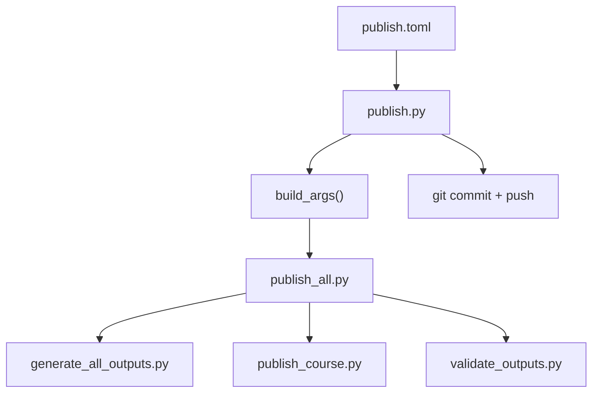

# Configuration Reference

> **Navigation**: [← Reference Home](README.md) | [CLI Reference](CLI_REFERENCE.md) | [Troubleshooting](TROUBLESHOOTING.md) | [Glossary](GLOSSARY.md)

Complete reference for every configuration setting that affects the cr-bio publish pipeline. Covers `publish.toml` (pipeline configuration) and `software/pyproject.toml` (Python tooling configuration).

---

## Contents

- [publish.toml — Pipeline Configuration](#publishtoml--pipeline-configuration)
  - [\[publish\] — Global Settings](#publish--global-settings)
  - [\[publish.formats\] — Output Format Toggles](#publishformats--output-format-toggles)
  - [\[publish.courses.biol-1\] — BIOL-1 Course Settings](#publishcoursesbiol-1--biol-1-course-settings)
  - [\[publish.courses.biol-8\] — BIOL-8 Course Settings](#publishcoursesbiol-8--biol-8-course-settings)
  - [\[publish.pipeline\] — Pipeline Stage Toggles](#publishpipeline--pipeline-stage-toggles)
  - [\[publish.git\] — Git Configuration](#publishgit--git-configuration)
  - [\[publish.git.repos.*\] — Repository Configuration](#publishgitrepos--repository-configuration)
- [pyproject.toml — Python Tooling Configuration](#pyprojecttoml--python-tooling-configuration)
  - [\[project\] — Project Metadata](#project--project-metadata)
  - [\[project.optional-dependencies\] — Dev Dependencies](#projectoptional-dependencies--dev-dependencies)
  - [\[tool.pytest.ini_options\] — Pytest Configuration](#toolpytestini_options--pytest-configuration)
  - [\[tool.black\] — Black Formatter](#toolblack--black-formatter)
  - [\[tool.mypy\] — Mypy Type Checker](#toolmypy--mypy-type-checker)
  - [\[tool.ruff\] — Ruff Linter](#toolruff--ruff-linter)
- [Other Configuration Files](#other-configuration-files)

---

## publish.toml — Pipeline Configuration

The root-level `publish.toml` is the authoritative configuration for the publish pipeline. It is read by `publish.py` and translated into CLI arguments for `publish_all.py`.



### \[publish\] — Global Settings

| Setting | Type | Default | Description |
|---------|------|---------|-------------|
| `clean` | bool | `true` | Clear output directories before generation |
| `verbose` | bool | `true` | Enable verbose logging |

### \[publish.formats\] — Output Format Toggles

Each format can be toggled independently. MP3 uses local TTS tooling and is time-consuming, so it is disabled for routine publish runs.

| Setting | Type | Default | Description |
|---------|------|---------|-------------|
| `pdf` | bool | `true` | PDF files (via WeasyPrint / `markdown_to_pdf`) |
| `docx` | bool | `true` | Word documents (via `format_conversion` / python-docx) |
| `html` | bool | `false` | HTML study-guide copies (via `format_conversion` / markdown2) |
| `txt` | bool | `false` | Plain text (via `format_conversion`) |
| `md` | bool | `true` | Markdown copy (source files with standardized names) |
| `mp3` | bool | `false` | Audio narration (local TTS + ffmpeg, slower) |

> **Note**: Defaults for `html` / `txt` / `md` can change over time — read the repo's `publish.toml` after pull.

### \[publish.courses.biol-1\] — BIOL-1 Course Settings

| Setting | Type | Default | Description |
|---------|------|---------|-------------|
| `enabled` | bool | `true` | Enable/disable this course in the pipeline |
| `modules` | int | `16` | Total module count (for reference/validation) |
| `max_module` | int | `16` | Generate modules 1 through `max_module` |
| `max_lab` | int | `16` | Generate labs 1 through `max_lab` |
| `path` | string | `"course_development/biol-1"` | Relative path to course source |
| `input_types` | list | `["keys-to-success", "questions"]` | Source file types to process |
| `include_syllabus` | bool | `true` | Process syllabus/schedule |
| `include_labs` | bool | `true` | Process lab manuals |
| `include_dashboards` | bool | `true` | Generate lab dashboards |
| `include_slides` | bool | `true` | Generate slide decks |
| `include_practice_tests` | bool | `true` | Process practice tests |

### \[publish.courses.biol-8\] — BIOL-8 Course Settings

| Setting | Type | Default | Description |
|---------|------|---------|-------------|
| `enabled` | bool | `false` | Enable/disable this course in the pipeline |
| `max_module` | int | `17` | Generate modules 1 through `max_module` |
| `max_lab` | int | `18` | Generate labs 1 through `max_lab` |
| `path` | string | `"course_development/biol-8"` | Relative path to course source |
| `archive_path` | string | `"archive/spring-2026/course_development/biol-8"` | Path to archived snapshot |
| `input_types` | list | `["keys-to-success", "questions"]` | Source file types to process |
| `include_syllabus` | bool | `true` | Process syllabus/schedule |
| `include_labs` | bool | `true` | Process lab manuals |
| `include_dashboards` | bool | `true` | Generate lab dashboards |
| `include_exams` | bool | `true` | Local rendering of exams (PDF + DOCX into `course/exams/output/`). Exams are **never** published to public git — teacher-only materials. |
| `include_slides` | bool | `true` | Generate slide decks |
| `include_practice_tests` | bool | `true` | Process practice tests |

### \[publish.pipeline\] — Pipeline Stage Toggles

Toggle individual pipeline stages. Useful for debugging or partial runs.

| Setting | Type | Default | Description |
|---------|------|---------|-------------|
| `generate` | bool | `true` | Generate outputs from source Markdown |
| `publish` | bool | `true` | Copy outputs to `PUBLISHED/` directory |
| `copy_extras` | bool | `true` | Copy labs and dashboards |
| `flatten` | bool | `true` | Flatten module subdirectory structure |
| `validate` | bool | `true` | Validate all outputs exist and are correct |
| `strict_dashboards` | bool | `true` | Enforce per-numbered-lab dashboard invariant (BIOL-1: 1/lab; BIOL-8: 1/lab + Lab 15 = 2) |
| `all_files` | bool | `true` | Flatten all files into `ALL_FILES/` per course |
| `git_push` | bool | `true` | Push to configured git repos after publish |

### \[publish.git\] — Git Configuration

| Setting | Type | Default | Description |
|---------|------|---------|-------------|
| `enabled` | bool | `true` | Master toggle for git operations |
| `auto_commit` | bool | `true` | Automatically commit `PUBLISHED/` changes |
| `commit_message` | string | `"Update published course materials"` | Git commit message |

### \[publish.git.repos.*\] — Repository Configuration

Each repo is configured as a sub-table under `[publish.git.repos]`.

#### `cr-bio` (private source of truth)

| Setting | Type | Default | Description |
|---------|------|---------|-------------|
| `remote` | string | `"origin"` | Git remote name |
| `url` | string | `"https://github.com/docxology/cr-bio.git"` | Remote URL |
| `branch` | string | `"main"` | Target branch |
| `push` | bool | `true` | Push to this repo |

#### `biol-1` (public course repo — subtree push)

| Setting | Type | Default | Description |
|---------|------|---------|-------------|
| `remote` | string | `"biol-1"` | Git remote name |
| `url` | string | `"https://github.com/docxology/biol-1.git"` | Remote URL |
| `branch` | string | `"main"` | Target branch |
| `prefix` | string | `"PUBLISHED/biol-1"` | Subtree prefix for push |
| `push` | bool | `true` | Push to this repo |
| `force` | bool | `true` | Use force push for subtree |

#### `biol-8` (public course repo — subtree push)

| Setting | Type | Default | Description |
|---------|------|---------|-------------|
| `remote` | string | `"biol-8"` | Git remote name |
| `url` | string | `"https://github.com/docxology/biol-8.git"` | Remote URL |
| `branch` | string | `"main"` | Target branch |
| `prefix` | string | `"PUBLISHED/biol-8"` | Subtree prefix for push |
| `push` | bool | `false` | Push to this repo (disabled by default) |
| `force` | bool | `true` | Use force push for subtree |

---

## pyproject.toml — Python Tooling Configuration

Located at `software/pyproject.toml`. Defines project metadata, dependencies, and tool configuration for the Python development environment.

### \[project\] — Project Metadata

| Setting | Value | Description |
|---------|-------|-------------|
| `name` | `"cr-bio-software"` | Package name |
| `version` | `"0.1.0"` | Package version |
| `description` | `"Course management utilities for Biology courses at College of the Redwoods"` | Project description |
| `readme` | `"README.md"` | README file path |
| `requires-python` | `">=3.11"` | Minimum Python version |

#### Runtime Dependencies

| Package | Min Version | Purpose |
|---------|------------|---------|
| `markdown` | `>=3.5.0` | Markdown parsing (toc extension, table fixes) |
| `markdown2` | `>=2.5.0` | Markdown to HTML (fenced code blocks, tables) |
| `weasyprint` | `>=60.0` | PDF rendering (CSS Paged Media) |
| `requests` | `>=2.31.0` | HTTP client (Canvas API, etc.) |
| `speechrecognition` | `>=3.10.0` | Speech-to-text |
| `pydub` | `>=0.25.1` | Audio manipulation for STT workflows |
| `pypdf` | `>=4.0.0` | PDF text extraction |
| `python-docx` | `>=1.1.0` | DOCX generation (table cell merging, styles) |
| `gtts` | `>=2.5.0` | Audio fallback (gTTS) |

### \[project.optional-dependencies\] — Dev Dependencies

| Package | Min Version | Purpose |
|---------|------------|---------|
| `pytest` | `>=7.4.0` | Test framework |
| `pytest-cov` | `>=4.1.0` | Coverage reporting |
| `black` | `>=23.12.0` | Code formatter |
| `mypy` | `>=1.7.0` | Static type checker |
| `ruff` | `>=0.1.6` | Linter |
| `types-Markdown` | `>=3.5.0` | Type stubs for Markdown |
| `types-requests` | `>=2.31.0` | Type stubs for requests |

### \[tool.pytest.ini_options\] — Pytest Configuration

| Setting | Value | Description |
|---------|-------|-------------|
| `testpaths` | `["tests"]` | Test discovery path |
| `pythonpath` | `["."]` | Python path for imports |
| `python_files` | `["test_*.py"]` | Test file pattern |
| `python_classes` | `["Test*"]` | Test class pattern |
| `python_functions` | `["test_*"]` | Test function pattern |
| `addopts` | see below | Default options appended to every run |

**`addopts` entries**:

| Flag | Description |
|------|-------------|
| `--cov=src` | Coverage source directory |
| `--cov-report=term-missing` | Terminal coverage with missing lines |
| `--cov-report=html` | HTML coverage report |
| `-v` | Verbose output |
| `-W ignore::DeprecationWarning:speech_recognition` | Suppress speech_recognition deprecation warnings |

**`filterwarnings`**: `ignore::DeprecationWarning:speech_recognition`

**Test markers**:

| Marker | Description |
|--------|-------------|
| `requires_internet` | Requires internet connection |
| `requires_api` | Requires external API access |
| `audio` | Invokes local audio/TTS tools (`say`, `ffmpeg`) |
| `slow` | Intentionally slower than default gate |

### \[tool.black\] — Black Formatter

| Setting | Value | Description |
|---------|-------|-------------|
| `line-length` | `100` | Maximum line length |
| `target-version` | `["py311"]` | Target Python version |

### \[tool.mypy\] — Mypy Type Checker

| Setting | Value | Description |
|---------|-------|-------------|
| `python_version` | `"3.11"` | Target Python version |
| `warn_return_any` | `true` | Warn on returning `Any` |
| `warn_unused_configs` | `true` | Warn on unused config |
| `disallow_untyped_defs` | `false` | Don't require type annotations on all defs |
| `ignore_missing_imports` | `true` | Suppress import-not-found for untyped packages |
| `disable_error_code` | `["arg-type", "attr-defined", "index", "operator"]` | Disabled error codes |

### \[tool.ruff\] — Ruff Linter

| Setting | Value | Description |
|---------|-------|-------------|
| `line-length` | `100` | Maximum line length |
| `target-version` | `"py311"` | Target Python version |

**Per-file ignores** (`[tool.ruff.lint.per-file-ignores]`):

| File pattern | Ignored Rules | Description |
|-------------|---------------|-------------|
| `scripts/*.py` | `E402` | Allow late imports (module path setup) |
| `tests/test_canvas_integration_main.py` | `E402` | Allow late imports |

---

## Other Configuration Files

### `.python-version`

Specifies Python 3.11 for the `uv` package manager:

```text
3.11
```

### `uv.lock`

Auto-generated lock file ensuring reproducible builds. **Never edit manually** — regenerate with:

```bash
uv lock
```

### `.cursorrules` (Real Methods Policy)

Documents the core development principle: production code uses real implementations, and tests use real files/libraries by default with only documented boundary doubles.

### `software/run_tests.sh`

Wrapper script for macOS that sets `DYLD_FALLBACK_LIBRARY_PATH` for WeasyPrint. The default profile is fast and offline; audio, slow, network, and API tests are opt-in:

```bash
./run_tests.sh                          # Fast offline gate
./run_tests.sh --fast                   # Same fast offline gate, explicit
./run_tests.sh tests/test_imports.py -v # Fast gate scoped to a path
./run_tests.sh --audio                  # Local TTS/audio tests
./run_tests.sh --full                   # Full suite
```

---

## Related Documentation

| Document | Description |
|----------|-------------|
| [CLI_REFERENCE.md](CLI_REFERENCE.md) | Complete CLI reference for all scripts |
| [../QUICKSTART.md](../QUICKSTART.md) | Installation and quick commands |
| [../ORCHESTRATION.md](../ORCHESTRATION.md) | Pipeline workflows and composition patterns |
| [TROUBLESHOOTING.md](TROUBLESHOOTING.md) | Troubleshooting guide |
